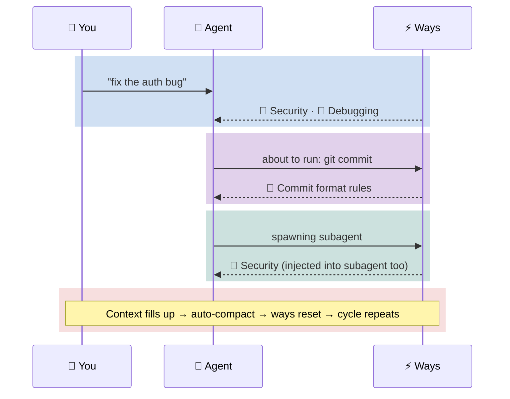

<p align="center">
  
</p>

# Agent Ways


Event-driven cognitive steering for AI coding agents. Ways encode *how we do things* — prescriptive guidance triggered by context, not requested by intent — and inject them just-in-time before tools execute.

> **Current status:** Agent Ways ships with full support for [Claude Code](https://docs.anthropic.com/en/docs/claude-code). Support for additional CLI-based coding agents is in development.



**Ways** = policy and process encoded as contextual guidance. Triggered by keywords, commands, and file patterns — they fire once per session, before tools execute, and carry into subagents.

**Why this works:** System prompt adherence decays as a power law over conversation turns — instructions at position zero lose influence as context grows. Ways sidestep this by injecting small, relevant guidance near the attention cursor at the moment it matters, maintaining steady-state adherence instead of a damped sawtooth. It's [progressive disclosure](docs/hooks-and-ways/context-decay.md) applied to the model itself.

### Session replay with `ways rethink`

`ways rethink` replays a completed session's way-firing history as an interactive TUI animation. Each frame shows a way firing at a specific point in the conversation — you can see how guidance clusters near the active attention cursor and packs into the context window like a compression pattern.


Ways fire via the **embedding engine** (all-MiniLM-L6-v2, a ~21MB GGUF model), which achieves ~98% accuracy on the match fixture set. The embedding tier handles semantic similarity — "pin lockfile versions" matches the supply chain way even though those exact words don't appear in the way's vocabulary.

---

This repo ships with software development ways, but the mechanism is general-purpose. You could have ways for:
- Excel/Office productivity
- AWS operations
- Financial analysis
- Research workflows
- Anything with patterns your agent should know about

## Prerequisites

Runs on **Linux** and **macOS**. The core system is a Rust binary (`ways`) plus thin bash hook scripts:

| Tool | Purpose | Notes |
|------|---------|-------|
| [Claude Code](https://docs.anthropic.com/en/docs/claude-code) | The agent this configures | `npm install -g @anthropic-ai/claude-code` |
| `ways` | Unified CLI — matching, scanning, linting, governance | Downloaded or built by `make setup` |
| `git` | Version control, update checking | Usually pre-installed |
| `jq` | JSON parsing (hook inputs, configs, API responses) | **Must install** |
| `python3` | Governance traceability tooling, chart-tool | Stdlib only — no pip packages |
| [`gh`](https://cli.github.com/) | GitHub API (update checks, repo macros) | Recommended, not required — degrades gracefully |

`make setup` acquires the `ways` binary automatically: pre-built download from GitHub Releases → build from source (requires `cargo`/Rust toolchain) → error with instructions. Standard utilities (`bash`, `awk`, `sed`, `grep`, `find`, `timeout`, `tr`, `sort`, `wc`, `date`) are assumed present via coreutils.

**Semantic matching** uses the **embedding engine** (all-MiniLM-L6-v2 via a separate `way-embed` binary, ~98% accuracy on the fixture set) as the sole retrieval tier. The embedding model is a hard dependency of `ways` and is fetched by `make setup`:

```bash
make setup   # download ways binary + embedding model (~21MB), generate corpus
```

See [Semantic Matching](docs/hooks-and-ways.md#semantic-matching) for the full setup and engine comparison.

**Platform install guides:**
[macOS (Homebrew)](docs/prerequisites-macos.md) · [Arch Linux](docs/prerequisites-arch.md) · [Debian / Ubuntu](docs/prerequisites-debian.md) · [Fedora / RHEL](docs/prerequisites-fedora.md)

> **macOS note:** `timeout` is a GNU coreutils command not present by default. Install `coreutils` via Homebrew — see the [macOS guide](docs/prerequisites-macos.md) for PATH setup.

## Quick Start

```bash
# Clone (fork first if you plan to customize)
git clone https://github.com/aaronsb/agent-ways ~/.claude

# Set up semantic matching engine (downloads ~21MB model)
cd ~/.claude && make setup

# Restart Claude Code — ways are now active
```

Or as a one-liner (clones to temp, verifies, then installs):

```bash
curl -sL https://raw.githubusercontent.com/aaronsb/agent-ways/main/scripts/install.sh | bash -s -- --bootstrap
```

The built-in ways cover software development, but the framework is domain-agnostic. Fork it, replace the ways, add your own domains.

> **Already have `~/.claude/`?** The installer detects existing files and won't clobber them. See the **[install guide](docs/install-guide.md)** for how to back up, merge, or start fresh. If you're sure: `scripts/install.sh --dangerously-clobber`.

> **Stop and read this** if you're letting an AI agent run the installer. You are about to let an agent modify `~/.claude/` — the directory that controls how Claude Code behaves. The agent is editing its own configuration. Review the repo first. You are responsible for the result.

## How It Works

`core.md` loads at session start with behavioral guidance, operational rules, and a dynamic ways index. Then, as you work:

1. **UserPromptSubmit** scans your message for keyword and semantic (embedding) matches
2. **PreToolUse** intercepts commands and file edits *before they execute*
3. **SubagentStart** injects relevant ways into subagents spawned via Task
4. Each way fires **once per session** — marker files prevent re-triggering

Matching has two channels: regex patterns for known keywords/commands/files, and [sentence-embedding](docs/architecture/system/ADR-108-embedding-based-way-matching-with-all-minilm-l6-v2.md) semantic scoring (all-MiniLM-L6-v2). See [matching.md](docs/hooks-and-ways/matching.md) for the full strategy.

`ways list` shows the live session state — which ways fired, when (epoch), how far back (distance), what triggered them, tree relationships, check decay curves, and a re-disclosure forecast showing when distant ways will re-fire as context fills:


For the complete system guide — trigger flow, state machines, the pipeline from principle to implementation — see **[docs/hooks-and-ways/README.md](docs/hooks-and-ways/README.md)**.

## Configuration

Ways config lives in `~/.claude/ways.json`:

```json
{
  "disabled": []
}
```

| Field | Purpose |
|-------|---------|
| `disabled` | Array of domain names to skip (e.g., `["itops", "softwaredev"]`) |

Disabled domains are completely ignored — no pattern matching, no output.

## Creating Ways

Each way is a `{wayname}.md` file with YAML frontmatter in `~/.claude/hooks/ways/{domain}/{wayname}/`:

```yaml
---
description: semantic text    # embedding semantic matching (preferred)
vocabulary: domain keywords   # space-separated terms augmenting the embedding
embed_threshold: 0.35         # cosine similarity threshold (optional per-way tuning)
pattern: commit|push          # regex on user prompts (supplementary)
commands: git\ commit         # regex on bash commands
files: \.env$                 # regex on file paths
macro: prepend                # dynamic context via macro.sh
scope: agent, subagent        # injection scope
---
```

Matching is **additive** — regex and semantic are OR'd. A way with both can fire from either channel.

**Project-local ways** live in `$PROJECT/.claude/ways/{domain}/{wayname}/{wayname}.md` and override global ways with the same path. Project macros are disabled by default — trust a project with `echo "/path/to/project" >> ~/.claude/trusted-project-macros`.

For the full authoring guide: [extending.md](docs/hooks-and-ways/extending.md) | For matching strategy: [matching.md](docs/hooks-and-ways/matching.md) | For macros: [macros.md](docs/hooks-and-ways/macros.md)

## Testing Ways

After creating or tuning a way, verify it matches what you expect — and doesn't match what it shouldn't.

```bash
# Score a way against sample prompts (inside Claude Code)
/ways-tests score security "how do i hash passwords with bcrypt"

# Rank all ways against a prompt
/ways-tests score-all "write some unit tests for this module"

# Validate frontmatter
ways lint --global

# Vocabulary gap analysis
ways suggest --file ~/.claude/hooks/ways/softwaredev/code/security/security.md

# Embedding similarity scores
way-embed match --corpus ~/.cache/claude-ways/user/ways-corpus.jsonl \
  --model ~/.cache/claude-ways/user/minilm-l6-v2.gguf \
  --query "pin lockfile versions"

# Sibling vocabulary overlap (Jaccard)
ways siblings softwaredev/code/supplychain/depscan/node

# Session simulation tests (Rust integration tests)
make test-sim

# Interactive: full hook pipeline with subagent injection
# Start a fresh session, then: read and run tests/way-activation-test.md
```

The embedding engine achieves 98.4% accuracy (63/64) with 0 false negatives on the fixture set.

Other test tools: `scripts/doc-graph.sh --stats` checks documentation link integrity; `ways governance lint` validates provenance metadata. Full test guide: [tests/README.md](tests/README.md).

## What's Included

This repo ships with **85+ ways** across six domains — covering commits, security, testing, debugging, dependencies, architecture, documentation, and more. The live index is generated at session start. **Replace these entirely** if your domain isn't software dev.

| Domain | Ways | Coverage |
|--------|------|----------|
| `softwaredev` | 50 | Commits, security, testing, debugging, deps, supply chain, architecture, delivery |
| `meta` | 19 | Ways system itself — knowledge, authoring, optimization, introspection |
| `ea` | 10 | Executive assistant — email, calendar, scheduling |
| `itops` | 4 | Infrastructure operations |
| `research` | 1 | Research workflows |
| `writing` | 1 | Writing and documentation |

Also included:
- **[Agent teams](docs/hooks-and-ways/teams.md)** — three-scope model (agent/teammate/subagent) with scope-gated governance and team telemetry. When one agent becomes a team, every teammate gets the same handbook.
- **6 specialized subagents** for requirements, architecture, planning, review, workflow, and organization
- **[Usage stats](docs/hooks-and-ways/stats.md)** — way firing telemetry by scope, team, project, and trigger type
- **Update checking** — detects clones, forks, renamed copies; nudges you when behind upstream

## Why Ways? (Rules, Skills, and Ways)

Claude Code ships two official features for injecting guidance: **Rules** (`.claude/rules/*.md`) and **Skills** (`~/.claude/skills/`). Ways solve problems that neither can.

### The progressive disclosure problem

Rules and ways both inject guidance conditionally — but their disclosure models are fundamentally different:

- **Rules** disclose based on **file paths** (`paths: src/api/**`). The project's directory tree *is* the disclosure taxonomy. This works when concerns map cleanly to directories, but most concerns don't — security, testing conventions, commit standards, and performance patterns cut across every directory.

- **Ways** disclose based on **actions and intent** — what you're doing (running `git commit`), what you're talking about ("optimize this query"), or what state the session is in (context 75% full). The disclosure schedule is decoupled from the file hierarchy entirely.

This matters because of how attention works in transformers. Rules loaded at file-read time are closer to the generation cursor than startup rules, but ways inject at the **tool-call boundary** — the closest possible point to where the model is actively generating. The [context decay model](docs/hooks-and-ways/context-decay.md) formalizes why this temporal coupling outperforms spatial coupling for maintaining adherence over long sessions.

### Three features, three jobs

| | **Rules** | **Skills** | **Ways** |
|--|-----------|------------|----------|
| **What** | Static instructions | Action templates | Event-driven guidance |
| **Job** | "Always do X" | "Here's how to do Y" | "Right now, remember Z" |
| **Trigger** | File access or startup | User intent (Claude decides) | Tool use, keywords, state conditions |
| **Conditional on** | File paths (directory tree) | Semantic similarity | Multi-channel: regex, embeddings, commands, files, state |
| **Cross-cutting concerns** | Needs duplicate `paths:` entries | N/A (intent-based) | Single way fires regardless of file location |
| **Dynamic content** | No | No | Yes (shell macros) |
| **Survives refactoring** | No (`src/` → `lib/` breaks paths) | Yes | Yes |
| **Non-file triggers** | No | No | Yes (`git commit`, context threshold, subagent spawn) |
| **Governance provenance** | No | No | Yes (NIST, OWASP, ISO, SOC 2 traceability) |
| **Org-level scope** | Yes (`/etc/claude-code/`) | No | No |
| **Zero-config simplicity** | Yes (drop a `.md` file) | Yes | No (requires hook infrastructure) |

**Rules** are best for static, always-on preferences ("use TypeScript strict mode", "tabs not spaces"). **Skills** are best for specific capabilities invoked by intent ("ship this PR", "rotate AWS keys"). **Ways** are best for context-sensitive guidance that fires on events, cuts across the file tree, and needs to stay fresh in long sessions.

They compose well: rules set baseline preferences, ways inject governance at tool boundaries, skills provide specific workflows. The [full comparison](docs/hooks-and-ways/README.md#ways-rules-and-skills) covers the architectural details.

> **Is this just RAG?** Ways and RAG solve the same fundamental problem — getting the right context into the window at the right time — but through different architectures. RAG retrieves by semantic similarity; Ways retrieve by event. RAG is stateless; Ways track session state. The [full comparison](docs/hooks-and-ways/ways-vs-rag.md) explores what's shared, what's different, and when each approach wins.

## Governance

Ways are compiled from policy. Every way can carry `provenance:` metadata linking it to policy documents and regulatory controls — the runtime strips it (zero tokens), but the [governance operator](governance/README.md) walks the chain:

```
Regulatory Framework → Policy Document → Way File → Agent Context
```

The [`governance/`](governance/) directory contains reporting tools and [policy source documents](governance/policies/) — coverage queries, control traces, traceability matrices. Designed to be separable. The built-in ways carry justifications across controls from NIST, OWASP, ISO, SOC 2, CIS, and IEEE.

Most users don't need governance. It's an additive layer that emerges when compliance asks *"can you prove your agents follow policy?"* See [docs/governance.md](docs/governance.md) for the full reference.

For adding provenance: [provenance.md](docs/hooks-and-ways/provenance.md) | Design rationale: [ADR-005](docs/architecture/legacy/ADR-005-governance-traceability.md)

## Philosophy

Policy-as-code for AI agents — lightweight, portable, deterministic.

| Feature | Why It Matters |
|---------|----------------|
| **Dual-channel matching** | Regex for precision, embeddings for semantics — no cloud API needed |
| **Shell macros** | Dynamic context from any source (APIs, files, system state) |
| **Minimal dependencies** | `ways` binary + bash + jq — no runtime services, no cloud APIs |
| **Domain-agnostic** | Swap software dev ways for finance, ops, research, anything |
| **Fully hackable** | Plain text files, fork and customize in minutes |

For the attention mechanics: [context-decay.md](docs/hooks-and-ways/context-decay.md) | For the cognitive science rationale: [rationale.md](docs/hooks-and-ways/rationale.md)

## Updating

At session start, `check-config-updates.sh` compares your local copy against upstream (`aaronsb/agent-ways`). It runs silently unless you're behind — then it prints a notice with the exact commands to sync. Network calls are rate-limited to once per hour. After pulling, run `make setup` to update the semantic matching corpus.

| Scenario | How detected | Sync command |
|----------|-------------|--------------|
| **Direct clone** | `origin` points to `aaronsb/agent-ways` | `cd ~/.claude && git pull` |
| **Fork** | GitHub API reports `parent` is `aaronsb/agent-ways` | `cd ~/.claude && git fetch upstream && git merge upstream/main` |
| **Renamed clone** | `.claude-upstream` marker file exists | `cd ~/.claude && git fetch upstream && git merge upstream/main` |
| **Plugin** | `CLAUDE_PLUGIN_ROOT` set with `plugin.json` | `/plugin update disciplined-methodology` |

### Renamed clones (org-internal copies)

If your organization clones this repo under a different name without forking on GitHub, update notifications still work via the `.claude-upstream` marker file. It uses `git ls-remote` against the public upstream — no `gh` CLI required.

| Goal | Action |
|------|--------|
| **Opt out entirely** | Delete `.claude-upstream` and point `origin` to your internal repo. |
| **Track a different upstream** | Edit `.claude-upstream` to contain your internal canonical repo. |
| **Disable for all users** | Remove `check-config-updates.sh` from `hooks/` or delete the SessionStart hook entry in `settings.json`. |

## Documentation

| Path | What's there |
|------|-------------|
| [docs/hooks-and-ways/README.md](docs/hooks-and-ways/README.md) | **Start here** — the pipeline, creating ways, reading order |
| [docs/hooks-and-ways/](docs/hooks-and-ways/) | Matching, macros, provenance, teams, stats |
| [docs/hooks-and-ways.md](docs/hooks-and-ways.md) | Reference: hook lifecycle, state management, data flow |
| [docs/governance.md](docs/governance.md) | Reference: compilation chain, provenance mechanics |
| [docs/architecture.md](docs/architecture.md) | System architecture diagrams |
| [docs/architecture/](docs/architecture/) | Architecture Decision Records |
| [governance/](governance/) | Governance traceability and reporting |
| [docs/README.md](docs/README.md) | Full documentation map |

## License

MIT
