# Ways System Architecture

Visual documentation of the ways trigger system.

## How a Session Flows

A typical session from the user's perspective, showing how events trigger way injections at each step:

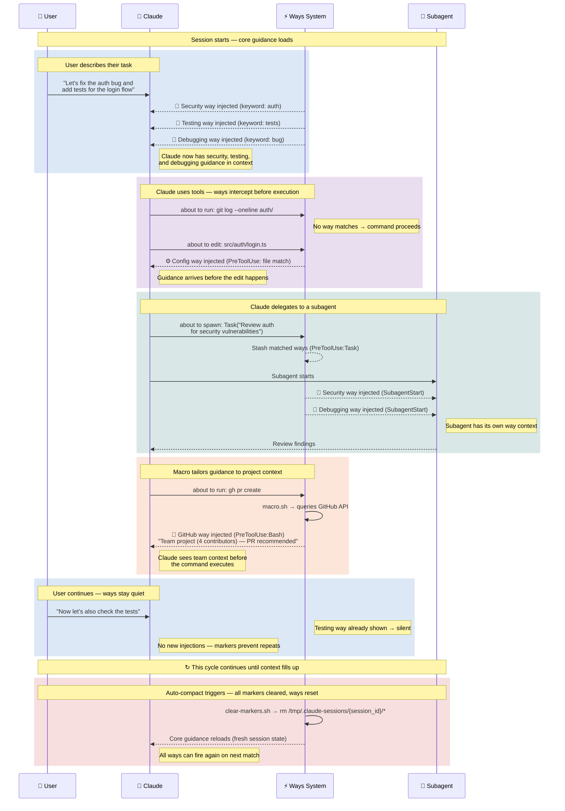

## Hook Flow

How ways get triggered during a Claude Code session:

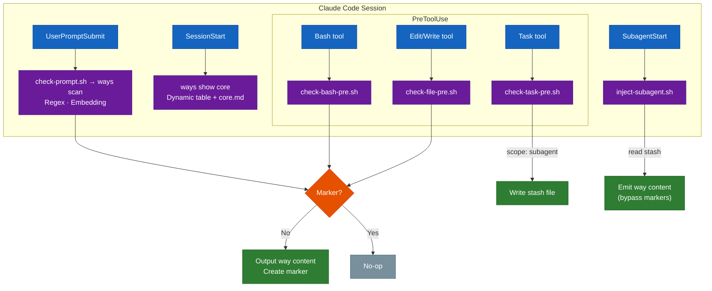

## Subagent Injection

Two-phase stash pattern bridges the gap between Task prompt visibility and SubagentStart injection:

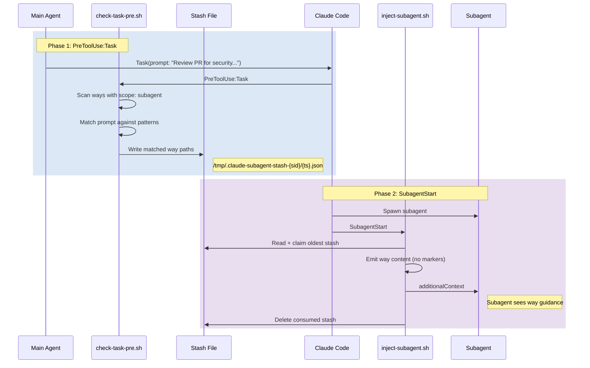

### Scope Filtering

The `scope` field controls where ways inject:

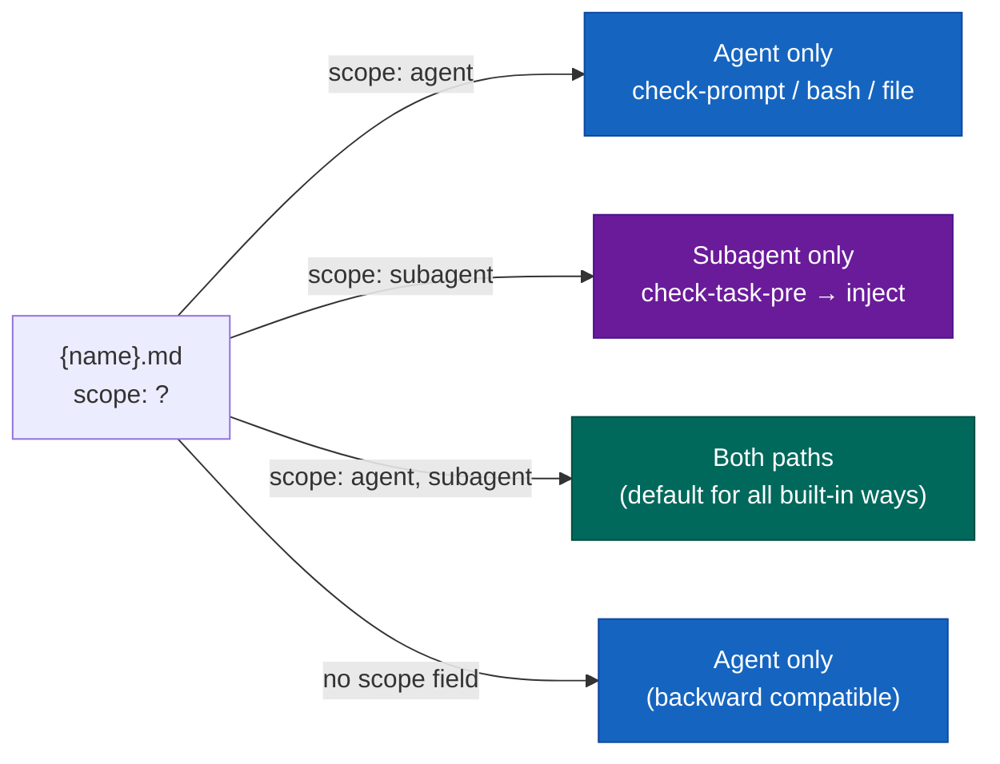

### Parallel Subagent Handling

Multiple Task tools in one message create separate stash files consumed in FIFO order:

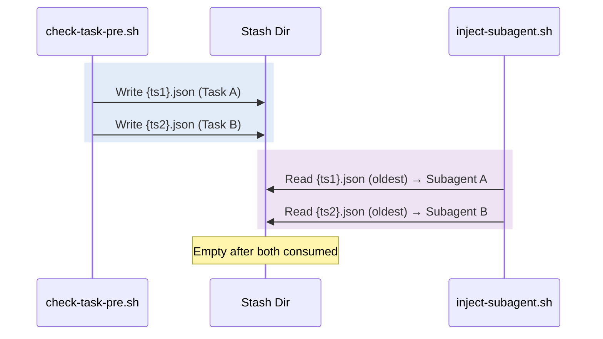

## Way State Machine

Each (way, session) pair has exactly two states:

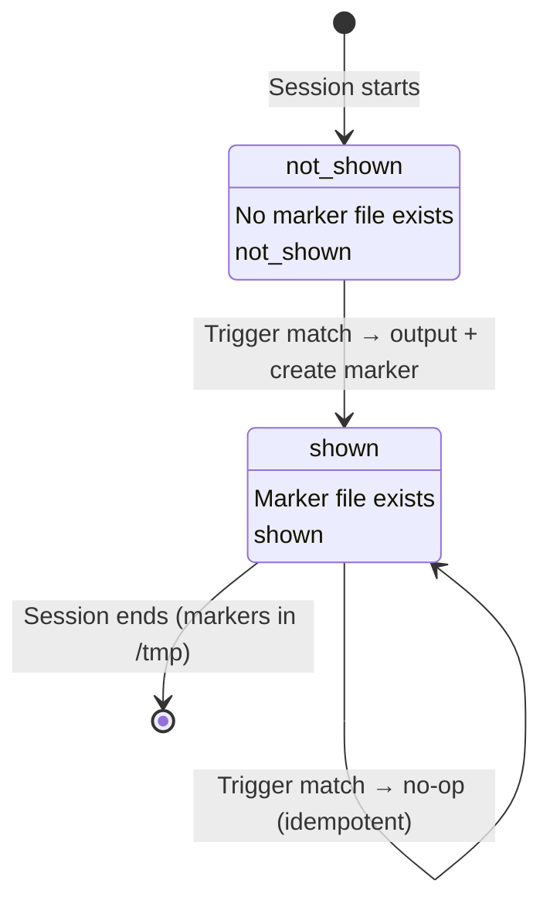

**Exception**: Subagent injection bypasses this state machine entirely. Ways injected via `inject-subagent.sh` are emitted without marker checks.

## Trigger Matching

How prompts and tool use get matched to ways:

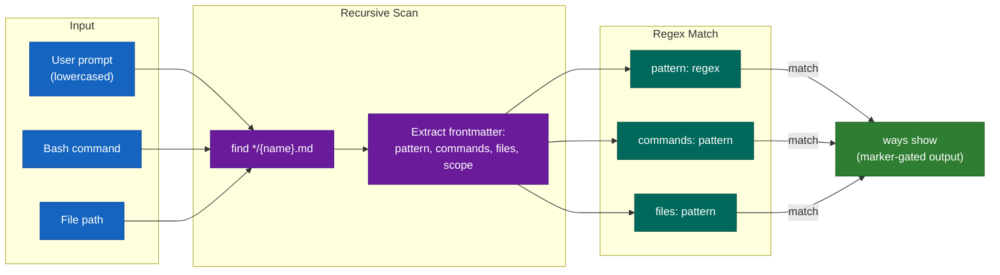

## Semantic Matching

Ways with `description:` fields use a three-tier scoring engine:

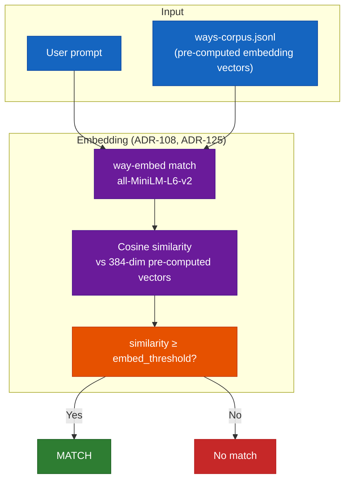

| Engine | Accuracy | Timing | Requirements |
|--------|----------|--------|-------------|
| **Embedding** | 98.4% (63/64) | ~20ms | `way-embed` binary + GGUF model (21MB) |

The embedding model is a hard dependency of `ways`. See ADR-125 for the authored disclosure graph model and the single-tier decision.

## Telemetry & Tuning

The matcher computes a score for every way on every prompt. Fires are recorded; so are the *near-misses* — ways that scored just under threshold and stayed silent. Both feed back into how the engine is tuned. This closes the loop ADR-134 opened: hand-set thresholds and half-lives become things the system can revise from its own experience.

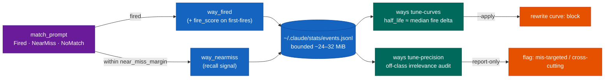

### Telemetry events

Two events in `~/.claude/stats/events.jsonl` carry the tuning signal:

- `way_fired` now records `fire_score` — the embedding score that cleared threshold — on **first-fires only** (not on `way_redisclosed`). It feeds future `embed_threshold` tuning.
- `way_nearmiss` is emitted when a way scores within `near_miss_margin` *below* its effective threshold but does not fire. The scores already exist; this is persistence, not new computation. Fields: `score_en`, `score_multi`, `thr_en`, `thr_multi`, `margin`, `trigger`, `query_tokens`. It is a recall signal — the first measure of likely *false silences*, the ways that should have fired and didn't.

`near_miss_margin` (default `0.05`) is parsed from the ways config YAML alongside `default_embed_threshold` and `default_multi_embed_threshold`. It caps near-miss volume: only the band just under threshold logs.

The log grows faster with near-misses, so its growth is bounded. `log_event` tail-compacts `events.jsonl` once it crosses ~32 MiB, keeping the most recent ~24 MiB (cut at a line boundary, written to a temp file and atomically renamed). The oldest events are lost; readers are unaffected — a reader holding the pre-compaction file keeps reading it intact.

### Tuning commands

- **`ways tune-curves`** (ADR-123 Phase E) — cadence calibration. Groups `way_fired` / `way_redisclosed` by `(way, session)`, computes token-position deltas between fires, and suggests `half_life ≈ median delta`. `--apply` rewrites the way's `curve:` block in place.
- **`ways tune-precision`** (ADR-134 Decision 3) — a heuristic relevance audit of fire telemetry, report-only. For each way it estimates how often its fires landed *off-class*: in sessions whose activity — judged by the parent-family of the ways that co-fired — never touched the way's own domain. It reports an irrelevance rate and a flag: **mis-targeted** (a narrow way repeatedly firing into the same wrong kind of session; remedy: raise `embed_threshold`, narrow vocabulary, or change trigger channel) vs **cross-cutting** (a way that fires broadly by design, e.g. `meta/tracking`; remedy: scope by trigger — vocabulary is *never* auto-narrowed). Flags: `--min-sessions` (default 5), `--flag-threshold` (default 0.5), `--project`, `--way`, `--json`.

ADR-134 is **Accepted**. One slice — the `embed_threshold`-gated `--apply`, driven by accumulated `fire_score` data — is deferred and data-gated (GitHub issue #123).

## Macro Injection

Ways with `macro: prepend|append` run dynamic scripts that query live state:

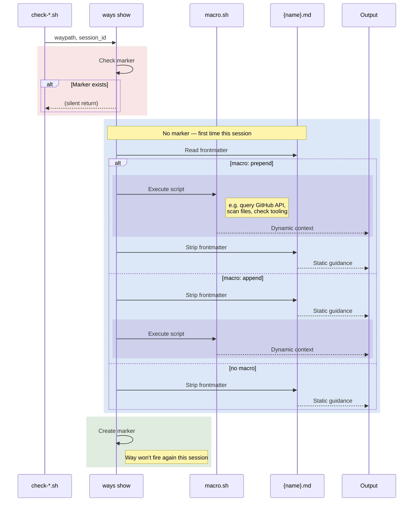

## Directory Structure

```
~/.claude/hooks/ways/
├── core.md                     # Base guidance (loads at startup)
├── macro.sh                    # Generates Available Ways table
│
├── check-prompt.sh             # UserPromptSubmit → dispatches to `ways scan prompt`
├── check-bash-pre.sh           # PreToolUse:Bash → scan commands
├── check-file-pre.sh           # PreToolUse:Edit|Write → scan files
├── check-task-pre.sh           # PreToolUse:Task → stash for subagent
├── check-state.sh              # UserPromptSubmit → state triggers
├── check-response.sh           # Stop → extract topics for next turn
│
├── inject-subagent.sh          # SubagentStart → emit stashed ways (JSON hookSpecificOutput)
├── clear-markers.sh            # SessionStart → reset session state
├── mark-tasks-active.sh        # PreToolUse:TaskCreate → context nag gate
│
├── softwaredev/                # Domain: software development
│   ├── commits/commits.md       #   git commit format
│   ├── testing/testing.md       #   test practices
│   ├── security/security.md     #   auth, secrets, vulnerabilities
│   ├── github/                  #   PR workflow
│   │   ├── github.md
│   │   └── macro.sh             #   detects solo vs team
│   └── ...                      #   18 ways total
├── itops/                       # Domain: IT operations
│   └── ...                      #   4 ways
└── meta/                        # Domain: meta-system
    └── ...                      #   5 ways

$PROJECT/.claude/ways/           # Project-local overrides
└── {domain}/{wayname}/{wayname}.md  # Same structure, takes precedence
```

### Script Relationships

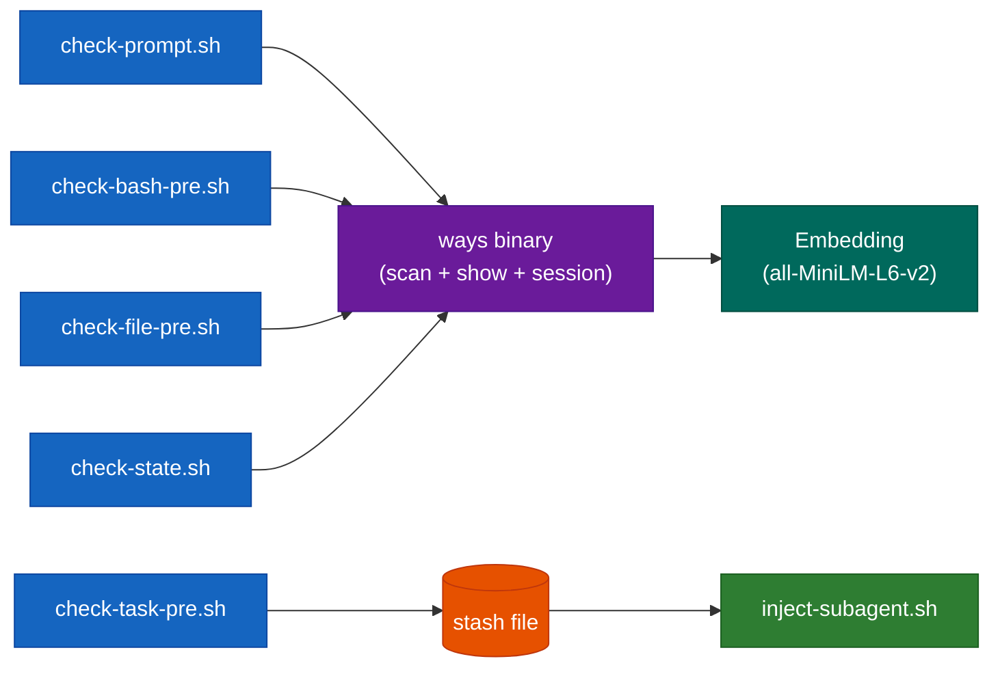

## Multi-Trigger Semantics

What happens when multiple triggers fire:

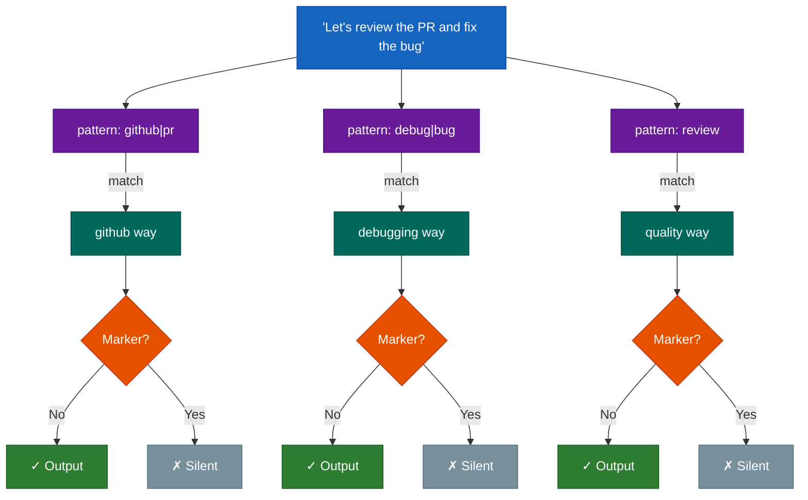

Each way has its own marker - multiple ways can fire from one prompt, but each only fires once per session.

## Project-Local Override

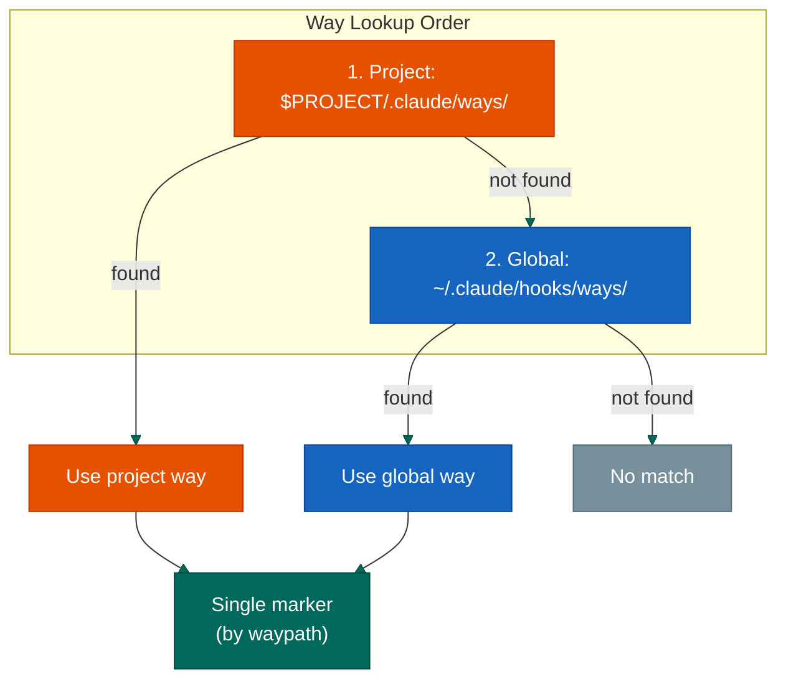

Project ways take precedence. Only one marker per waypath regardless of source.
