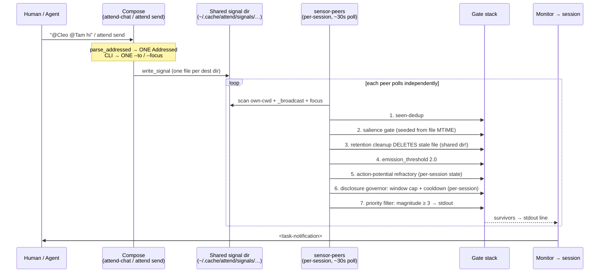
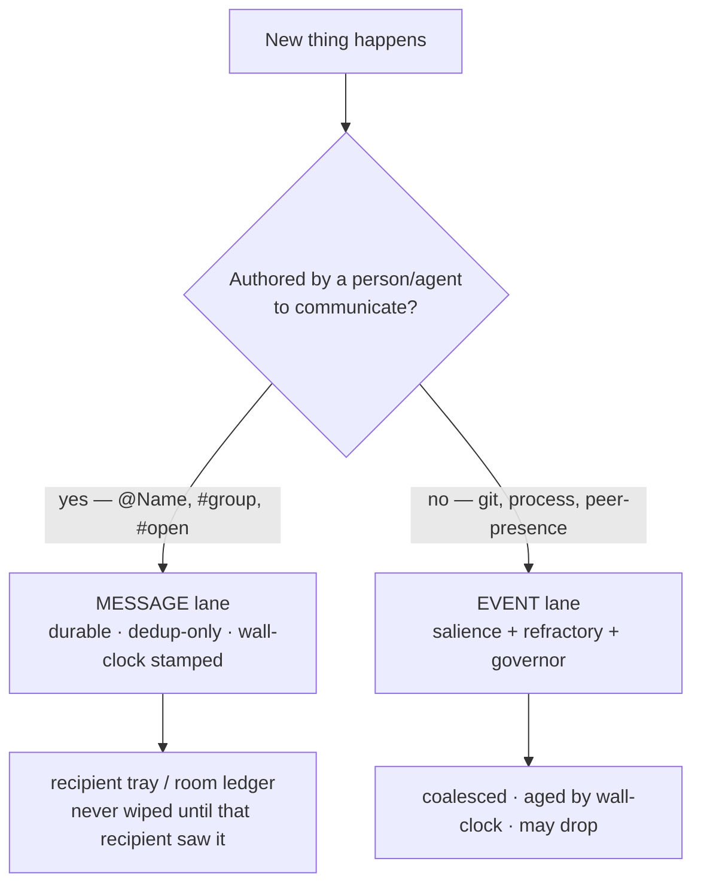
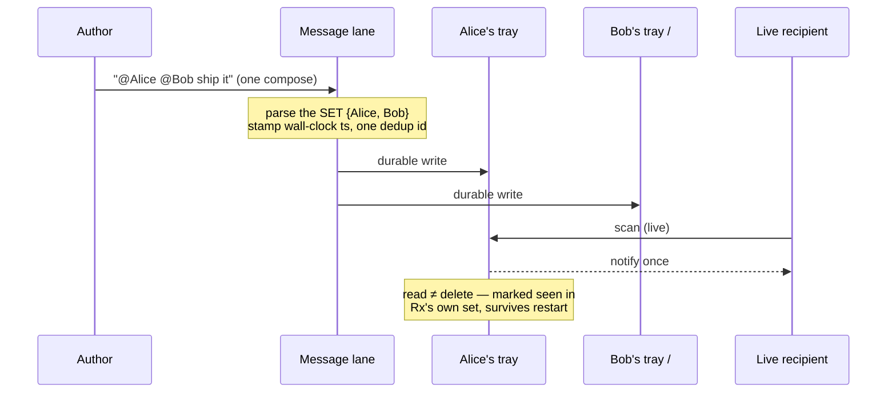
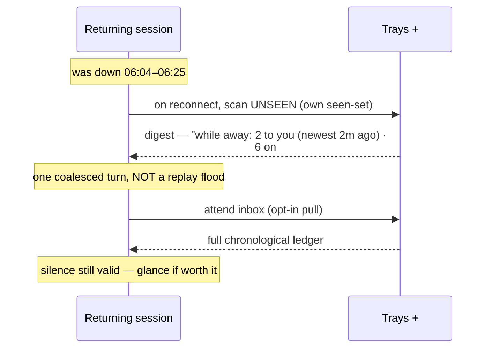
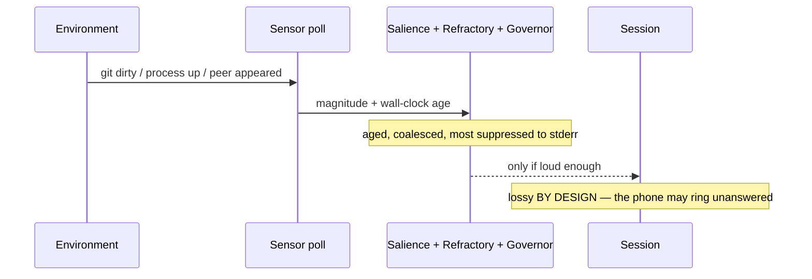

# ADR-136: Split addressed messaging from the sensor-observation bus

## Context

Attend carries two kinds of traffic over one pipeline, and they have
opposite handling requirements.

### The office analogy

Picture several office workers near each other. They **talk back and
forth** — conversations with continuity, where each knows roughly where
the exchange stands. That conversation is durable *state*; it must not
get wiped.

Meanwhile the **phone rings, a fax comes in, a work package is dropped
off.** These are events. A worker mid-conversation can queue them or
ignore them, and either choice is fine — handling an interrupt, or
choosing not to, never erases the conversation they're holding. The fax
sitting in the tray and the package on the desk are **durable work
items**: they wait there until that worker processes them. Nobody empties
the tray on a timer, and no co-worker walking past gets to shred an
unread fax.

Mapped to attend:

- **Ambient observations** — git churn, a peer appearing, a process
  starting. The phone ringing. These are *noise* / interrupts. The whole
  point of the salience gate ([[ADR-121]]), the action-potential
  refractory ([[ADR-123]]), and the disclosure governor is to *suppress*
  most of them so Monitor only wakes a session for something that moved.
  Queue-or-ignore, lossy, and rate-limited is exactly right here.
- **Addressed messages** — `attend send`, `attend reply`, and the
  attend-chat `@Name` / `#group` surface. The fax in the tray, the
  package on the desk, the conversation itself. These are *intentional
  communication* a human or agent composed on purpose. The work item
  waits in **that recipient's own tray** until they process it; the
  conversation state it belongs to is never wiped by event handling.

Today both ride the same path: a `.signal` file in a **shared**
directory, scanned by `sensor-peers` on each poll, then run through the
same gate stack built to throttle observations. Two concrete defects
surfaced, and both are symptoms of messages being second-class citizens
on a bus designed for disposable observations — work items thrown in a
shared tray that anyone can shred.

### Two clocks — and the bridge between them

attend and the ways/steering system run on **different time dimensions**,
and keeping them straight is what scopes this ADR.

- **attend is wall-clock.** It is deliberately a real-time system: it
  runs *between* an agent's turns, polls on a wall-clock cadence, decays
  salience in seconds, and measures "away for 21 minutes." Real time is
  its native substrate. Everything in this ADR — both lanes — lives here.
- **Ways / agent steering is epoch/turn-driven.** Ways fire and refire on
  conversation *turns*, match per-prompt, and disclosure-gate per-turn.
  There is no wall-clock in that dimension; a session paused for hours and
  resumed is the same turn-continuum. The salience engine is *shared*
  between the two ([[ADR-123]]), but consumed on two different clocks —
  `salience.rs` already names the "deliberate asymmetry vs. ways'
  `way_fire_outcome`, which always fires on first match regardless of
  age," precisely because ways live on the turn clock and sensors on the
  wall clock.

**The notification is the bridge.** A wall-clock event crosses into the
turn dimension when Monitor injects a `<task-notification>` that becomes
a prompt. That crossing is why **digest-not-replay** (below) is not just
ergonomics but *dimensionally correct*: a wall-clock burst of N messages
must not become N turn-injections — it must coalesce into **one** turn,
because the receiving dimension is turn-discrete and context-precious.
Many-in-wall-clock → one-in-turns is the correct impedance match. The
turn dimension itself is out of scope here; it only meets attend at this
boundary.

### The current flow

Seven gates sit between "send" and "notify." Three of them (salience,
refractory, governor) carry **per-session timing state**, so two peers
watching the same message can legitimately diverge. One of them
(retention cleanup) is **destructive on a shared resource**.

### Bug 1 — `@multi` addresses only the first agent

The bus is single-recipient end to end.
`parse_addressed` (`tools/attend-chat/src/legend.rs:173`) parses only
the *leading* sigil token and returns one `Addressed`;
`handle_enter` (`tools/attend-chat/src/app/keys.rs:78`) matches one arm
and writes to one inbox — so `@Cleo @Tam msg` routes to Cleo and
`@Tam` becomes body text. The CLI mirrors this: `attend send` accepts a
single `--to` or single `--focus`
(`tools/attend/src/cmd/send.rs`). The *write* layer already loops over a
`Vec<PathBuf>` of destinations (`send.rs:151`) — it is only ever handed
one element. Multi-recipient was never representable above the write
layer.

### Bug 2 — a `#open` message reached one peer but not another

Reported live: a human sent `#open`; the KGS peer (Clio) surfaced it,
the agent in `~/.claude` did not — only a few minutes apart. Timeline
reconstruction from the session transcript confirmed the agent's
Monitor had **down-gaps** (stopped 06:04:42Z, and again 06:35:53Z) while
the peer ran continuously. The decisive mechanism, consistent with a
few-minutes gap:

1. The message was written during the recipient's Monitor-down gap.
2. The live peer scanned it within ~30s and was notified.
3. The retention cleanup sweep — run by *any* live attend, including the
   peer (`tools/sensor-peers/src/lib.rs:394`, and the periodic sweep in
   `tools/attend/src/cmd/run/tick.rs`) — **deleted the stale file from
   the shared dir**.
4. The recipient's Monitor came back *after* the file was gone, so it
   never saw the message.

The root defect is not "the Monitor was off" — sessions stop and start
routinely. It is that **delivery is best-effort against an ephemeral
shared directory with no durable, replayable, per-recipient inbox.** A
recipient that is momentarily away loses the message permanently. The
52-minute salience-decay backlog filter ([[ADR-121]]) was an early
suspect and is *not* the cause here; the message was fresh.

## Decision

Split the bus into two lanes with different delivery contracts. The
sensor-observation lane is unchanged. Addressed messages move to a
**message lane** that is reliable rather than throttled.

**The lane boundary is _authored communication_ vs _environmental
event_ — not directed vs broadcast.** A person or agent composing words
to reach someone is conversation, and rides the message lane. The
environment generating a notice — git changed, a peer appeared, a
process started; the phone, the fax, the package — is an event, and
rides the observation lane. This matters most for `#open`: it is
authored, so it is durable, full stop. `#open` is "talking loud in the
open office" — sometimes to convene ("we should all discuss this, maybe
break into smaller groups"), sometimes just because only a couple of
sessions are around and `#open` *is* the conversation. Both are talking.
Demoting `#open` to a best-effort bulletin would shred conversation in
exactly the small-room case where it carries the real exchange.
Convening-then-splitting rides the existing focus-group mechanism
([[ADR-118]], [[ADR-129]]); the migration from `#open` to a `#group` is a
workflow, not a durability tier.

**1. The message lane bypasses the noise-control stack.** Addressed
messages (directed `@`, group `#`, and `#open` broadcast) skip the
salience gate, the action-potential refractory, and the disclosure
governor. Those exist to suppress ambient observation *noise*; a
composed message is not noise. The lane keeps only **dedup** (deliver
once) — never magnitude-aging or rate-limiting.

**2. Each recipient has their own durable tray.** A message waits in the
recipient's own inbox until *that* recipient has processed it — i.e. its
own seen-set marks it, persisted across restarts. Not a wall-clock
retention timer, and not a shared tray. A session that starts or
restarts drains its pending tray as part of catch-up, so a brief
down-gap no longer drops messages. This is deliberately *lighter* than a
cross-party acknowledgement protocol: GC is "you processed your own
fax," not a handshake among peers. The durable thing is each recipient's
unread queue, owned by that recipient.

**3. Nothing wipes an unprocessed item, and no co-worker shreds your
tray.** Cleanup may remove a message from a recipient's tray only after
*that* recipient has observed it. One peer's scan must never delete a
message another peer hasn't seen — the destructive-on-shared cleanup
that caused Bug 2 is removed outright. Conversation state (a session's
seen-set and thread context, [[ADR-120]]) is likewise never wiped as a
side effect of handling or ignoring an event.

**4. Addressing is multi-recipient.** `parse_addressed` becomes
"parse the leading run of `@`/`#` tokens" and returns a *set* of
targets; `handle_enter` and `attend send` build a multi-element
`dest_dirs` and fan out one durable write per recipient. This is the
direct fix for Bug 1 and falls out naturally once messages are
first-class — the write layer already loops.

**5. Re-entry is a wall-clock digest, not a replay.** When a session was
down and comes back, it does not get every missed message re-injected.
It gets a coalesced notice — *"while away: 2 addressed to you (newest 2m
ago), 6 on `#open` over 21m"* — and pulls detail on demand. This is the
many-in-wall-clock → one-in-turns impedance match at the notification
bridge. The pull surface **already exists**: `attend inbox`
(`tools/attend/src/cmd/inbox.rs`) scans the same trays the sensor does
and renders them **chronologically by mtime** — it is already the durable
ledger, and already treats wall-clock as first-class. The work is to stop
shredding it (Decision 3) and to add the re-entry digest, not to build a
new store.

**Wall-clock is first-class in both lanes; the lanes differ only in how
they _use_ it.** The event lane uses time to **decay and drop** (a stale
observation is less worth a wake-up — correct lossiness). The message
lane uses time to **stamp and digest** (a stale message is never dropped,
only summarized as "how long ago — you decide"). Same clock, opposite
policy. That is the clean line between the lanes.

The exact on-disk shape (extend the existing signal-dir convention vs. a
dedicated message store) is an implementation choice for the follow-up
PRs; the contract above is what this ADR fixes. CLI remains the whole
interface ([[ADR-124]] / attend's CLI-is-the-contract rule) — no new
caller reaches into attend-owned state.

### Target flows

**Classification — what picks the lane** (authored vs environmental, the
one decision that routes everything):

**Authored message, live recipients** (also the Bug 1 multi-recipient fix):

**Re-entry after a down-gap** (the Bug 2 fix; wall-clock front and center):

**Environmental event** (unchanged — the lane the gate stack was built for):

## Consequences

### Positive

- Messages a human or agent composed on purpose are delivered reliably
  and exactly once, including across a recipient's brief restart.
- Both reported bugs are fixed by construction: multi-recipient
  addressing (Bug 1) and no-silent-drop delivery (Bug 2).
- The salience / refractory / governor machinery gets a clearer mandate
  — it governs *observations*, the job it was designed for — instead of
  being asked to also not-lose intentional messages, which it was never
  built to guarantee.

### Negative

- Two lanes is more surface than one pipeline. The win is that each lane
  has a single, honest contract; the cost is that "it's all just
  signals" stops being true.
- Per-recipient trays mean a message may be stored once per intended
  recipient rather than once in a shared dir, and an unread tray must be
  bounded somehow (e.g. cap depth, or expire only items old enough that
  no reconnect is plausible) so a permanently-gone recipient doesn't
  accumulate forever. Lighter than a cross-party ack protocol, but still
  real state to design and test.

### Neutral

- The three synchronized messaging docs must move in lockstep with any
  contract change: `skills/attend/SKILL.md`,
  `tools/sensor-disclosure/src/disclosures/messaging.md`, and
  `hooks/ways/softwaredev/environment/attend/attend.md`.
- `#open` broadcast keeps its semantics ([[ADR-124]] base channel); only
  its delivery guarantee changes from best-effort to durable.
- Threaded replies ([[ADR-120]]) ride the message lane unchanged.

## Alternatives Considered

- **Tune the gates so messages always pass.** Raise message magnitude
  above every threshold, exempt them from cleanup. Rejected: it keeps
  messages coupled to per-session timing state (governor window,
  refractory) that can still diverge between peers, and it is a pile of
  special-cases rather than a contract. The defect is structural, not a
  threshold value.
- **Make the salience gate anchor to first-observation instead of file
  mtime.** Fixes the backlog-decay edge but not this bug (the message
  was fresh) and does nothing for the destructive-cleanup race or
  multi-recipient addressing. A partial patch on one of seven gates.
- **Full cross-party acknowledgement protocol with shared-state GC.** A
  message lingers in a shared store until every recipient explicitly
  acks, then a collector reaps it. Rejected as too heavy: the office
  analogy says the durable thing is *each worker's own tray*, emptied
  when that worker processes their own fax — not a handshake the senders
  and receivers all have to participate in. Per-recipient ownership gets
  the same no-silent-drop guarantee with far less coordination.
- **Leave delivery best-effort; document that messages can drop.**
  Rejected: the human's mental model is "I sent it, the agent will see
  it." Silent loss of intentional communication is the worst failure
  mode for a coordination surface, and "silence is a valid reply"
  ([[ADR-121]]) only holds if the recipient actually *received* the
  message and chose not to answer.
