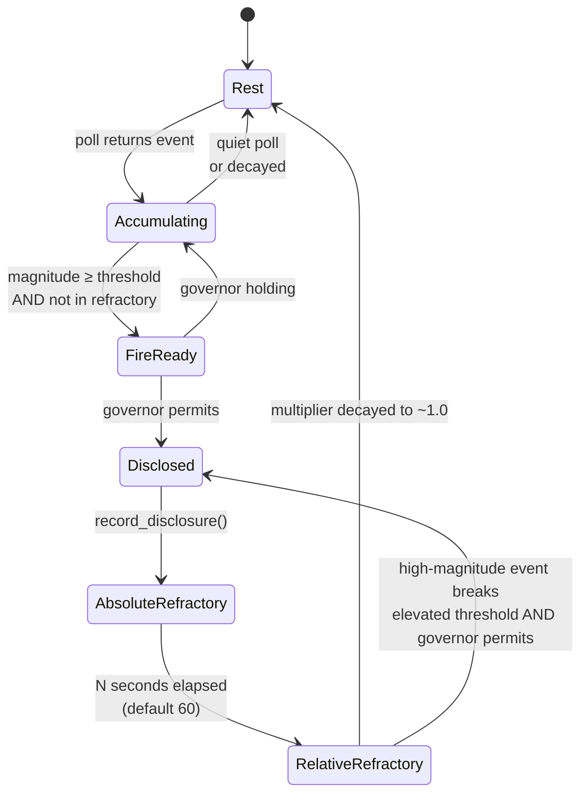

# Engagement — the action potential model

Attend's engagement model governs *when a sensor is allowed to fire a disclosure*. It's a per-sensor state machine inspired by the neuronal action potential: resting baseline, rapid rise on stimulus, refractory period after a burst, gradual return to rest. The biology gives us a predictable, well-studied shape for a phenomenon we actually care about — how productive engagement with a stimulus decays naturally over time.

This page covers the model in prose and diagrams, explains what each parameter does, and walks through how it interacts with the disclosure governor. The authoritative source is **ADR-119**; this page is the implementer-and-author-friendly explainer.

## The problem engagement solves

Without engagement, attend's disclosure logic is a flat threshold. A sensor observes something, accumulates magnitude, crosses the emission threshold, fires. Rinse and repeat. This produces the "party problem": an agent responding to a lively conversation has no built-in signal that the return on engagement is declining. It will keep responding at the same threshold indefinitely until the human intervenes or the context window runs out.

The action potential model adds **per-sensor memory of recent activity**. After a sensor has fired a burst of disclosures, its effective threshold *rises* for a while, then decays back to baseline. High-magnitude stimuli still break through. Low-magnitude follow-ups are silently suppressed. The sensor disengages from the fading topic on its own.

Said another way: refractory isn't silence, it's *raised bar*. Nothing is censored; thresholds are just temporarily harder to cross.

## The biological analogy

```
    Engagement
    (magnitude)
        ^
   +30  |        * peak
        |       / \
        |      /   \
        |     /     \
    0   |    /       \
        |   /         \
  -55   |--*           \          ← threshold (normal)
        | stimulus      \
        |                \_____________ ← elevated threshold
        |                               (relative refractory)
  -70   |.................\___*___........ ← resting potential
        |                 ^
        |                 └── absolute refractory
        +--------------------------------> time
```

- **Resting state**: sensor at baseline, polling on schedule, accumulating nothing. Threshold is whatever the author configured (default 1.5–2.5).
- **Stimulus**: an observation arrives. Magnitude accumulates. Below threshold, it's quiet. At or above threshold, the sensor becomes a disclosure candidate.
- **Depolarization / peak**: the sensor fires. Observations reach the agent.
- **Absolute refractory**: for ~60 seconds after the burst, nothing from this sensor fires, regardless of magnitude. The agent is processing what it just received; another signal would interfere.
- **Relative refractory**: for the next several minutes, the threshold is temporarily multiplied by an elevation factor. Routine events that would normally fire get silently accumulated. Only truly high-magnitude events break through.
- **Decay**: the elevation factor drifts back toward 1.0 over time, at the configured rate (default 0.1 per minute). After enough quiet time, the sensor is fully at rest again.

The biological action potential has an overshoot and hyperpolarization phase too, but attend's model is the simplified practical version: threshold rise + decay, no overshoot.

## Burst detection

A "burst" isn't a single firing — it's *N firings within a window*. Until the sensor fires enough times in a short enough period, no refractory kicks in. This preserves fast-reply behavior: two observations in quick succession both fire normally; the third (in the default config) triggers the elevated threshold.

Default values:

- `burst_window = 900s` (15 minutes)
- `burst_threshold = 3` (firings)
- `step_multiplier = 1.25` (per-firing threshold elevation past the burst threshold)

With these numbers, the first three firings in a 15-minute window are all "free." The fourth starts elevating the threshold. The fifth elevates more. By the time you've fired five in a window, the effective threshold is meaningfully higher than the baseline.

## Absolute vs relative refractory



**Absolute refractory** is a hard wall. For a configurable duration after any firing, the sensor cannot disclose at all — not even on a maximum-magnitude event. The default is 60 seconds, chosen to be roughly one Claude turn of complete silence. During this window, events still arrive and still accumulate, but none of them fire.

**Relative refractory** is a moving threshold. After the absolute window passes, the sensor's effective threshold is `base_threshold × elevation_factor`. The elevation factor decays over time at `decay_per_minute` (default 0.1). Events that would normally fire at, say, magnitude 2.0 now need magnitude 2.5 or 3.0 to break through, depending on how recently the burst happened. A high-magnitude event (your PR-review-requested signal, say) can still break through; a chatty low-magnitude follow-up will sit in the accumulator silently.

The result: natural disengagement on fading topics, preserved break-through for genuinely urgent new stimuli.

## Per-peer boost (sensor-peers specific)

One extension to the basic model lives inside `sensor-peers`: a **per-peer magnitude boost** that amplifies messages from agents the user has been actively conversing with. It's the engagement model applied at the level of individual conversation partners, not the sensor as a whole.

The rules:

- Track a sliding window (default 900 seconds = 15 minutes) of messages from each peer.
- The first message from a peer in that window gets magnitude × 1.0 (normal).
- The second message gets × 1.75 (participant emerging).
- The third and subsequent get × 2.5 (established conversation partner — reliably breaks through elevated refractory).

The effect: messages from a peer you've been going back and forth with climb above the refractory threshold, while broadcast noise from uninvolved peers stays at baseline and gets suppressed. **Auto-grouping emerges from the magnitude gradient** without any explicit group infrastructure — the conversation partners you care about naturally break through, and the unrelated chatter doesn't.

This is what ADR-119 calls "routing simplification from action potential." There's no need to manually scope peer messaging to a focus group for most cases, because the engagement boost handles the scoping dynamically.

## Tuning with `attend tune`

The default engagement parameters are sized for a typical Claude session, but they're derivable from real data. `attend tune` surveys recent sessions under `~/.claude/projects/` (the 10 most-recent active projects, 5 most-recent sessions each by default), computes percentiles on turn cycle durations (assistant → user, user → user), and proposes engagement parameters grounded in actual usage:

```
$ attend tune
[tune] surveying 18 sessions across 10 projects

=== attend tune — session survey ===
  projects surveyed:  10
  sessions parsed:    18
  turn samples:       544

  assistant → user (think time):
    median=24s  p75=62s  p90=164s
  user → user (full cycle):
    median=82s  p75=212s  p90=430s

=== derived engagement config ===
engagement:
  burst_window: 1289          # 430s p90 × 3 burst threshold
  burst_threshold: 3
  step_multiplier: 1.25
  absolute_refractory: 23     # median think time
  decay_per_minute: 0.0291    # peak decays over 2× burst_window
  peer_activity_window: 1289  # matches burst_window

(pass --apply to write these values to your attend config)
```

The output is not applied automatically — it's a recommendation. Review, tweak, then `attend tune --apply` writes the values to your user-scope config. This is a one-time calibration; re-run whenever your session patterns change significantly.

## Interaction with the disclosure governor

Engagement is a **per-sensor** gate. The disclosure governor is a **global** gate. Both must permit a firing for it to happen.

- **Sensor refractory says NO** → event accumulates silently. No disclosure fires.
- **Sensor refractory says YES, governor cooldown active** → sensor is "ready" but held. The loop logs `N sensors ready but governor holding`. When the cooldown rolls, accumulated sensors fire together.
- **Both say YES** → disclosure fires. Events are emitted as Monitor notifications, governor records the disclosure, engagement records the burst count.

The governor protects against *global flood* — too many sensors all trying to fire at once. Engagement protects against *per-sensor spam* — one sensor firing too frequently on declining-value stimuli. They're complementary.

## Design rules of thumb

When should you tune these parameters vs leave defaults?

- **Leave defaults unless you've run `attend tune`.** The defaults are reasonable for a typical dev workflow. Random tweaking is unlikely to improve things.
- **Shorter `burst_window` if your sessions are short.** If you mostly have 5-minute interactions, a 15-minute burst window is too long — it'll never kick in. Drop to 5 minutes.
- **Lower `burst_threshold` if you're getting spammed.** If a particular sensor is firing too often, lower the threshold to 2 so refractory kicks in faster.
- **Higher `step_multiplier` if refractory isn't strong enough.** If elevated threshold still lets chatty events through, raise the multiplier from 1.25 to 1.5.
- **Longer `absolute_refractory` if you need more silence.** 60 seconds is one Claude turn. If you want a full pause between bursts, raise it to 120–180.
- **Faster `decay_per_minute` if you want quick return to normal.** The default (0.1) takes ~12 minutes to fully relax. If you want 3-minute recovery, raise to 0.33.

All tuning is via attend config, using the ADR-115 overlay pattern — user scope, project scope, or both.

## Related

- **ADR-119** — the decision record for the action potential model
- [`loop.md`](loop.md) — where engagement state sits in the loop iteration
- [`authoring-sensors.md`](authoring-sensors.md) — how sensor authors design around engagement
- [`configuration.md`](configuration.md) *(planned)* — full config schema for engagement parameters
