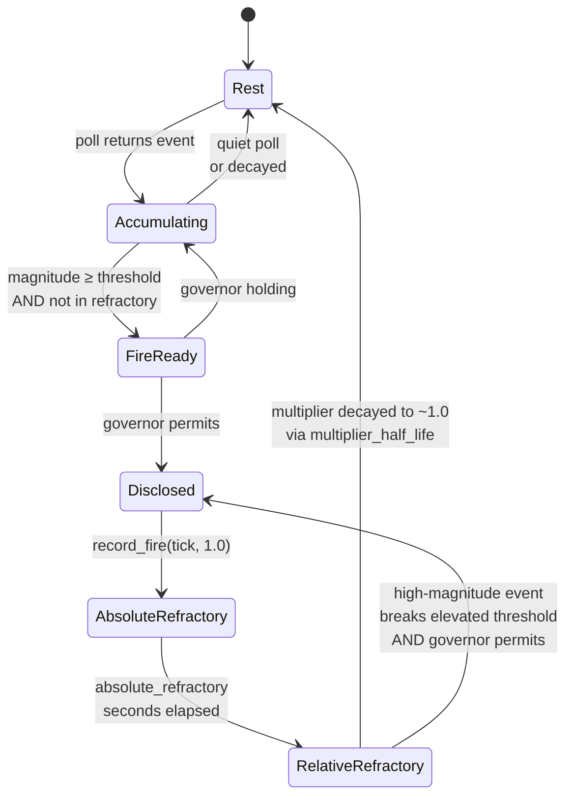

# Engagement — the action potential firing gate

Attend's engagement model governs *when a sensor is allowed to fire a disclosure*. It's a per-sensor state machine inspired by the neuronal action potential: resting baseline, rapid rise on stimulus, refractory period after a burst, gradual return to rest. The biology gives us a predictable, well-studied shape for a phenomenon we actually care about — how productive engagement with a stimulus decays naturally over time.

This page covers the model in prose and diagrams, explains what each parameter does, and walks through how it interacts with the disclosure governor. The canonical architecture is **[ADR-123](../architecture/system/ADR-123-firing-dynamics-progression-axis-unification.md)** — the progression-axis unification that moved the firing-dynamics core into a shared crate consumed by both attend and ways. This page is the attend-specific, implementer-and-author-friendly explainer for how attend instantiates that core.

## The problem engagement solves

Without engagement, attend's disclosure logic is a flat threshold. A sensor observes something, accumulates magnitude, crosses the emission threshold, fires. Rinse and repeat. This produces the "party problem": an agent responding to a lively conversation has no built-in signal that the return on engagement is declining. It will keep responding at the same threshold indefinitely until the human intervenes or the context window runs out.

The action potential model adds **per-sensor memory of recent activity**. After a sensor has fired a burst of disclosures, its effective threshold *rises* for a while, then decays back to baseline. High-magnitude stimuli still break through. Low-magnitude follow-ups are silently suppressed. The sensor disengages from the fading topic on its own.

Said another way: refractory isn't silence, it's *raised bar*. Nothing is censored; thresholds are just temporarily harder to cross.

## The biological analogy

```
    Engagement
    (magnitude)
        ^
   +30  |        * peak
        |       / \
        |      /   \
        |     /     \
    0   |    /       \
        |   /         \
  -55   |--*           \          ← threshold (normal)
        | stimulus      \
        |                \_____________ ← elevated threshold
        |                               (relative refractory)
  -70   |.................\___*___........ ← resting potential
        |                 ^
        |                 └── absolute refractory
        +--------------------------------> time
```

- **Resting state**: sensor at baseline, polling on schedule, accumulating nothing. Threshold is whatever the author configured (default 1.5–2.5).
- **Stimulus**: an observation arrives. Magnitude accumulates. Below threshold, it's quiet. At or above threshold, the sensor becomes a disclosure candidate.
- **Depolarization / peak**: the sensor fires. Observations reach the agent.
- **Absolute refractory**: for ~60 seconds after a burst, nothing from this sensor fires, regardless of magnitude. The agent is processing what it just received; another signal would interfere.
- **Relative refractory**: for the next several minutes, the threshold is temporarily multiplied by an elevation factor. Routine events that would normally fire get silently accumulated. Only truly high-magnitude events break through.
- **Decay**: the elevation factor decays exponentially back toward 1.0 over the configured half-life. After enough quiet time, the sensor is fully at rest again.

The biological action potential has an overshoot and hyperpolarization phase too, but attend's model is the simplified practical version: threshold rise + exponential decay, no overshoot.

## Progression axis: wall-clock seconds for attend

Attend's firing engine operates on an abstract monotonic **progression axis**. The engine does not know what a tick is — attend supplies one by convention. For attend, a tick is **one second of wall-clock time** (`sensor_trait::epoch_secs()`, which reads `SystemTime::now().duration_since(UNIX_EPOCH)`).

Why wall clock: attend steers external timing — peer conversations, build events, ambient awareness — which all live outside any single model's token space. Multiple attend instances may need to compare events across their own independent progressions, and wall clock is the only axis that's guaranteed common across all of them. This is the multi-observer case argued in [ADR-123 Decision 4](../architecture/system/ADR-123-firing-dynamics-progression-axis-unification.md#4-ways-tick-unit-host-addressing-not-a-decay-theory).

The consequence for attend authors: **all engagement parameters are in seconds**. `absolute_refractory: 60` means 60 wall-clock seconds. Half-lives are in wall-clock seconds. If you ever see a parameter expressed as a "tick count" in the code, interpret it as seconds for attend specifically.

## Curves as first-class

ADR-123 made the firing-dynamics shape a first-class parameter rather than a built-in assumption. The engine knows four curve variants — `Exponential`, `ActionPotential`, `ProgressiveStaircase`, `Flat` — and attend uses exactly one of them: **`Curve::ActionPotential`**. This page describes that variant. The other three are used elsewhere (ways is mostly `Exponential`); they don't appear in attend's runtime.

The `ActionPotential` curve has four parameters:

```rust
Curve::ActionPotential {
    burst_threshold: usize,             // fires in recent history to trigger a burst
    peak_multiplier: f64,               // refractory multiplier at burst peak
    absolute_refractory: TickDelta,     // hard-suppression window (seconds for attend)
    multiplier_half_life: TickDelta,    // exponential decay half-life for the multiplier
}
```

Everything attend used to express with `burst_window`, `step_multiplier`, and `decay_per_minute` now maps onto these four parameters at config-load time. The yaml field names stay the same for back-compat (see [`configuration.md`](configuration.md)), but attend converts them via:

- `peak_multiplier = 1.0 + step_multiplier` — the old "peak at exactly burst_threshold" value (2.25 at defaults) becomes a fixed ceiling rather than a growing scale.
- `multiplier_half_life = ln(0.5) / ln(1 - decay_per_minute) × 60` — converts the pre-ADR-123 per-minute linear-decay rate into an exponential half-life in seconds. At the default `decay_per_minute = 0.1`, the half-life is ≈ 395 s (≈ 6.6 min).
- `absolute_refractory` and `burst_threshold` pass through unchanged.
- `burst_window` is currently parsed from yaml but has no runtime effect. See "Event-count burst detection" below for why — the window is implicit.

## Event-count burst detection

The most visible difference between the pre-ADR-123 model and the current one is how "burst" is detected.

**Before ADR-123**, a burst was "N firings within a tick-span window." Attend counted firings that fell within the last `burst_window` seconds, and the third one triggered the elevated threshold. This works for fine-grained axes like wall-clock seconds, but it breaks completely for chunky axes like ways' token-position — a single Read tool call can advance the tick by 5k–20k in one step, swallowing any reasonable window.

**After ADR-123**, a burst is "N firings whose contribution to the multiplier hasn't decayed past an epsilon." The engine asks each history entry: is your exponential contribution under `multiplier_half_life` still above ~1%? If yes, you count toward burst detection. If no, you age out. The "burst window" is an emergent property of `multiplier_half_life`, not a standalone parameter.

For attend on wall-clock seconds, this makes essentially no practical difference — `multiplier_half_life` of 395 s produces an effective burst window of ~15 min (the point at which the contribution falls below epsilon), which is close to the old 900 s `burst_window` default. The unification lets ways and attend share the same engine without attend having to carry time-specific assumptions into a shared crate.

Defaults at config load:

- `burst_threshold = 3` — three fires in the live-event window triggers the refractory.
- `peak_multiplier = 2.25` — from `1.0 + step_multiplier=1.25`, the old "peak at exactly burst_threshold."
- `absolute_refractory = 60` seconds — one Claude turn of complete silence.
- `multiplier_half_life ≈ 395` seconds — derived from `decay_per_minute = 0.1`.

## Absolute vs relative refractory



**Absolute refractory** is a hard wall. For `absolute_refractory` seconds after any firing, the sensor cannot disclose at all — not even on a maximum-magnitude event. During this window the engine's `current_multiplier(tick)` returns `f64::INFINITY`, which `in_absolute_refractory(tick)` recognizes as "gate fully closed." Events still arrive and still accumulate, but none of them fire.

**Relative refractory** is an exponentially-decaying multiplier on top of the base threshold. After the absolute window passes, the sensor's effective threshold is `base_threshold × current_multiplier(tick)`. The multiplier starts at `peak_multiplier` (2.25 at defaults) immediately after the burst and decays as `1 + (peak - 1) × 0.5^(delta / multiplier_half_life)`. Events that would normally fire at magnitude 2.0 now need ~4.5 magnitude to break through immediately after a burst, falling to ~3.2 at one half-life, back to baseline over 4–5 half-lives.

The result: natural disengagement on fading topics, preserved break-through for genuinely urgent new stimuli.

## How attend calls the engine

Attend's `SensorSlot` owns an `EngagementState` from `sensor-trait`. The runtime queries are:

```rust
// During SensorSlot::poll()
let tick = sensor_trait::epoch_secs();
if slot.engagement.in_absolute_refractory(tick) {
    // hard-blocked — don't even accumulate filtered events
    return;
}
let multiplier = slot.engagement.current_multiplier(tick);
// elevated gate during relative refractory, rest-gate (0.0) otherwise

// At the batch-disclosure point in the main loop, after governor permits
slots[i].engagement.record_fire(tick, 1.0);
```

The `record_fire(tick, magnitude)` call replaces the pre-ADR-123 `record_disclosure()` — same moment in the flow, new API shape. Magnitude is `1.0` (unit-weight) for attend; the engine supports weighted fires for callers that want them, but attend's sensors all contribute equally to the burst count.

## Per-peer boost (sensor-peers specific)

One extension to the basic model lives inside `sensor-peers`: a **per-peer magnitude boost** that amplifies messages from agents the user has been actively conversing with. It's the engagement model applied at the level of individual conversation partners, not the sensor as a whole.

The rules:

- Track a sliding window (default 900 seconds = 15 minutes) of messages from each peer via `peer_activity_window`.
- The first message from a peer in that window gets magnitude × 1.0 (normal).
- The second message gets × 1.75 (participant emerging).
- The third and subsequent get × 2.5 (established conversation partner — reliably breaks through elevated refractory).

The effect: messages from a peer you've been going back and forth with climb above the refractory threshold, while broadcast noise from uninvolved peers stays at baseline and gets suppressed. **Auto-grouping emerges from the magnitude gradient** without any explicit group infrastructure — the conversation partners you care about naturally break through, and the unrelated chatter doesn't.

The peer window is the one place in attend's engagement config that is still explicitly a tick-span — sensor-peers implements its own sliding-window count rather than using the shared curve engine, because the boost is per-peer rather than per-sensor and doesn't fit the single-subject shape the curve engine is built around.

## Tuning with `attend tune`

The default engagement parameters are sized for a typical Claude session, but they're derivable from real data. `attend tune` surveys recent sessions under `~/.claude/projects/` (the 10 most-recent active projects, 5 most-recent sessions each by default), computes percentiles on turn cycle durations (assistant → user, user → user), and proposes engagement parameters grounded in actual usage:

```
$ attend tune
[tune] surveying 34 sessions across 10 projects

=== attend tune — session survey ===
  projects surveyed:  10
  sessions parsed:    34
  turn samples:       661

  assistant → user (think time):
    median=32s  p75=106s  p90=296s
  user → user (full cycle):
    median=78s  p75=210s  p90=489s

=== derived engagement config ===
engagement:
  burst_window: 1467          # 489s p90 × 3 burst threshold
  burst_threshold: 3
  step_multiplier: 1.25
  absolute_refractory: 31     # median think time
  decay_per_minute: 0.0256    # peak decays over 2× burst_window
  peer_activity_window: 1467  # matches burst_window

(pass --apply to write these values to your attend config)
```

The output is not applied automatically — it's a recommendation. Review, tweak, then `attend tune --apply` writes the values to your user-scope config. This is a one-time calibration; re-run whenever your session patterns change significantly.

Two notes on what tune emits after ADR-123:

1. **Yaml field names are stable**. Tune still writes `decay_per_minute` and `burst_window` because attend's config yaml keeps those keys for back-compat. At runtime, attend converts `decay_per_minute` to `multiplier_half_life` via `ln(0.5) / ln(1 - rate) × 60` and ignores `burst_window` (the engine derives the burst window implicitly from `multiplier_half_life`). If you hand-edit the config to `decay_per_minute: 0.0256`, the engine will translate it to `multiplier_half_life ≈ 1611` seconds (~27 min).
2. **Tune's underlying math is still linear**. Tune derives `decay_per_minute` from a linear assumption: "peak should relax to rest over 2 × burst_window minutes." When attend loads that value and converts to exponential half-life, the shapes differ — linear reaches rest at ~2× burst_window, exponential decays to ~25% of the excess at the same point and never quite reaches 1.0. In the load-bearing first few minutes post-burst the shapes are close; at the tail they diverge. If you need exact reproduction of the old linear shape, this is the friction point. Empirical calibration via a future `ways tune` style sweep will replace tune's heuristic with a direct half-life choice.

## Interaction with the disclosure governor

Engagement is a **per-sensor** gate. The disclosure governor is a **global** gate. Both must permit a firing for it to happen.

- **Sensor refractory says NO** → event accumulates silently. No disclosure fires.
- **Sensor refractory says YES, governor cooldown active** → sensor is "ready" but held. The loop logs `N sensors ready but governor holding`. When the cooldown rolls, accumulated sensors fire together.
- **Both say YES** → disclosure fires. Events are emitted as Monitor notifications, governor records the disclosure, engagement records the burst count via `record_fire(tick, 1.0)`.

The governor protects against *global flood* — too many sensors all trying to fire at once. Engagement protects against *per-sensor spam* — one sensor firing too frequently on declining-value stimuli. They're complementary.

## Design rules of thumb

When should you tune these parameters vs leave defaults?

- **Leave defaults unless you've run `attend tune`.** The defaults are reasonable for a typical dev workflow. Random tweaking is unlikely to improve things.
- **Lower `burst_threshold` if you're getting spammed.** If a particular sensor is firing too often, lower the threshold to 2 so refractory kicks in faster.
- **Higher `step_multiplier` if refractory isn't strong enough.** If elevated threshold still lets chatty events through, raise from 1.25 to 1.5 (which becomes `peak_multiplier = 2.5` at runtime).
- **Longer `absolute_refractory` if you need more silence.** 60 seconds is one Claude turn. If you want a full pause between bursts, raise it to 120–180.
- **Faster decay if you want quick return to normal.** Raising `decay_per_minute` from 0.1 to 0.33 lowers the half-life from ~395 s (~6.6 min) to ~103 s (~1.7 min). Equivalently, if you're hand-editing and think in half-lives, pick the half-life directly and solve the inverse.

All tuning is via attend config, using the ADR-115 overlay pattern — user scope, project scope, or both.

## Shared engine, cross-tool

The shift in this page's framing (vs earlier versions) is that engagement no longer exclusively belongs to attend. After ADR-123, the engagement state machine — `EngagementState` with a `Curve::ActionPotential` — is a shared crate (`sensor-trait::engagement`) consumed by both attend and ways. Attend uses it with wall-clock-seconds ticks and action-potential refractory. Ways uses the same engine with token-position ticks and `Curve::Exponential` outward-gate salience. Same math, different axis, different curve variant.

For the ways-side equivalent of this page see [ADR-123 Decision 4](../architecture/system/ADR-123-firing-dynamics-progression-axis-unification.md#4-ways-tick-unit-host-addressing-not-a-decay-theory) and the context-decay presentation-economics model in [`../hooks-and-ways/context-decay.md`](../hooks-and-ways/context-decay.md). The shared engine means any future improvement to burst detection, refractory decay, or curve shapes lands in one place and reaches both tools.

## Related

- **[ADR-123](../architecture/system/ADR-123-firing-dynamics-progression-axis-unification.md)** — the progression-axis unification and curve-as-parameter framing
- **ADR-119** — the original action potential model (pre-unification; superseded by ADR-123 for the math, preserved for the biology-analogy framing)
- [`loop.md`](loop.md) — where engagement state sits in the loop iteration
- [`authoring-sensors.md`](authoring-sensors.md) — how sensor authors design around engagement
- [`configuration.md`](configuration.md) — full config schema for engagement parameters
