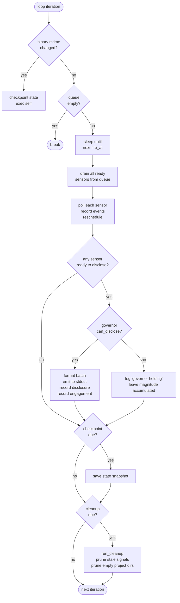
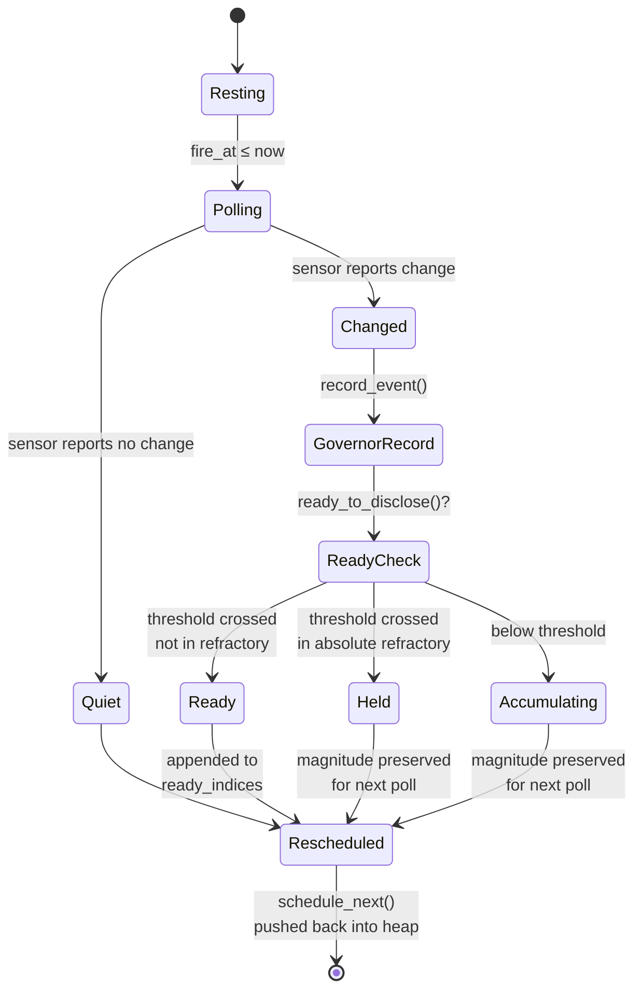
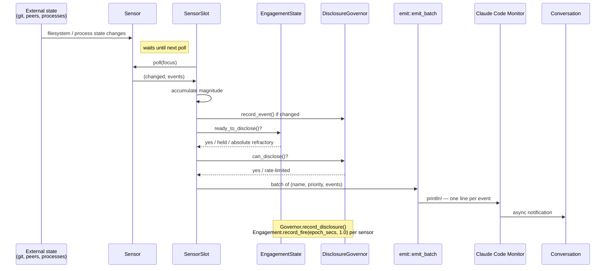

# The attend loop

Attend is a single long-lived process that runs a timer-driven sensor loop. It has no threads, no async runtime, no event subscriptions. Each iteration looks at a priority queue of upcoming sensor polls, sleeps until the next one is due, polls everything that's ready, decides whether to emit, and goes back to sleep.

This page covers the rhythm of one iteration, the phases a sensor passes through inside that iteration, and how observations leave attend and reach whoever is listening. It's the substrate document — every other page in this directory refers back to something here.

Two consumers ride on top of this loop: an AI agent session (via `attend run` delivering lines through Monitor) and a human operator (via `attend chat` rendering the same signals in an interactive TUI). The loop itself doesn't know or care which is connected — both drink from the same signal bus, and both are subject to the same engagement and governor rules. See [`tui.md`](tui.md) for the human mode.

## The rhythm

Attend's loop is **pull-based, not push-based**. Nothing wakes it up — it wakes itself up at timestamps it already knows about, does one unit of work, and goes back to sleep. The only external input is the filesystem: signal files other agents write, git state, process list, transcript changes. Sensors read these during their own scheduled polls.

The implication for latency: attend's response time to an external change is bounded by the polling interval of the sensor that watches the relevant thing, not by the loop's "tick rate" (which doesn't really exist). A peer message arrives on disk immediately, but the peer sensor won't see it until its next poll — `min_interval` 10 seconds by default.

The implication for cost: when nothing is happening, attend is asleep almost all the time. A quiet terminal with nothing changing is essentially free.

## Startup

Before the loop begins, `cmd_run_with_catchup` builds up the context it needs:

1. **Focus** — resolve the working directory and human-readable description (`Focus::default_focus()`).
2. **Config** — load `~/.config/attend/config.yaml`, then overlay `<cwd>/.claude/attend.yaml` on top (ADR-115 pattern).
3. **Groups manager** — construct a `Groups` handle for the signals base and the current session ID. This is what ADR-118 focus groups ride on.
4. **Sensor registration** — `sensors::register_sensors()` walks the config and feature flags, instantiating each enabled sensor with its configured intervals and thresholds. The peers sensor receives a closure provider for focus-group directories so it can refresh membership on every scan (ADR-118 / issue #15).
5. **Engagement state** — apply ADR-119 action-potential parameters to every slot. Refractory behavior is per-sensor but the parameters are shared.
6. **State restore** — if `~/.cache/attend/state/<session>.checkpoint` exists from a previous run, import the saved seen-signals and disclosed-thresholds so restart is continuous.
7. **Banner** — print a startup line unless the fingerprint (version + commit + sensor list + focus) matches the last one written to `_last_banner`, in which case print `[attend] restarted (unchanged)` to keep noisy Monitors quiet.
8. **Governor** — build a `DisclosureGovernor` with the configured cooldown, rate window, and max disclosures per window.
9. **Priority queue** — push every sensor slot into a `BinaryHeap<ScheduledSensor>` keyed by `fire_at`.
10. **Timers** — record startup `Instant`s for checkpoint, cleanup, and self-reload checks.

Then the loop begins.

## One iteration

The reload branch is a hard exit — `execve(2)` replaces the current process image with a fresh copy of the binary. State is checkpointed first, and the new process restores from that checkpoint during startup, so observed signals, engagement history, and disclosed context thresholds survive the reload.

The queue-empty branch is a defensive break. In practice it's unreachable because every poll reschedules the sensor, but a future sensor that explicitly retires could drop out of the queue.

## The sensor queue

`BinaryHeap<ScheduledSensor>` is a min-heap ordered by `fire_at` — the soonest-scheduled sensor is always at the top. The loop peeks it to find the next wakeup, sleeps precisely that long (no jitter, no coarse tick), then drains *every* sensor whose `fire_at` has passed.

Draining is important: if two sensors both came due during the sleep, they both poll in this iteration. This keeps the loop from falling behind during bursts.

After each poll, the sensor's `schedule_next()` computes its next `fire_at` based on whether it observed anything, the action-potential engagement state, and its `min_interval` floor. The updated entry gets pushed back into the heap.

Scheduling dynamics:

- **Quiet sensor**: interval grows toward `base_interval()`. Polls become less frequent.
- **Active sensor**: interval shrinks toward `min_interval()`. Polls become more frequent.
- **Refractory sensor**: interval still runs, but the effective threshold is elevated so polls that would normally cross threshold are suppressed. See `engagement.md` once it exists.

## One sensor's lifecycle within an iteration

Each drained sensor walks through a short state machine before control returns to the loop body:

**Quiet** is the happy path when nothing changed. The sensor's interval grows, its accumulator stays at zero, the loop logs nothing, and it sleeps until next fire.

**Changed but below threshold** means the sensor saw something but the magnitude isn't high enough to emit yet. The event is accumulated in the sensor's `DeltaAccumulator` and will be combined with future events if they arrive before the accumulator decays.

**Changed, above threshold, but held in absolute refractory** means ADR-119's action potential is actively suppressing this sensor after a recent burst. The magnitude stays on the accumulator but the sensor is not added to `ready_indices`. The log line `held in absolute refractory` marks this case.

**Ready** means the sensor crossed threshold and engagement state permits disclosure. The sensor index is appended to `ready_indices`, which the loop processes in a batch after draining.

## Disclosure and the governor

After all ready sensors are drained, the loop checks whether the `DisclosureGovernor` permits output. The governor enforces two limits:

- **Base cooldown** — minimum seconds between disclosures (default 15s).
- **Rate window** — max disclosures per rolling window (default 3 per 120s).

If both pass, the loop builds a batch:

1. For each ready sensor, compute a priority (`high` / `medium` / `low`) based on accumulated magnitude.
2. Drain the sensor's events into a list of observations.
3. Append `(sensor_name, priority, observations)` to the batch.
4. Hand the batch to `emit::emit_batch()` which formats each event as a single Monitor-visible line.

Each emitted event is a single `println!` to stdout. Monitor captures each line and delivers it to the conversation as an async notification. **One event = one notification line.** This is the reason peer messages have a practical ~400 character ceiling — longer payloads get truncated by Monitor's per-line buffer. See `skills/attend/SKILL.md` for the operator-facing note.

After emission, the loop records a disclosure on the governor and records engagement for every sensor whose magnitude was actually actionable (≥ 3.0). Quiet filler events don't count toward engagement, so refractory only escalates when real bursts happen.

If the governor rejects the batch, the magnitudes stay on the accumulators and the loop logs `N sensors ready but governor holding (X/Y in window)`. The next time the governor window rolls, those accumulated events will fire together.

## Signal flow end-to-end

This is the one-way data flow. Signals enter via sensors (reading the environment) and leave via stdout (intercepted by Monitor). Nothing in attend's runtime is event-driven — every transition is a poll that happened to find something new.

## Timers running in parallel

All of these tick inside the same single-threaded loop using `Instant::now()` comparisons against stored last-time values:

| Timer | Interval | Purpose |
|---|---|---|
| Per-sensor poll | `slot.next_fire` (varies) | Primary loop rhythm — when to poll each sensor |
| Self-reload check | 10s | Detect binary change, exec self |
| Checkpoint | 30s | Save sensor state snapshot for restart continuity |
| Cleanup sweep | `cleanup.interval` (default 600s) | Prune stale signal files + empty project dirs |
| Sensor min_interval | per-sensor (default 10–20s) | Floor on polling frequency |
| Sensor base_interval | per-sensor (default 30–60s) | Ceiling — rest-state polling frequency |
| Governor cooldown | `governor.base_cooldown` (default 15s) | Minimum gap between disclosures |
| Governor rate window | `governor.rate_window` (default 120s) | Rolling window for disclosure rate limit |
| Absolute refractory | `engagement.absolute_refractory` (default 60s) | Full suppression after burst — the `Curve::ActionPotential` hard gate |
| Multiplier half-life | derived from `engagement.decay_per_minute` (default 0.1 → ~395s) | Exponential half-life of the relative-refractory multiplier's decay back toward 1.0 (ADR-123) |

Attend's engagement parameters are all in wall-clock seconds because attend's progression axis is `sensor_trait::epoch_secs()`. The `burst_window` yaml field is still parsed for back-compat but is no longer a runtime parameter — under ADR-123 the burst window is implicit in the multiplier's half-life decay rather than a standalone span. See [`engagement.md`](engagement.md#event-count-burst-detection) for the full reframing.

The loop doesn't coordinate these timers explicitly — each is a separate "has enough time passed since the last time we did this?" check at the natural point in the iteration. The loop body walks through them in a fixed order so behavior is deterministic.

## Loop termination

Three ways the loop ends:

1. **`execve` via self-reload.** The current process image is replaced and control never returns to the loop. State is checkpointed first so the replacement process restores cleanly.
2. **Queue empty.** Defensive `break` — currently unreachable because every poll reschedules the sensor, but a future explicit-retire mechanism could drop out.
3. **External signal (SIGTERM, etc).** Default handling — the process exits. The most recent checkpoint is the restore point; any accumulated-but-not-disclosed magnitude since then is lost. This is acceptable because accumulation is ephemeral by design.

There's no graceful shutdown hook. The `attend run` process is meant to be started via Monitor, live as long as the session lives, and die when the session ends. The checkpoint timer is aggressive enough (30s) that losing <30s of accumulation is the worst case.

## Where to go from here

- **Writing new sensors**: [`authoring-sensors.md`](authoring-sensors.md) — how to implement a crate sensor or external script sensor that plays nicely with this loop.
- **Human mode**: [`tui.md`](tui.md) — the `attend chat` interactive TUI, same signal bus as the agent side.
- **Sensors individually**: `sensors.md` covers what each built-in observes and how it emits.
- **Engagement curve**: `engagement.md` covers the action potential model — why sensors go quiet after bursts.
- **Signal format**: `signals.md` covers the wire format, on-disk layout, and lifecycle.
- **Configuration**: `configuration.md` covers the YAML overlay and how to reshape any of the timers above.
- **Salience decay**: `salience.md` covers ADR-121's presentation-layer aging — orthogonal to this loop, sitting in the emit path.
