# Signals — wire format, storage, lifecycle

Signals are attend's on-disk messaging primitive — the transport underneath its workspace awareness. Everything that flows between sessions — peer messages sent with `attend send`, notifications rendered into the conversation via Monitor, human-typed lines in `attend chat` — is mediated by signal files on the local filesystem. This page covers the wire format, how signals are organized on disk, and the full lifecycle from arrival to deletion.

## The wire format

Every signal is a single-line, pipe-delimited record in a `.signal` file:

```
from|project|cwd|message
```

With threading extensions (when the `re:` field is present, per ADR-120):

```
from|project|cwd|re:signal-id|message
```

**Field-by-field:**

- **`from`** — identifier of the sender, in the form `<kind>:<identity>`. Kinds seen in practice:
  - `claude:<session-id>` — a Claude Code session, identified by its 36-char session UUID
  - `external:<user>@<terminal>` — a human sending via `attend chat` or `attend send` from a terminal
  - Future kinds (e.g., `script:<name>` for automated ops) follow the same pattern
- **`project`** — human-readable project name (e.g., `api-service`, `bosectl-qt`). Used in display formatting, not routing.
- **`cwd`** — absolute path of the sender's current working directory. This is the ground truth for "who am I" — signals scope to encoded-cwd directories, so cwd determines where a signal goes and where it comes from.
- **`re:signal-id`** — optional threading field. Present only when the sender explicitly marked this signal as a threaded reply (via `attend send --re <id>`); unthreaded sends emit the 4-field legacy form unchanged. One level of threading only — no reply-to-reply. The signal ID is the original signal's filename stem and must match `[A-Za-z0-9_-]+`; that char class is also the parser's discriminator fence, so legacy prose that happens to start with "re:" (e.g., a reply quoting an email header) round-trips as a plain message.
- **`message`** — the payload. Free text, usually the actual content the sender wants the receiver to see.

Fields are pipe-delimited with no escaping. If your message contains a literal `|`, you need to escape it yourself at emit time — in practice this almost never happens because peer messages are prose.

**Encoding and length.** UTF-8. Monitor's per-line buffer is the practical length limit for messages — see [`skills/attend/SKILL.md`](../../skills/attend/SKILL.md) for the ~400 character ceiling note. Longer messages aren't truncated on disk, only in the Monitor notification line — recipients can always read the full file via `attend inbox <id>`.

## Storage layout

Signal files live under `~/.cache/attend/signals/` in a flat two-level hierarchy:

```
~/.cache/attend/signals/
├── _broadcast/                               # broadcast scope
│   ├── claude-abc123-1743280000.signal
│   └── aaron-1743280042.signal
├── _groups.yaml                              # focus group state (ADR-118)
├── _last_banner                              # startup banner fingerprint dedup
├── @deploy/                                  # named focus group
│   └── claude-abc123-1743280100.signal
├── @infra/                                   # another focus group
│   └── aaron-1743280200.signal
├── -home-aaron-Projects-api-service/         # encoded cwd (project scope)
│   ├── claude-def456-1743280000.signal
│   └── claude-abc123-1743280050.signal
├── -home-aaron-Projects-infra/               # another project scope
│   └── ...
└── -home-aaron--claude/                      # the agent-ways project itself
    └── ...
```

Three kinds of subdirectories:

1. **`_broadcast/`** — the reserved broadcast dir. Every agent with attend running sees signals here regardless of their project or focus group membership.
2. **`@<name>/`** — focus group directories (ADR-118). Only sessions that have joined that group (via `attend focus on <name>`) receive signals from here.
3. **`-<encoded-cwd>/`** — project-scope directories. The cwd encoding replaces `/`, `_`, and `.` with `-` to produce a filesystem-safe name. A session working in `/home/aaron/Projects/api-service` writes to and reads from `-home-aaron-Projects-api-service/`.

**Reserved names:**

- Anything starting with `_` (e.g., `_broadcast`, `_groups.yaml`, `_last_banner`) is a system file or dir. Never touched by cleanup, never interpreted as a project dir.
- Anything starting with `@` is a focus group dir. Managed by `attend focus` commands, self-cleaning on leave/dissolve.

## Filename convention

Signal filenames are `<sender-id>-<timestamp>.signal`:

```
claude-abc123-1743280000.signal
aaron-1743280042.signal
```

- **`<sender-id>`** — for claude sessions, the session UUID (sometimes truncated); for humans, a simple username
- **`<timestamp>`** — Unix seconds at emit time
- **`.signal`** — the file extension. Cleanup and scan paths only touch `.signal` files; anything else in a signal directory is left alone.

Filenames are sortable by timestamp when the sender ID is consistent — useful for chronological ordering within a single sender's history, though the TUI and `attend inbox` use the file's mtime for the authoritative order across senders.

## Atomic writes

Signals are written atomically via the classic write-then-rename pattern:

1. Writer creates `<filename>.tmp` with the content
2. Writer renames `<filename>.tmp` → `<filename>` (atomic on any POSIX filesystem)

Readers that see `<filename>` are guaranteed to read complete, consistent content. Readers ignore `.tmp` files. This prevents a reader from catching a half-written signal mid-disk-flush.

`_groups.yaml` uses the same pattern (this was the fix for issue #16 — before, it was written with a plain `fs::write` and concurrent writers could corrupt it). Any tool or sensor that writes to the signals base should follow this pattern.

## The full lifecycle

A signal's journey from creation to deletion:

```mermaid
flowchart LR
    Create[attend send<br/>or sensor emit]
    Write[write .tmp<br/>rename to .signal]
    Scan[peer sensor scans<br/>reads new files]
    Present[present to agent<br/>via Monitor]
    Age[age with turns<br/>ADR-121 salience decay]
    Below[below presentation floor<br/>no longer shown]
    Cleanup[auto-cleanup sweep<br/>every 10 min]
    Delete[file removed<br/>after 30 days]

    Create --> Write
    Write --> Scan
    Scan --> Present
    Present --> Age
    Age --> Below
    Age -->|re-engaged| Present
    Below --> Cleanup
    Cleanup --> Delete
```



**Phase 1 — creation.** The sender (an agent via `attend send`, a sensor via an internal emit path, or a human via `attend chat`) constructs the `from|project|cwd|message` line — or `from|project|cwd|re:signal-id|message` if `--re <signal-id>` was passed to mark the send as a threaded reply — and writes it atomically to the right scope directory. Routing flags pick the directory: `--broadcast` → `_broadcast/`, `--focus <name>` → `@<name>/`, `--to <path>` → the encoded path, no flags → the sender's own project scope. The threading flag composes with any routing flag.

**Phase 2 — scanning.** Every peer sensor poll (default 30 seconds), `sensor-peers` walks its scan directories: own project scope, `_broadcast`, every `@group` the session has joined (refreshed per-poll since issue #15). New `.signal` files (not in the seen-set) are read and parsed into observations.

**Phase 3 — presentation.** Observations become events in the peer sensor's accumulator, feed into engagement/governor, and if they survive all the gates, emit as Monitor notification lines into the conversation. The agent sees them; the human (if running `attend chat`) sees them in the TUI.

**Phase 4 — salience decay (ADR-121, drafted).** Once presented, a signal carries a salience that decays over turns. After its salience drops below the presentation floor, the signal stops appearing in notifications — but the file stays on disk. Re-engagement (a reply or reference) resets salience to 1.0 and the signal is visible again.

**Phase 5 — auto-cleanup.** Every `cleanup.interval` seconds (default 10 minutes), the attend loop runs a sweep of the signals base. Any `.signal` file older than `cleanup.retention` (default 30 days) is removed. Empty project subdirs left behind after the file removal are also cleaned up.

**Phase 6 — manual cleanup.** The operator can also run `attend cleanup` at any time to force an immediate sweep. Flags:

- `--older-than <dur>` — override the retention cutoff (e.g., `5m`, `1h`, `1d`, `30d`)
- `--dry-run` / `-n` — list what would be removed without deleting
- `--all` — remove every signal regardless of age (nuclear option)

## Two TTLs: disk vs attention

Signals have **two different retention windows** that operate at different scales for different purposes:

| | Disk retention | Attention window |
|---|---|---|
| **Unit** | Time (30 days) | Turns (half-life 20, per ADR-121) |
| **Purpose** | Bulk storage hygiene | Presentation relevance |
| **Controlled by** | `cleanup.retention` config | `attention.half_life` (planned) |
| **Observable in** | Disk usage | Which signals Monitor notifies about |
| **Resets on** | Nothing; strict cutoff | Re-engagement — reply or reference |

The short answer on why two units: **precision where it matters, convenience where it doesn't.** Attention works in turns because turn pacing varies too much to use wall-clock time at fine grain. Disk retention works in time because at 30-day horizons the variance averages out and "30 days" is a human-readable unit everyone intuits.

See [`salience.md`](salience.md) for the attention side and the ADR-121 decay curve math.

## Reading signals in tooling

The signal directory layout is stable and designed to be read by external tools. If you're building something that wants to observe what's flowing through the signal bus, the conventions are:

- Only read `*.signal` files. Everything else is reserved or transient.
- Parse the pipe-delimited format. The `re:` field is optional; handle its presence or absence.
- Respect the mtime ordering — creation timestamps in filenames aren't always the same as the file's effective age after atomic rename.
- Don't delete files you didn't write. Auto-cleanup handles retention.

Reading from `_broadcast/` gives you cross-agent visibility. Reading from `@<name>/` gives you a focus-group tap. Reading from an encoded cwd gives you per-project history.

## Related

- **ADR-113** — the original attend design, including signal dir conventions
- **ADR-118** — focus groups, `@<name>` directories
- **ADR-120** — `attend chat`, the `re:` threading field
- **ADR-121** — salience decay on the presentation side
- [`loop.md`](loop.md) — where signals are scanned and emitted in the loop
- [`tui.md`](tui.md) — how the TUI reads and writes signals
- [`focus-groups.md`](focus-groups.md) *(planned)* — `@<name>` dir management in detail
- [`salience.md`](salience.md) *(planned)* — presentation-layer aging
