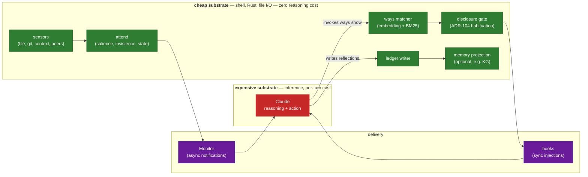
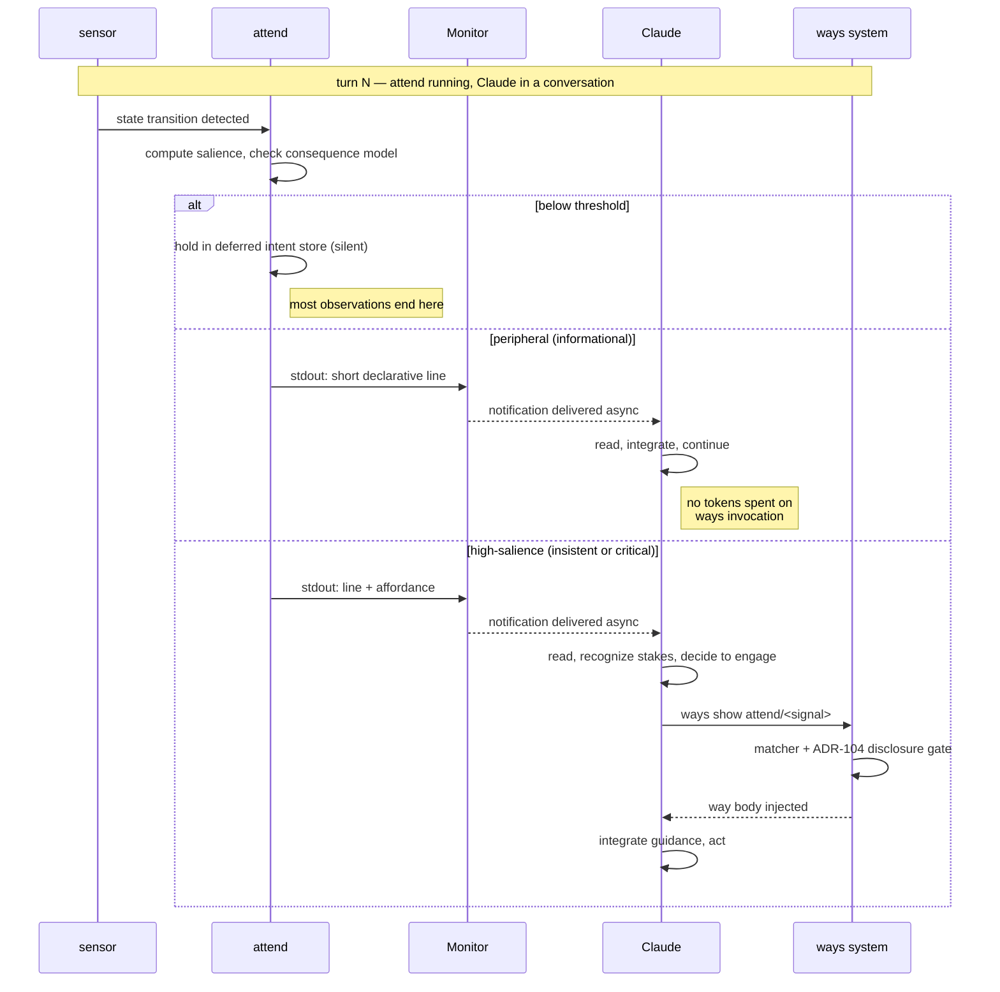
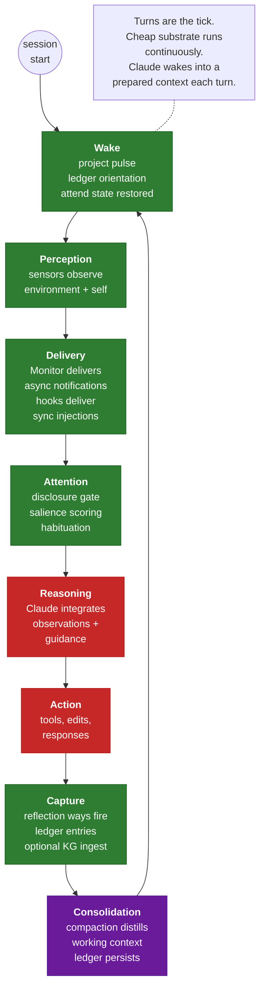

# The cognitive loop: how agent-ways works

This document is a walk-through of the agent-ways cognitive architecture. It assumes you know what Claude Code is and nothing beyond that. It is the document to read when you want to understand how the pieces fit together — ways, progressive disclosure, the session ledger, optional memory projections, and the awareness layer — without diving into the individual ADRs.

If you want to decide a specific tradeoff, read an ADR. If you want the theoretical framing, read the [cognitive loop and awareness layer design note](design-notes/cognitive-loop-and-awareness-layer.md). If you want to build a way, read the [hooks-and-ways guide](hooks-and-ways/README.md). This document sits one level above all of those: it tells the story of how the system composes.

## The problem this system addresses

Long collaborations with Claude degrade silently. Not because Claude forgets — it doesn't have memory to forget — but because context fills, attention drifts, and the model that worked at the start of a session stops working later without anyone noticing. The specific failure modes:

- **Guidance dilution.** You told Claude important things early in the session, but forty turns later they're buried under task-specific details.
- **Context pressure.** Compaction happens at the worst possible moment, in the middle of a thought.
- **Cross-session amnesia.** Lessons learned yesterday are invisible today.
- **Interaction friction.** You have to re-brief Claude on context Claude could have observed for itself.
- **Silent drift.** Claude works on something tangentially related to the goal without anyone noticing until the drift is large.

agent-ways is the composition of mechanisms that address these failures together. No single mechanism solves any of them; the system works because the pieces cover each other's blind spots.

## The governing principle: substrate separation

The most important thing to understand is that agent-ways treats Claude's reasoning capacity as **the expensive substrate**, and everything else as **cheap substrates**. Deterministic computation runs in shell scripts, compiled binaries, file I/O, and tool invocations. Reasoning runs in inference. The design principle is:

> *Do the cheap work in a cheap substrate so the expensive substrate can think about things that matter.*

This pattern runs through every layer of the system:

- **Way scoring** is a compiled Rust binary doing embedding math. Claude never decides which ways are relevant; a tiny program does it before Claude sees anything.
- **Ledger writing** is shell extracting prose from a transcript and appending to a file. Claude doesn't "save" anything manually.
- **KG ingestion** (when configured) is a file copy into a FUSE mount. No inference is invoked to decide what's worth ingesting.
- **Sensor observation** (the awareness layer) is a background script emitting stdout lines when state transitions are worth surfacing. The heavy lifting of turning raw events into discrete observations happens entirely below Claude's token budget.

Most of what happens in an agent-ways session is happening in cheap substrates. Claude only pays tokens for what requires reasoning, and the cheap substrates prepare the ground so that reasoning is aimed at real problems instead of housekeeping.

The visual shape of this separation:



Almost every box on the left runs in a substrate that costs nothing to operate. Claude occupies one box on the right. That ratio is the whole design.

## Ways for steering

[Ways](hooks-and-ways/README.md) are the reactive guidance layer. A way is a markdown file with YAML frontmatter and a prose body. The frontmatter declares when the way should fire (on a user prompt pattern, on a tool call, on a session event, on a context threshold), and the body is the guidance Claude reads when the way fires.

Ways are triggered by **hook events** that Claude Code emits on its own loop: `UserPromptSubmit`, `PreToolUse`, `Stop`, `SessionStart`, `PostCompact`, and `context-threshold`. A hook fires, a shell script runs, the script asks the `ways` binary which ways match the current context, and matched way bodies are injected into Claude's next turn as additional context.

Ways are **premises, not rules**. They give Claude *reasoning to work from*, not instructions to follow. The distinction matters because rules scale poorly — a rule that says "always X" becomes a rule you have to remember and a rule Claude has to apply even when X doesn't make sense. A premise says "here's what you should know to reason well about this situation," and Claude's reasoning does the rest. Premises compose because reasoning composes; rules don't, because rules collide.

A typical way looks like:

```yaml
---
name: commit-message-format
description: Guide Claude in writing commit messages when invoking git commit
trigger:
  type: PreToolUse
  commands: git commit
embed_threshold: 0.55
---

When writing a commit message:

- Lead with the why, not the what (the diff shows the what)
- First line under 70 characters
- Separate subject from body with a blank line
- Use imperative mood ("Add feature" not "Added feature")
```

When Claude is about to run `git commit`, the `PreToolUse` hook fires, the matcher finds this way, and the body is injected into Claude's context right before the tool call. Claude reads the premises, writes a good message, runs the commit. No one had to encode rules; the way provided the reasoning.

See [hooks-and-ways/rationale.md](hooks-and-ways/rationale.md) for the why, [hooks-and-ways/matching.md](hooks-and-ways/matching.md) for how triggers are chosen, and [architecture.md](architecture.md) for the visual documentation of the hook flow.

## Progressive disclosure: why you don't dump

The naive approach would be: at session start, inject every way that's possibly relevant. That fails for three reasons.

1. **Token budget.** Hundreds of ways times hundreds of tokens each would consume most of the context window before any work started.
2. **Attention dilution.** Claude reads what's nearest the current conversation most carefully. Guidance injected at startup becomes guidance buried under forty turns of later content. See [hooks-and-ways/context-decay.md](hooks-and-ways/context-decay.md) for the formal model.
3. **Habituation.** If every way fires on every possible trigger, Claude's context becomes a soup of guidance that doesn't map to what's happening right now.

**Progressive disclosure** ([ADR-105](architecture/system/ADR-105-progressive-disclosure-for-way-trees.md)) and **token-gated re-disclosure** ([ADR-104](architecture/system/ADR-104-token-gated-way-re-disclosure-for-long-context-windows.md)) address this together. The rules:

- Ways only fire when their triggers match the current situation, never speculatively
- Once a way has fired, it is marked as "disclosed" and will not fire again until its re-disclosure cooldown expires
- The cooldown is measured in *tokens of context consumed since the disclosure* — not wall-clock, not turns, tokens
- When the cooldown has passed and the trigger fires again, the way re-surfaces fresh

This is *habituation* in the biological sense. The first mention of something is fully attended to. Repeated mentions become background. If the signal disappears for long enough and returns, it becomes fresh again. Claude's attention budget is managed by the cheap substrate (the disclosure gate) so that Claude's reasoning gets each signal at the right level of prominence.

The mental model: **ways are a rate-limited stream of premises**. Claude does not read them all at once; Claude reads them as the situation calls for them, with the understanding that anything already disclosed is still in context unless compaction has happened.

## Memory across sessions: ledger and optional projections

Ways handle the *current* session. Memory handles what persists across sessions.

The **session ledger** ([ADR-112](architecture/system/ADR-112-session-ledger-and-knowledge-graph-integration.md) Tier 1) is a durable, chronological stream of epoch reflections. An epoch is a window of work between context-threshold boundaries: at roughly 30% context, Claude writes what it's orienting toward; at 50%, what has changed; at 70%, what has consolidated; at pre-compaction, a handoff note. The reflection way fires at these thresholds and Claude writes a short prose reflection. The Stop hook captures the prose and appends it to the ledger as one entry.

The ledger is **what was understood**, not **what was observed**. Entries are small, hand-curated, high-signal. One ledger per project; sessions contribute to the same chronological stream. When a new session starts, the ledger is the project's history — Claude reads recent entries to orient, and the ledger represents lived experience of the project across all sessions.

**Memory projections** (ADR-112 Tier 2, optional) are a second layer built on top of the ledger. The most developed example is knowledge-graph ingestion: ledger entries are copied via FUSE mount into a KG, which extracts concepts, deduplicates them against prior sessions, and builds associative structure. When a later session enters a new domain, the KG can surface concepts Claude learned in an earlier session that are relevant to the current work.

Memory projections are **configurable and never required**. The KG is one example; a user could attach a different memory tool with the same general shape, or none at all. The system is memory-tool-agnostic: it works with whatever projection (or none) is configured, and the ledger is the stable foundation underneath.

The **forgetting principle** is the critical counterpart. Most of what passes through a session is not worth keeping. Reflection captures what was reasoned about; everything else evaporates when the session ends. This keeps the ledger a journal rather than a log. The gate is: *did Claude actually reason about this?* If yes, eligible for ledger. If no, it dies with the session.

## Active perception: the awareness layer

The pieces described so far are *reactive*: they respond to things Claude is doing. Ways fire on hook events. The ledger is written during reflection. Memory is read at session start. All of this happens on Claude's own timeline — tied to events inside Claude's loop.

But some things happen *outside* Claude's loop. A background build finishes. A peer Claude Code session modifies a file Claude is editing. Context pressure approaches a critical threshold five turns from now. These are events Claude cannot observe without burning reasoning tokens to check, and that the hook system cannot surface because they do not correspond to Claude's own actions.

The **awareness layer** ([ADR-113](architecture/system/ADR-113-attend-active-awareness-module.md), [ADR-114](architecture/system/ADR-114-attend-as-insistent-way-trigger-type.md)) closes this gap. It has two components:

1. **`attend`** — a background Rust binary that observes Claude's session state and environment via small sensor scripts, tracks approaching mechanical consequences using turn-based arithmetic, and emits single-line observations when something is worth surfacing.
2. **`Monitor`** — Claude Code's async-notification tool that delivers background-script stdout as notifications in Claude's chat.

Claude invokes `Monitor` with `attend` as the command at session start. `attend` runs for the session's lifetime, writing observations to stdout as they become worth emitting. Each line becomes a notification Claude reads asynchronously between turns. When the session ends, `Monitor` terminates `attend`, which flushes state to disk so the next session can restore it.

The awareness layer honors substrate separation rigorously:

- **Sensors operate below the token layer.** A file-compare sensor hashes current state, compares to prior, and emits only if the state changed. 99.9% of the time it emits nothing. Only transitions become tokens.
- **Salience is computed in shell.** The insistence engine is turn-delta arithmetic: given `(disclosed_at_turn, current_turn, context_growth_rate, critical_threshold)`, compute the projected critical turn. No reasoning required.
- **Emissions are informational, not emotional.** The format is declarative: *"disclosed at turn 47, currently turn 52, projected critical at turn 58."* No simulated urgency, no arbitrary escalation — just honest communication of stakes and timing.

Two delivery paths compose cleanly:

- **`Monitor` notification only** — default for most observations. Claude reads the one-line note, integrates it, acts or dismisses. No ways involvement.
- **`Monitor` notification + affordance → `ways show attend/<signal>`** — for high-salience observations. `attend` formats the notification with an explicit `ways show` command Claude can invoke if deeper guidance is warranted. If Claude invokes it, the ways system runs the matcher and disclosure gate normally and injects the matched way body.

Claude retains agency at every step. `attend` suggests; Claude decides. The awareness layer informs, never overrides.

The signal flow through the awareness layer looks like this:



The three alternative branches — silent, peripheral, high-salience-with-affordance — are what makes the awareness layer honest about its cost. The overwhelming majority of sensor events fall into the first branch and cost nothing. Some become one-line peripheral notifications. Only a small minority of genuinely important events pay the full cost of a ways invocation.

## The composed loop

Put the pieces together and you get a full cognitive loop running at turn cadence:



Stage by stage:

- **Wake.** A new session begins. Project pulse surfaces recent ledger entries to orient Claude. `attend` is invoked via `Monitor` at session start and restores its prior state from disk. Claude reads the orientation context and begins working.
- **Perception.** `attend` runs its sensors in the background, watching Claude's context state, workspace files, peer sessions, and approaching consequences. Most observations are silent; only state transitions worth surfacing reach stdout.
- **Delivery.** Two paths operate in parallel. `Monitor` delivers `attend`'s stdout lines as asynchronous notifications. Hooks deliver synchronous way injections at event boundaries (`UserPromptSubmit`, `PreToolUse`, etc.). Both paths land on Claude's attention surface.
- **Attention.** The disclosure gate ([ADR-104](architecture/system/ADR-104-token-gated-way-re-disclosure-for-long-context-windows.md)) applies habituation rules. Recently-disclosed ways are suppressed or re-surfaced tersely. Fresh signals get full weight. The cheap substrate decides what reaches Claude's reasoning in what form.
- **Reasoning.** Claude integrates observations and guidance into its working model and decides what to do.
- **Action.** Claude acts — edits files, runs tools, responds to the user.
- **Capture.** At context-threshold boundaries, the reflection way fires. Claude writes a short prose reflection. The Stop hook captures it and appends to the ledger. If a memory projection is configured, the entry is also handed off to it.
- **Consolidation.** When context fills, compaction distills the working window. The ledger, memory projections, and `attend`'s state survive the pass. The next turn begins with a compressed but coherent working context.
- **Back to Wake.** At the next session, the loop restarts with the updated state as its foundation.

The loop is **turn-driven, not time-driven**. Each Claude turn is a tick. Between turns, the cheap substrate (sensors, scripts, ledger state) keeps running. When the next turn arrives, Claude wakes into a richer context than the turn before — not because time passed, but because observations accumulated and were filtered by the cheap substrates into summary form.

Every stage of the loop has an appropriate substrate. Only the Reasoning and Action stages use inference. Everything else runs in deterministic code: shell scripts, a Rust binary, file I/O, tool invocations. This is what makes the whole system affordable to run continuously for a full workday — the cost is bounded by what Claude actually reasons about, not by what the system observes.

## What this isn't

Worth naming explicitly, because the architecture can be misread if these aren't said out loud:

- **Not consciousness.** The substrate is text replay through an inference model. The composition is novel; the substrate is not. agent-ways does not claim or produce sentience. Any language about "presence" or "continuity" in the design note refers to structural properties of the composition, not metaphysical claims about the substrate.
- **Not surveillance.** The awareness layer's scope of observation never exceeds the session that owns it. All observations are local. Sensors emit metadata, not content (a presence sensor might emit "user at desk," never a camera frame). The person observed and the person the observations serve are the same person — mirror, not camera.
- **Not required.** `attend` is opt-in. Ways with `trigger.type: attend` are dormant when `attend` is not running. The baseline Claude Code experience is unchanged if you do not install the awareness layer. `ways` itself is additive too — Claude Code works without it. agent-ways is a composition you can opt into at whatever depth makes sense for your workflow.
- **Not C2.** Despite superficial resemblance to command-and-control patterns, the architecture points *inward*, not outward. One session, one user, one machine. No inter-instance protocols. No central servers. [ADR-101](architecture/system/ADR-101-wormhole-relay-protocol-for-cross-instance-agent-communication.md) and [ADR-102](architecture/system/ADR-102-irc-based-local-agent-communication.md) tried outward-facing designs and were abandoned for good reasons; the awareness layer points the other direction.
- **Not automatic guidance injection at the awareness layer.** Even at critical salience, `attend` does not inject ways directly. It suggests affordances; Claude decides whether to invoke them. The "Claude retains agency" invariant is load-bearing.

## Where to dig deeper

Ordered roughly by how specific the topic is to your interest:

**If you want the theoretical framing:**
- [Design note: cognitive loop and awareness layer](design-notes/cognitive-loop-and-awareness-layer.md) — reads the system as an active-inference loop and names the invariants the ADRs preserve
- [hooks-and-ways/rationale.md](hooks-and-ways/rationale.md) — the rationale for the ways system
- [hooks-and-ways/context-decay.md](hooks-and-ways/context-decay.md) — the attention-decay model underlying progressive disclosure

**If you want to understand specific decisions:**
- [ADR-104](architecture/system/ADR-104-token-gated-way-re-disclosure-for-long-context-windows.md) — token-gated re-disclosure
- [ADR-105](architecture/system/ADR-105-progressive-disclosure-for-way-trees.md) — progressive disclosure for way trees
- [ADR-108](architecture/system/ADR-108-embedding-based-way-matching-with-all-minilm-l6-v2.md) — embedding-based way matching
- [ADR-112](architecture/system/ADR-112-session-ledger-and-knowledge-graph-integration.md) — session ledger and optional KG integration
- [ADR-113](architecture/system/ADR-113-attend-active-awareness-module.md) — the `attend` binary
- [ADR-114](architecture/system/ADR-114-attend-as-insistent-way-trigger-type.md) — the way trigger schema for `attend` signals

**If you want to build ways or operate the system:**
- [hooks-and-ways/README.md](hooks-and-ways/README.md) — start here for way authoring
- [hooks-and-ways/matching.md](hooks-and-ways/matching.md) — choosing a trigger strategy
- [hooks-and-ways/extending.md](hooks-and-ways/extending.md) — adding new ways
- [hooks-and-ways.md](hooks-and-ways.md) — reference for the hook lifecycle and system mechanics
- [architecture.md](architecture.md) — visual documentation of the ways system's internals (sequence diagrams, state machines, scoring pipeline)

**If you are auditing for safety, privacy, or governance:**
- The "What this isn't" section above
- Hard invariants in ADR-113 (session-scoped observation, no C2 topology, informational not enforceable, consequence-anchored, metadata-only for content-bearing sensors, additive never required)
- [hooks-and-ways/provenance.md](hooks-and-ways/provenance.md) — governance traceability

**If you are new to the whole thing and want the shortest reading path:**
1. This document
2. [hooks-and-ways/README.md](hooks-and-ways/README.md)
3. [design-notes/cognitive-loop-and-awareness-layer.md](design-notes/cognitive-loop-and-awareness-layer.md)

Everything else is there when you need it.
