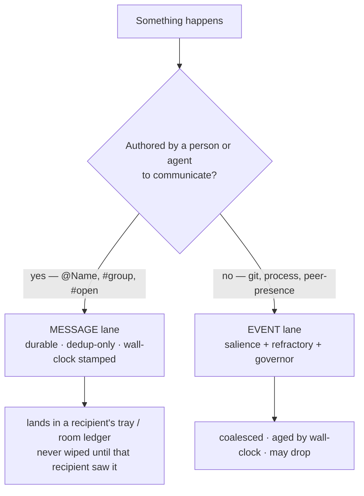

# Attend messaging and awareness — the model

This is the **explanation** companion to [[ADR-136]] (the decision). The ADR
argues *why* attend should split into two lanes; these pages show *how the
system behaves* once it does — across one, two, and many Claudes, with
sub-agents, across dimensions, and with a human on the wire.

If you read nothing else, read this page, then [[01.002.E]] (the cast). The
numbered scenarios are independent — pick the shape that matches your situation.

## The one distinction everything hangs on

Attend carries two kinds of traffic, and they want opposite handling.

- **Authored communication** — `attend send`, `attend reply`, attend-chat's
  `@Name` / `#group` / `#open`. A colleague chose to say this. It must be
  **delivered, once, and survive a brief absence.**
- **Environmental events** — git churned, a peer appeared, a process started.
  The phone ringing. These are *noise* by design; the whole salience /
  refractory / governor stack exists to **suppress** most of them so a session
  is only woken for something that moved.

The office analogy: workers talk back and forth (durable conversation); the
phone rings and faxes arrive (interrupts you can queue or ignore); the fax in
your tray waits until *you* process it, and no passing colleague gets to shred
your unread fax.

## Two clocks

attend and the ways/steering system live in **different time dimensions**, and
the boundary between them is where messaging gets subtle.

| | attend | ways / steering |
|---|---|---|
| clock | **wall-clock** (real time, runs between turns) | **epoch / turn** (per prompt, no wall-clock) |
| job | notice what changed in the world | shape how the agent reasons this turn |

The **notification is the bridge**: a wall-clock event crosses into the
turn-stream when Monitor injects a `<task-notification>`. That crossing is why
re-entry is a **digest, not a replay** — a burst of N wall-clock messages must
become *one* turn, because the receiving dimension is turn-discrete and
context-precious.

## What this buys each lane

Both lanes timestamp everything; they *use* time oppositely:

- The **event lane** uses time to **decay and drop** — a stale observation is
  less worth a wake-up.
- The **message lane** uses time to **stamp and digest** — a message is never
  dropped, only summarized as *"6 on `#open` over the last 21 min"*. The pull
  surface already exists: `attend inbox` is the durable, chronological ledger.

## The scenarios

| # | Scenario | The thing it shows |
|---|----------|--------------------|
| [[01.002.E]] | The cast — heterogeneous peers | Peers are specialists (different MCP, CLAUDE.md, skills), not clones |
| [[01.003.E]] | Divide and conquer | Two Claudes splitting one problem — convene + directed Q&A |
| [[01.004.E]] | A team inside one voice | A Claude running sub-agents — one tray to peers, a team within |
| [[01.005.E]] | Different dimensions | Code work and "office" work as related but distinct dimensions |
| [[01.006.E]] | The crowd | 3–5 Claudes — convene on `#open`, split to focus groups, digests |
| [[01.007.E]] | The human on the surface | attend-chat — the human as a co-equal peer |
| [[01.008.E]] | The lane gate | The mechanism under the scenarios — one fork, two state machines |
