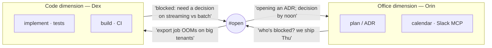

# Scenario — different dimensions

Not every peer is writing code. `Orin` does **office work** — planning, ADRs,
status, scheduling — in a docs/planning workspace, steered by a coordinator
CLAUDE.md and holding calendar / Slack / Workspace MCP. `Dex` does **code work**
in the implementation repo, steered as an engineer, holding build and test
tooling. Same problem ("ship the export feature Thursday"), **two dimensions**:
*organising the building* vs *building the thing*.

## attend as the seam between dimensions

A turn of the loop:

1. **Orin convenes** on `#open`: *"export ships Thursday — anyone blocked?"* An
   authored broadcast; it lands in Dex's tray durably.
2. **Dex reports** a real blocker: the export OOMs on large tenants; streaming
   vs batch is a design call Dex won't make unilaterally.
3. **Orin acts in the office dimension** — opens an ADR for the decision, drops a
   Slack note, books a 20-minute slot — none of which touches code.
4. **Dex acts in the code dimension** — once the decision lands, implements
   streaming, runs the tests.

Neither agent reaches into the other's dimension. Orin doesn't write the export;
Dex doesn't manage the calendar. **attend is the shared surface where the two
dimensions exchange exactly the messages that cross between them** — a blocker
out, a decision in.

## Why this isn't just "two coders"

The capability gap is the whole point (see [[01.002.E]]). Orin literally cannot
run the tests; Dex literally cannot send the calendar invite. So the messages
between them are *requests across a capability boundary*, and they must be
delivered: a dropped "I'm blocked on a decision" stalls the code dimension
silently, and a dropped "decision is made, go" leaves Dex waiting on a green
light that already turned. This is the [[ADR-136]] message lane doing its job
across dimensions, not just across desks.

## The point

attend coordinates *dimensions*, not just *peers*. The office/code split is the
literal version of the analogy that runs through these pages — durable,
authored messages are how work and the organising-of-work stay in sync without
either side doing the other's job.
