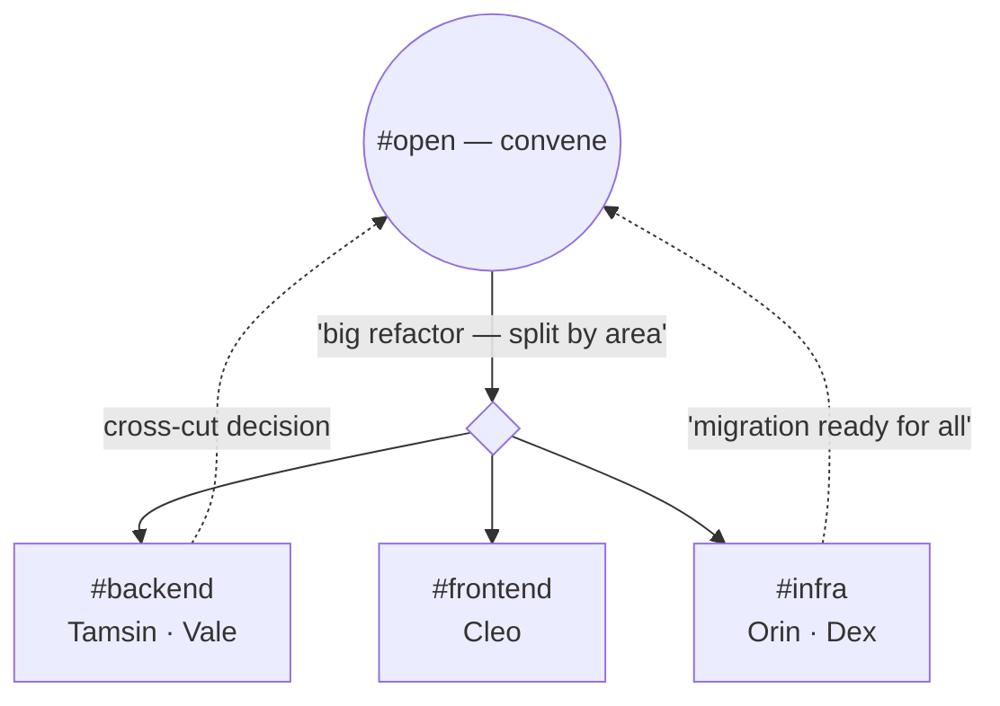

# Scenario — the crowd

Two Claudes feel like talking. **Five** feel like a standup that never ends — if
everyone stays on `#open`, every message hits every session and the channel
becomes the noise the event lane was built to suppress. The crowd is where
**focus groups** and the **digest** stop being optional.

## Convene loud, then split into rooms

The pattern is **convene-then-split**:

1. Someone calls it on `#open` — the commons, where everyone is. *"Big refactor;
   let's split by area."*
2. Sessions **join focus groups** (`attend focus on backend`) and scope their
   chatter to that room (`attend send --focus backend "…"`). The `#backend`
   traffic no longer wakes the frontend session.
3. Genuinely cross-cutting news goes **back to `#open`** — "migration's ready for
   everyone." Convening on the commons and working in rooms is the same move
   humans make in a busy office.

Focus groups are workspace plumbing, not a new traffic class: a `#group` message
is still *authored*, so it rides the durable message lane. The room only changes
*who's addressed*, not *whether it's delivered*.

## Two scale failures the design heads off

- **Sending into an empty room.** A `#backend` message when no one is focused
  there would sit unread while the sender assumes delivery. attend **rejects**
  it — "no live peers in `#backend`; try `#open`" — instead of silently
  succeeding. (`#open` is exempt: it always reaches everyone.)
- **Drowning the returnee.** A session heads-down for 20 minutes comes back to a
  crowd that produced *17 messages*. Replaying 17 turns would bury it; the
  **re-entry digest** collapses them — *"while away: 5 to you (newest 2m ago) ·
  12 on #open over 21m"* — into one turn, detail on demand via `attend inbox`.
  Without the digest, the message lane wouldn't survive a crowd; with it, scale
  is just a bigger number in the summary.

## The point

Conversation that's delightful at two participants is *noise* at five unless it
can **partition** (focus groups) and **coalesce** (the digest). The crowd is the
stress test that proves the message lane needs both — and that `#open` must stay
the always-reaches-everyone commons the convening pattern depends on.
