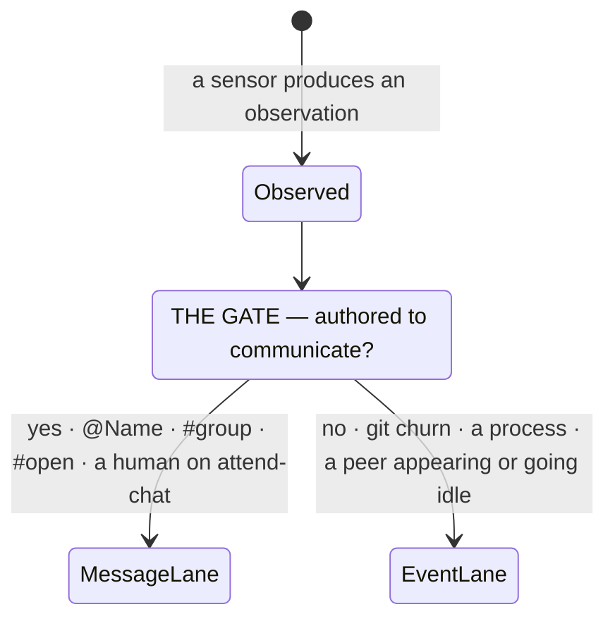
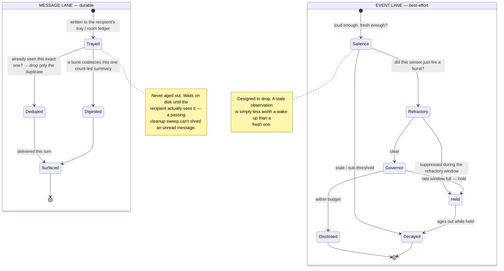

# The lane gate

The scenarios show the two lanes *in use*. This page is the mechanism
underneath them: the single fork every observation passes through, and what
each branch does with it. If [[01.001.E]] is the *why*, this is *how the
routing decides*.

## The one question the gate asks

Everything attend notices — a colleague's `@you`, a git commit, a peer going
idle — arrives as an **observation**. The gate asks one thing of each:

> **Was this *authored* to communicate?**

That single question decides the lane, and the lanes want opposite handling.

- **Yes → message lane.** A person or agent *chose* to say this. It is a unit
  of work routed to a recipient, and a dropped one means the work silently
  never happens. It must be **delivered, once, and survive a brief absence.**
- **No → event lane.** The world moved. Useful, but *noise by design* — the
  whole salience / refractory / governor stack exists to **suppress** most of
  it so a session is only woken for something that actually matters.

## What each lane does with what it's handed

The two branches are different state machines. The message lane is built to
**never lose** a unit; the event lane is built to **shed most** of them.

## Why handling the same moment two ways is the whole point

Both lanes timestamp everything — they just *use* time in opposite directions:

| | Message lane | Event lane |
|---|---|---|
| **Uses time to** | stamp & **digest** | decay & **drop** |
| **On a burst** | coalesce into *"6 on `#open` over 21 min"* | suppress the noise, surface the one that moved |
| **On absence** | hold durably until you return | age out — you didn't miss much |
| **Pull surface** | `attend inbox` — the full chronological ledger | none needed; it was noise |
| **Failure that matters** | a dropped message = work that never happens | a dropped event = a wake-up you didn't need |

The office analogy from [[01.001.E]]: workers talking is the message lane —
durable conversation. The phone ringing and faxes arriving is the event lane —
interrupts you can queue or ignore. The fax in your tray waits until *you*
process it; no passing colleague gets to shred your unread fax.

## Where this shows up in the scenarios

- [[01.003.E]] and [[01.006.E]] lean on the **message-lane** half — durable
  trays, threading, and the re-entry digest that turns a crowd's 17 messages
  into one turn.
- [[01.004.E]] is the sharpest case: a session heads-down in a long workflow
  is exactly when wall-clock messages pile up, and the durable tray plus digest
  is what lets it stay deep *and* lose nothing.
- [[01.007.E]] raises the stakes — when the *human* addresses an agent and it
  silently never arrives, their mental model is now wrong. The human surface is
  the least forgiving consumer of the message lane's "delivered, once" promise.

The gate is the quiet machinery that makes all of those true: classify once,
then let each lane do the one job it's good at.
