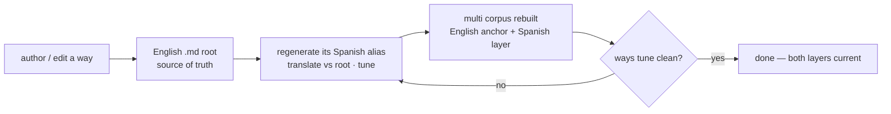

# Scenario — steady-state authoring

**A localized install (Spanish active) evolves: a way is added or edited.** Once an
adopter is in localized mode, maintenance settles into a stable two-part shape: **the
English root + its one localization, kept together.**

## How it plays out

## What each move is doing

- **The English root is authored normally.** Writing or editing a way means writing
  English `description`+`vocabulary` — exactly as on an English install. The 17×
  all-languages stub tax is gone ([[ADR-139]], Phase A); the root is just English.
- **One localization, not eighteen.** Because `output_language` is `es`, the steady
  state is the root **plus Spanish** — the single active language — regenerated for the
  new or changed way. Not a matrix of every language the project ever shipped; only
  what this adopter actually uses.
- **Re-localization is incremental and root-anchored.** The changed way's Spanish alias
  is re-translated against the (possibly updated) English root and re-tuned. A drifting
  English root pulls its Spanish alias back into alignment — the root leads, the
  localization follows.
- **Tuning gates the change.** `ways tune` re-checks the touched alias: does it still
  align to the English root, and does it still avoid colliding with another way? Clean →
  done; flagged → re-author the stub (see [[01.013.E]]).

## The point

Localized maintenance is not a perpetual translation marathon — it is "write English,
keep one shadow in sync." The cost scales with *one* language and with *what changed*,
not with a language matrix or the whole corpus. This is the steady state the
adopter-run model converges to, and it is sustainable for a single maintainer precisely
because the English root does the anchoring, not a committee of equal translations.
