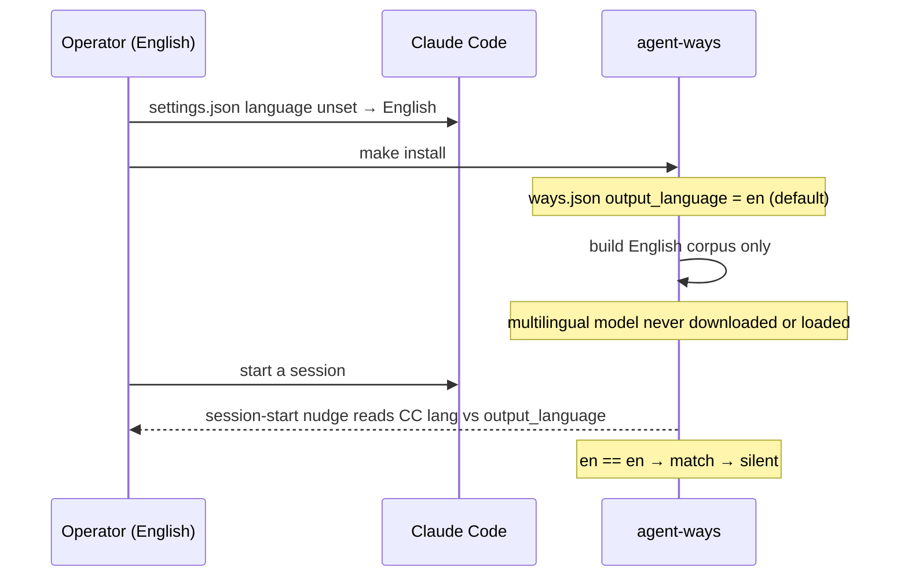

# Scenario — the English-native install

**An English-speaking operator, Claude Code in English, installs agent-ways.** This is
the default and the overwhelming-majority case. The point of the scenario is that
**nothing happens** — and that the nothing is by design, not by omission.

## How it plays out

## What each move is doing

- **No language is set, so English mode is the default.** `ways.json` ships with
  `output_language: en`. There is no step to opt into; English *is* the built state.
- **The build is English-only.** `make setup` fetches one model (the 384-dim English
  model) and builds one corpus. The 127 MB multilingual model is never downloaded — it
  is on-demand, and nothing has demanded it.
- **The nudge runs but finds nothing.** At session start the detection check reads CC's
  `language` and ways' `output_language`. Both resolve to English, so there is no
  mismatch and it emits nothing. The check is cheap — a single config read — and
  silence is the correct, common outcome (see [[01.013.E]] on why running-but-silent is
  not the same as absent).

## The point

The default install pays nothing for a capability it does not use. An English operator
never sees a localization prompt, never downloads a second model, and never pays
multilingual match compute. The intl system is present but fully dormant — the
adopter-run model ([[ADR-139]]) puts the cost on whoever asks for the benefit. The next
scenario is what "asking" looks like ([[01.011.E]]).
