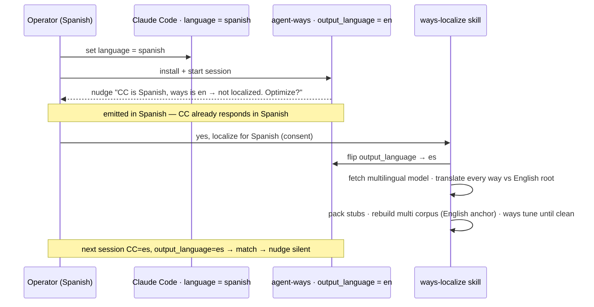

# Scenario — the language switch

**A Spanish-speaking operator sets Claude Code to Spanish, then installs agent-ways.**
This is the ladder the whole adopter-run design exists to serve: ways notices it is
under-serving, asks permission, and — only on consent — localizes itself.

## How it plays out

## What each move is doing

- **The operator switches CC, not ways.** Setting `settings.json language: spanish` is
  the operator's own choice, for their own reasons. Ways is untouched — still English
  mode. There is *no* automatic cascade from "CC is Spanish" to "rebuild the world";
  that would be a heavyweight surprise.
- **Ways notices the mismatch and speaks up — in Spanish.** The session-start nudge
  reads both flags, sees `es ≠ en`, and emits guidance. Because CC is already responding
  in Spanish, the guidance reaches the operator *in Spanish* for free — the bootstrap
  paradox (a non-English user can't read an English how-to) dissolves.
- **It asks permission; it does not act.** Localization is expensive — a 127 MB model
  download, a translate-every-way pass, a tuning loop. So the nudge **requests operator
  consent** and stops. Human-in-the-loop on a heavy, consequential operation.
- **On consent, `ways-localize` does the work and flips the flag.** It sets
  `output_language → es`, fetches the multilingual model, translates each way's
  `description`+`vocabulary` against the **English root**, packs the stubs, rebuilds the
  multi corpus with the English anchor, and runs `ways tune` until the Spanish layer is
  clean — aligned to the root, no collisions (see [[01.013.E]]).
- **The flag flip is what satisfies the nudge.** Next session, `output_language` is `es`,
  matching CC, so the mismatch is gone and the nudge stays silent — *self-silencing via
  the config flag*, not by sniffing whether data happens to exist.

## The point

The operator gets a localized experience exactly when they want one, pays its cost
themselves (as the beneficiary), and is the native speaker best able to judge the
result. Ways never assumes; it observes, asks, and — only on a yes — acts. After this,
the install sits in localized steady state ([[01.012.E]]).
