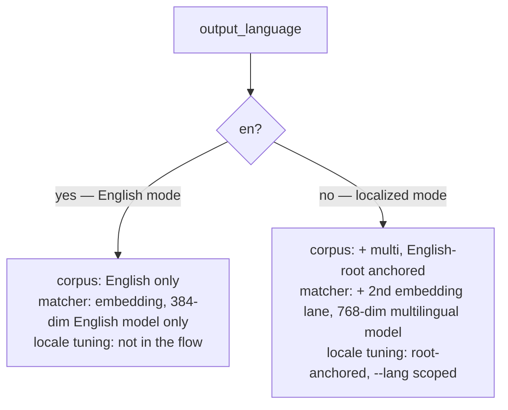

# The mode gate — mechanism under the scenarios

The scenarios describe behavior; this page is the machinery they share. One flag, two
modes, and three things that flip with it. The decision rationale lives in the design
note *Adopter localization lifecycle and tuning*; this is the operational map.

## The flag

The resolved `Config.language`, default `en`/`auto`. It is *layered*: `output_language`
in `~/.claude/ways.json` (Layer 1) is overridden by `language` in the user-scope
`~/.config/ways/config.yaml` (Layer 2). So the effective switch is the user-scope
`language` — the layer `ways-localize` writes. It is the only thing that writes a
non-English value. It is
read **once, upstream** — components do not each sniff for locale data; they consult the
mode.

## What flips with it

1. **Corpus build** (`corpus.rs`). Localized mode emits each way's English root into the
   multilingual corpus (embedded with the multilingual model) as the anchor, plus the
   localized aliases. English mode builds the English corpus only.
2. **Match compute** (`scan/scoring.rs`). *Both modes match by embedding cosine* — the
   difference is the model, not the method. English mode runs the 384-dim English model
   only; localized mode adds the 768-dim multilingual model as a **second lane** (English
   lane still runs too). The matcher gates that second lane on the mode, not on
   corpus-file presence, so English mode **never loads the heavier 768-dim model** — a
   per-prompt saving on every match for the default install.
3. **Locale tuning** (`tune.rs`). The root-anchored locale-alias audit runs only in
   localized mode, scoped by `--lang`. (English *corpus* tuning — vocabulary health,
   sibling discrimination, and threshold calibration of the English ways themselves — is
   a separate, always-on concern: a new or materially-changed English way retunes
   regardless of mode.) There is no empty / "0/0" path to special-case, because locale
   tuning is simply never invoked in English mode.

## Root-anchored tuning, in one breath

Fidelity is **alignment to the English root**, measured per language and independently —
`cosine(localized alias, English root)`. *Not* agreement among sibling translations
(which would let a drifting cluster self-certify). Discrimination stays as
`alias − top_confuser`: the alias must not collide with a *different* way. A language
passes the `ways-localize` gate when every alias both aligns to its root and avoids
collision. This works identically for one language or many — the English root is the
fixed peer that makes N=1 meaningful. Full treatment: the design note and [[ADR-125]].

## Running-but-silent ≠ absent

The session-start nudge always runs — it must read the flags to know the mode — but only
the mismatch state (CC non-English, ways `en`) produces output. English mode runs the
check, finds nothing to do, and emits nothing, at the cost of one config read. Silence
is the check working, not the check missing.
