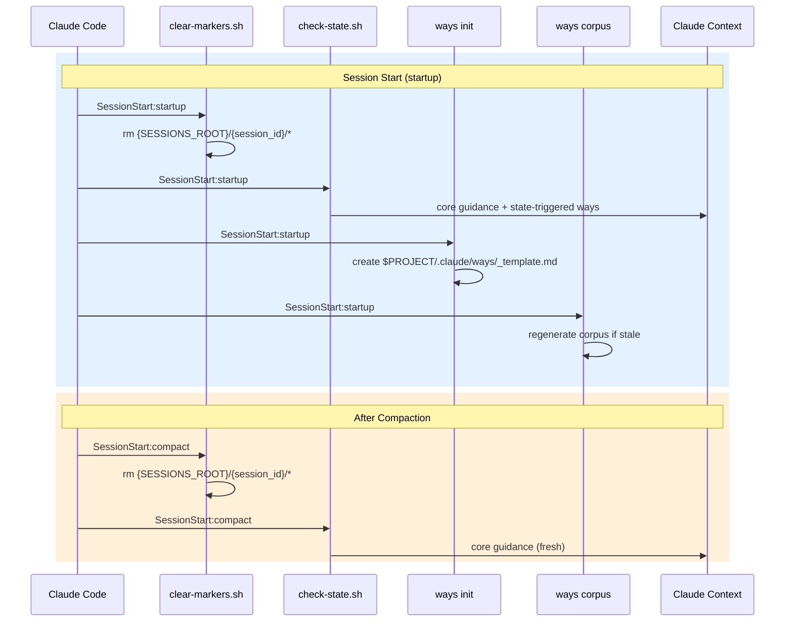
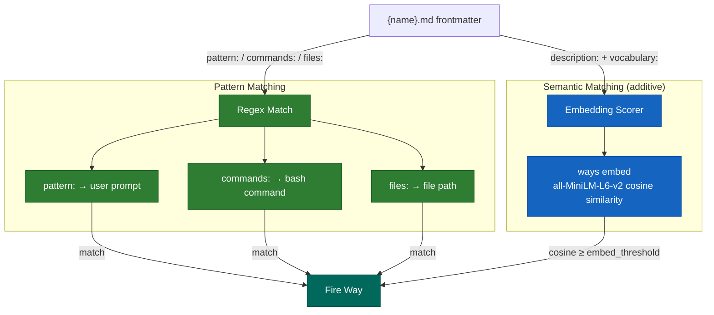
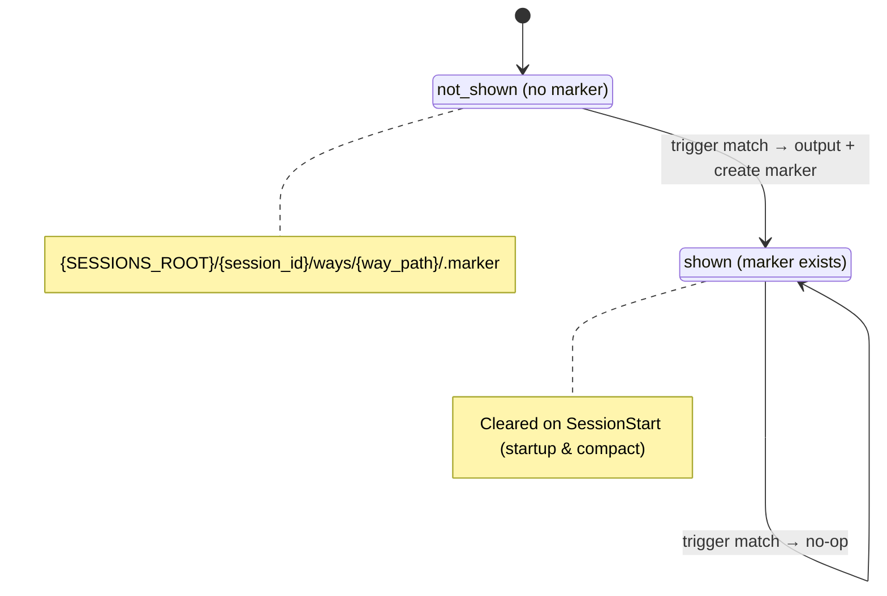
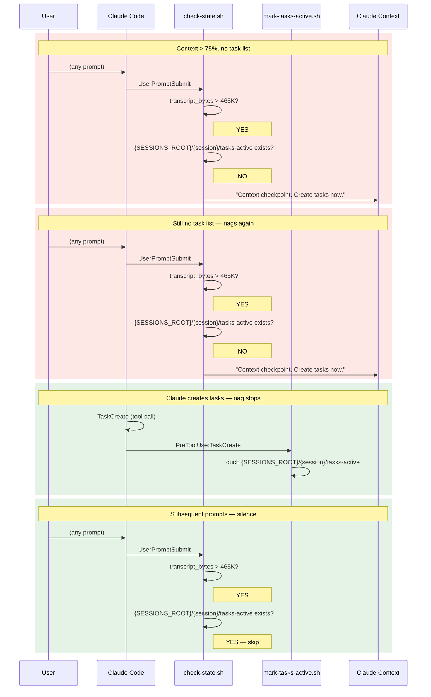
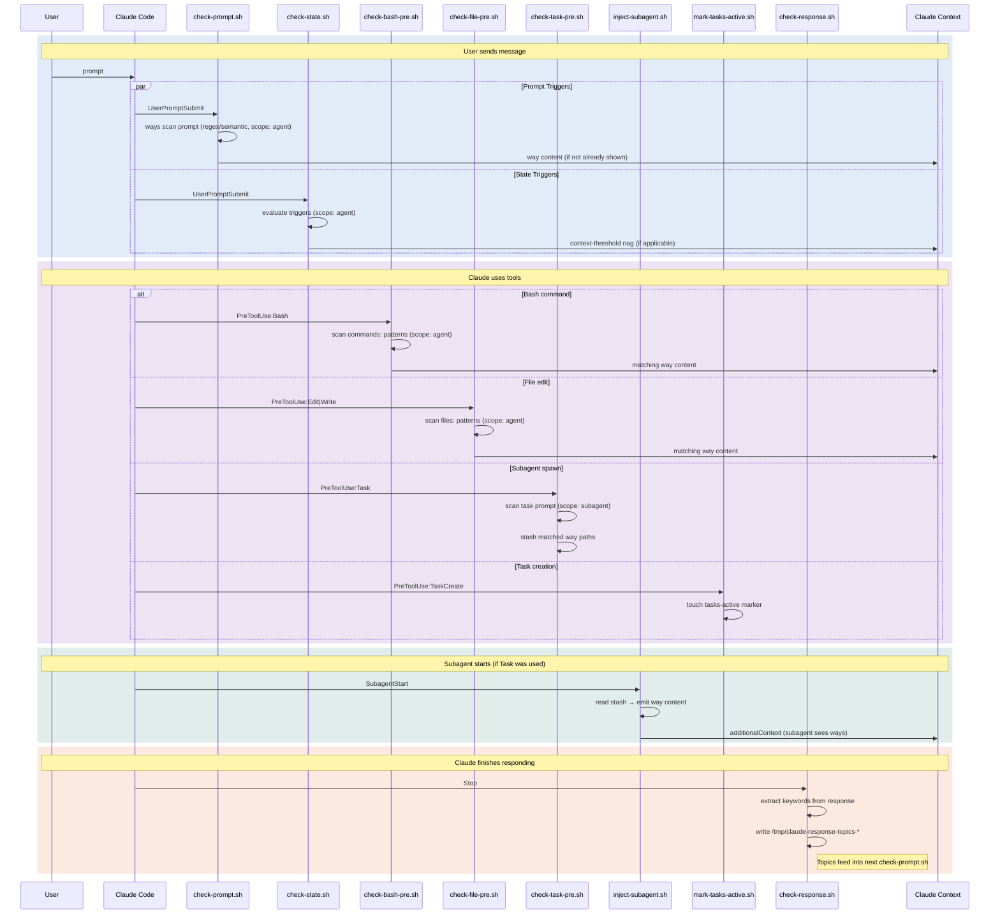
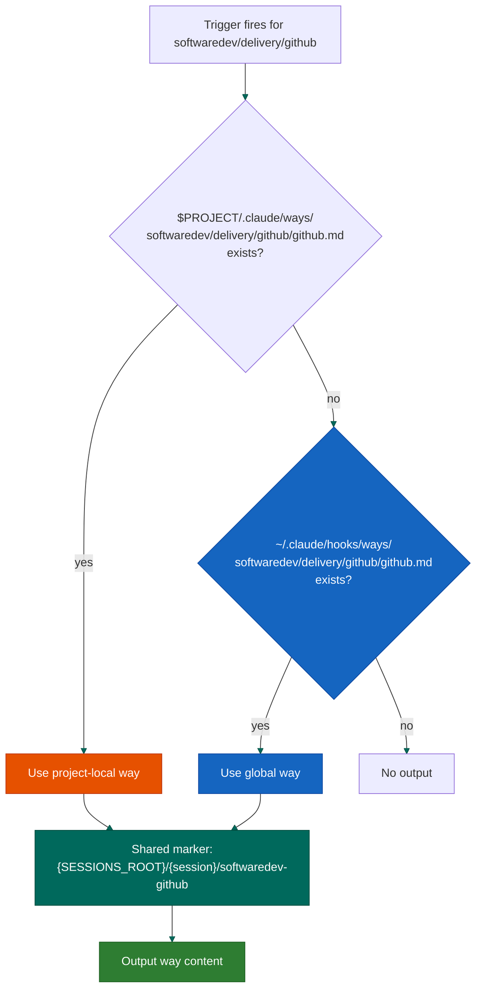

# Hooks and Ways System

How contextual guidance gets injected into Claude Code sessions.

## Hook Events

Claude Code hook events drive the system. Each fires shell scripts that scan for matching ways and inject their content.

| Event | When | Scripts |
|-------|------|---------|
| **SessionStart** (startup) | Fresh session | `clear-markers.sh`, `check-config-updates.sh`, `check-state.sh`, `ways init`, `ways corpus` |
| **SessionStart** (compact) | After compaction | `clear-markers.sh`, `check-state.sh` |
| **SessionStart** (resume) | Session resume | `check-state.sh` |
| **UserPromptSubmit** | Every user message | `check-prompt.sh`, `check-state.sh` |
| **PreToolUse** (Edit\|Write) | Before file edit | `check-file-pre.sh` |
| **PreToolUse** (Bash) | Before command | `check-bash-pre.sh` |
| **PreToolUse** (Task) | Before subagent spawn | `check-task-pre.sh` |
| **PreToolUse** (TaskCreate) | Before task creation | `mark-tasks-active.sh` |
| **SubagentStart** | When subagent starts | `inject-subagent.sh` |
| **SessionStart** (clear) | After `/clear` | `clear-markers.sh`, `check-state.sh`, `ways init` |
| **Stop** | After Claude responds | `check-response.sh` |

## What Each Script Does

### Session Lifecycle

- **`clear-markers.sh`** - Clears session markers from `{SESSIONS_ROOT}/{session_id}/`. Resets session state so ways can fire fresh. Scoped to the current session only.
- **`ways init`** - Creates `$PROJECT/.claude/ways/_template.md` if the project has a `.claude/` or `.git/` dir but no ways directory yet.
- **`ways corpus --if-stale --quiet`** - Regenerates the embedding corpus if way files have changed since last build.
- **`check-config-updates.sh`** - Checks if the config is behind upstream. Detects four install scenarios: direct clones, GitHub forks, renamed clones (via `.claude-upstream` marker file), and plugin installs. Network calls (`git fetch`, `gh api`, `git ls-remote`) are rate-limited to once per hour; update notices fire every session when behind. See the [Updating](#updating) section of the README for scenario details and how to control this behavior.

### Trigger Evaluation

These scripts fire on **PreToolUse** — before the tool executes, not after. This is a critical design choice: guidance must arrive while Claude can still act on it. A commit format reminder after the commit is too late. Security guidance after the file edit is too late. The "Pre" in PreToolUse means Claude sees the way content and can adjust its behavior before the action happens.

- **`check-prompt.sh`** - Thin dispatcher to `ways scan prompt`. Passes the user prompt (plus response topics from the previous turn) and session ID. The `ways` binary handles all matching: file walking, frontmatter extraction, pattern + semantic matching, scope/precondition gating, parent threshold lowering, session markers, macro dispatch, and content output.
- **`check-bash-pre.sh`** - Scans ways for `commands:` patterns. Tests the command about to run. Also checks `pattern:` against the command description.
- **`check-file-pre.sh`** - Scans ways for `files:` patterns. Tests the file path about to be edited.
- **`check-state.sh`** - Evaluates `trigger:` fields (context-threshold, file-exists, session-start). See [State Triggers](#state-triggers).

All trigger evaluation scripts respect the `scope:` frontmatter field - ways without `agent` scope are skipped.

### Subagent Injection

- **`check-task-pre.sh`** - PreToolUse:Task hook (Phase 1). Reads the Task tool's `prompt` parameter, runs inline matching for `scope: subagent` ways. Writes matched way paths to `{SESSIONS_ROOT}/{session_id}/subagent-stash/`. Never blocks Task creation.
- **`inject-subagent.sh`** - SubagentStart hook (Phase 2). Reads the oldest stash file, claims it atomically, emits way content as JSON `hookSpecificOutput.additionalContext`. Bypasses markers entirely - subagents get fresh context regardless of what the parent triggered.

### State Management

- **`mark-tasks-active.sh`** - Creates `{SESSIONS_ROOT}/{session_id}/tasks-active`. Silences the context-threshold nag.
- **`check-response.sh`** - Extracts technical keywords from Claude's last response, writes to `/tmp/claude-response-topics-{session_id}`. These topics feed back into `check-prompt.sh` on the next turn, so ways can trigger based on what Claude discussed (not just what the user asked).

### Way Display

The `ways` binary (`ways scan` / `ways show`) handles all way display: domain disable list, session markers, macro dispatch, content output (stripping frontmatter), and marker creation. Per-way `macro.sh` scripts still run as shell commands, but orchestration is in Rust.

## Session Lifecycle



## Way Scope

The `scope:` frontmatter field controls where a way fires. There are three scopes, reflecting the three types of Claude Code sessions:

| Scope | Session type | Detection |
|-------|-------------|-----------|
| `agent` | Your main session | Default (no marker file) |
| `teammate` | Named agent in a coordinated team | `{SESSIONS_ROOT}/{session_id}/teammate` exists |
| `subagent` | Quick Task tool delegate | Spawned via Task without `team_name` |

Ways declare which scopes they apply to:

```yaml
scope: agent                     # Main session only (default if omitted)
scope: teammate                  # Team members only
scope: agent, teammate           # Both, but not quick delegates
scope: agent, subagent           # Main + delegates, not teammates
scope: agent, teammate, subagent # Everyone
```

### Scope Detection

Scope detection is handled by the `ways` binary. It checks for a teammate marker file — if one exists, the scope is `teammate`; otherwise `agent`. Subagent scope is determined at injection time by `check-task-pre.sh`, not by the running session itself.

The teammate marker is created by `inject-subagent.sh` during Phase 2 of the two-phase injection. It persists for the teammate's entire session lifetime and contains the team name (used for telemetry).

### What Gets Gated

| Way | Scope | Why |
|-----|-------|-----|
| `meta/memory` | `agent` | Prevents concurrent MEMORY.md writes from multiple teammates |
| `meta/subagents` | `agent` | Delegation guidance is irrelevant to agents that are themselves delegated work |
| `collaboration/teams` | `teammate` | Coordination norms only make sense for team members |

Subagent injection bypasses the marker system entirely. A way can fire for the parent (marker-gated) AND separately for each subagent or teammate (no markers). The parent's way guidance doesn't automatically transfer because the Task prompt is a compact delegation — the scope system bridges this gap.

See [teams.md](hooks-and-ways/teams.md) for the full team coordination model.

## Way Matching Modes

Each way declares how it should be matched in its YAML frontmatter.



Matching is **additive** — pattern and semantic are OR'd. A way with both `pattern:` and `description:`+`vocabulary:` can fire from either channel.

### Pattern

```yaml
pattern: commit|push          # matched against user prompt
commands: git\ commit         # matched against bash commands
files: \.env$|config\.json    # matched against file paths
```

Fast and precise. Most ways use this.

### Semantic Matching

```yaml
description: "API design, REST endpoints, request handling"
vocabulary: api endpoint route handler middleware
embed_threshold: 0.35 # cosine similarity threshold
```

Embedding-only engine, built into the `ways` binary:

| Engine | How it works |
|--------|-------------|
| **Embedding** | all-MiniLM-L6-v2 sentence embeddings via `way-embed` binary + GGUF model. Pre-computed 384-dim vectors in corpus. Cosine similarity against all ways (~20ms). |

The embedding model is a hard dependency of `ways`. `make setup` fetches the binary and GGUF model on four supported platforms.

**Embedding engine** (ADR-108, ADR-125): Semantic similarity captures concepts that lexical scoring would miss — "SSH agent" and "AI agent" share the same English stem but have distant embedding vectors, and the multilingual variant routes native-language queries through locale-stub aliases without per-language stemmer wiring.

#### Setup

```bash
# Install the ways binary and set up corpus + embedding model
make install    # builds ways, downloads model, generates corpus
make test       # smoke tests (lint, match, graph)
make test-sim   # 8 integration scenarios

# Check engine status
ways status
```

Model location: `${XDG_CACHE_HOME:-~/.cache}/claude-ways/user/minilm-l6-v2.gguf`
Corpus: `${XDG_CACHE_HOME:-~/.cache}/claude-ways/user/ways-corpus.jsonl`

Both user-scope (`~/.claude/hooks/ways/`) and project-scope (`.claude/ways/`) corpora are scanned. They share the same model file.

#### Calibrating from telemetry

Once a corpus has been firing for a while, two commands audit and calibrate the embedding match against observed behavior rather than guesswork (ADR-134).

```bash
# Audit fire relevance — flag ways landing in off-domain sessions
ways tune-precision

# Calibrate firing-dynamics curves from observed cadence
ways tune-curves
```

`ways tune-precision` is a report-only relevance audit. For each way it estimates how often its fires landed *off-class* — in sessions whose activity (judged by the parent-family of the ways that co-fired) never touched the way's own domain — and reports an irrelevance rate plus a flag. **mis-targeted** is a narrow way repeatedly firing into the same wrong kind of session (remedy: raise `embed_threshold`, narrow vocabulary, or change the trigger channel); **cross-cutting** is a way that fires broadly by design, e.g. meta/tracking ways (remedy: scope by trigger — never auto-narrow vocabulary). Flags: `--min-sessions` (default 5), `--flag-threshold` (default 0.5), `--project`, `--way`, `--json`.

`ways tune-curves` (ADR-123 Phase E) groups `way_fired`/`way_redisclosed` events by (way, session), computes token-position deltas between consecutive fires, and suggests a `half_life` ≈ the median delta. Dry-run by default; `--apply` rewrites the `curve:` block in place via line surgery. (Vocabulary and `embed_threshold` are never auto-applied — they stay authorial.)

## State Triggers

Evaluated by `check-state.sh` on every UserPromptSubmit. Unlike pattern-based ways, these fire based on session conditions.

### context-threshold

```yaml
trigger: context-threshold
threshold: 75
```

Estimates transcript size since last compaction (~4 chars/token, ~155K token window = ~620K chars). Fires when `transcript_bytes > 620K * threshold%`.

**Special behavior**: Does not use the standard marker system. Repeats on every prompt until a `{SESSIONS_ROOT}/{session_id}/tasks-active` marker exists (created by `mark-tasks-active.sh` when `TaskCreate` is used).

### file-exists

```yaml
trigger: file-exists
path: .claude/todo-*.md
```

Fires once (standard marker) if the glob pattern matches any file relative to the project directory.

### session-start

```yaml
trigger: session-start
```

Always evaluates true. Uses standard marker, so fires exactly once per session on the first UserPromptSubmit.

## Once-Per-Session Gating

Most ways fire once then go silent for the rest of the session.



**Exceptions**:
- Context-threshold triggers bypass this system entirely - they repeat until the tasks-active marker exists.
- Subagent injection (`inject-subagent.sh`) bypasses markers completely - each subagent gets fresh way content.

## The Context-Threshold Nag

The `meta/todos` way uses context-threshold to ensure task lists exist before compaction.



## Full Data Flow



## Telemetry

Firing activity is logged to `~/.claude/stats/events.jsonl` — one JSON object per line. Beyond the `way_fired`/`way_redisclosed` cadence events that `tune-curves` reads, two signals feed the precision and recall tuning above (ADR-134):

- **`fire_score`** — recorded on `way_fired` events for **first-fires only** (not redisclosures): the embedding score that cleared threshold. It is the raw material for future `embed_threshold` tuning.
- **`way_nearmiss`** — emitted when a way scored within `near_miss_margin` *below* its effective threshold but did **not** fire. Fields: `score_en`, `score_multi`, `thr_en`, `thr_multi`, `margin`, `trigger`, `query_tokens`. This is a recall signal — it measures the likely false silences a threshold drop would recover.

`near_miss_margin` (default `0.05`) is a config knob, parsed from the ways config YAML alongside `default_embed_threshold` and `default_multi_embed_threshold`.

The near-miss and fire-score streams grow the log faster than fires alone, so its size is **bounded**: `log_event` tail-compacts `events.jsonl` once it exceeds ~32 MiB, keeping the most recent ~24 MiB (cut at a line boundary, written atomically via temp + rename). Compaction is lossy only on the oldest events; readers are unaffected.

ADR-134 ("Empirical auto-tuning from fire and near-miss telemetry") is Accepted. One slice — the gated `embed_threshold` `--apply` — is deferred until the `fire_score` population accumulates enough to validate against, tracked as GitHub issue #123.

## Macros

Ways can include a `macro.sh` alongside the way file. Frontmatter declares positioning:

```yaml
macro: prepend   # macro output before static content
macro: append    # macro output after static content
```

Macros generate dynamic content. Examples:
- `documentation/adr/macro.sh` - Tri-state detection: no tooling, tooling available, tooling installed
- `softwaredev/code/quality/macro.sh` - Scans for long files in the project, outputs priority list
- `softwaredev/delivery/github/macro.sh` - Detects solo vs team project, adjusts PR guidance

**Security**: Project-local macros only run if the project is listed in `~/.claude/trusted-project-macros`.

## Project-Local Ways

Projects can override or add ways at `$PROJECT/.claude/ways/{domain}/{way}/{way}.md`. Project-local takes precedence over global. Same-path ways share a marker, so only one fires.



## Domain Enable/Disable

`~/.claude/ways.json` controls which domains are active:

```json
{
  "disabled": ["itops"]
}
```

Checked by `ways scan` before outputting any way.

## Testing

Three test layers verify the matching and injection pipeline. See [tests/README.md](../tests/README.md) for full details.

| Layer | Command | What it tests |
|-------|---------|---------------|
| **Smoke** | `make test` | Lint (0 errors), match (sample queries), graph (node/edge count) |
| **Simulation** | `make test-sim` | 8 integration scenarios: matching, idempotency, commands, files, checks, disclosure, scope, epochs |
| **Activation** | `read and run the activation test at tests/way-activation-test.md` | Live hook pipeline: regex, embedding semantic match, negative control, subagent injection |

The `/ways-tests` skill provides ad-hoc scoring for vocabulary tuning:

```
/ways-tests "write some unit tests for this module"
```
