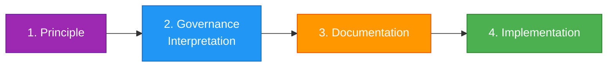
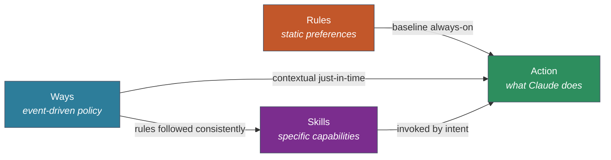

# Start Here

This directory documents a system for injecting contextual guidance into Claude Code sessions. If you're new to it, read this page first.

## The Pipeline

Ways are the end product of a pipeline that starts with opinions and ends with machine-readable guidance. Each stage has a different audience and purpose.

### 1. Principle

An opinion about how things should work. This might come from experience, organizational policy, industry standards, or hard-won lessons.

*Example: "Errors should be caught at system boundaries, not deep inside business logic."*

Principles are the raw input. They don't need to be formalized - they just need to be articulated clearly enough to act on.

### 2. Governance Interpretation

How that principle applies in practice. This is where the principle meets the real world: what does it mean for this team, this stack, this workflow? What are the boundaries, exceptions, and trade-offs?

*Example: "Catch at API endpoints, CLI entry points, and message handlers. Wrap with context at module boundaries. Let programmer errors crash. Handle operational errors gracefully."*

This is the human-readable policy layer. It lives in these docs (`docs/hooks-and-ways/`). Someone reading it should understand not just the rule but the reasoning.

### 3. Documentation

How the implementation works. The reference layer (`docs/hooks-and-ways.md`) describes the system mechanics: which hooks fire when, how matching works, what the data flow looks like. This is the bridge between understanding the "why" (governance) and understanding the "how" (implementation).

### 4. Implementation

The actual way files (`hooks/ways/*/{name}.md`) and macros (`macro.sh`). These are tuned for Claude's context window - terse, directive, structured for a language model. They read differently from normal documentation because every token in the context window has a cost.

## Where Things Live

| Layer | Location | Read by | Purpose |
|-------|----------|---------|---------|
| Guide | `docs/hooks-and-ways/*.md` | Humans | Rationale, 5W1H, how-to guides |
| Policy source | `governance/policies/*.md` | Governance chain | Source docs that ways compile from |
| Reference | `docs/hooks-and-ways.md` | Humans + Claude | System mechanics, diagrams, data flow |
| Machine | `hooks/ways/*/{name}.md` | Claude (via hooks) | Terse, directive, context-optimized guidance |

## Ways, Rules, and Skills

Claude Code ships two official features for injecting guidance: **Rules** (`.claude/rules/*.md`) and **Skills** (`~/.claude/skills/`). Ways are a third system built on hooks. All three serve different purposes — understanding where each one fits explains why ways exist alongside the official primitives.

### The progressive disclosure divide

Rules and ways both inject guidance conditionally, but their disclosure models differ at a fundamental level:

**Rules are spatially coupled to the file tree.** A rule with `paths: src/api/**/*.ts` fires when Claude reads files matching that glob. The project's directory hierarchy *is* the disclosure taxonomy. This works when concerns map cleanly to directories — and breaks when they don't.

**Ways are temporally coupled to actions.** A way fires when you run `git commit`, when you mention "optimize" in a prompt, when context usage crosses 75%, or when a subagent spawns. The disclosure schedule has no relationship to the file tree.

The difference matters because most development concerns are **cross-cutting**. Security applies to `src/api/`, `lib/crypto/`, `infra/terraform/`, and everywhere else. A path-scoped rule needs duplicate entries or globs so broad they lose the progressive benefit. A way triggers once on the *activity* — regardless of which files are open.

This also means ways survive refactoring. Rename `src/` to `lib/`, reorganize your module structure, split a monolith into packages — every path-scoped rule breaks. Ways keep working because they never referenced the tree.

The [context decay model](context-decay.md) provides the theoretical grounding: what matters for sustained adherence is proximity to the generation cursor, and ways inject at the tool-call boundary — the closest possible point. Rules loaded at file-read time are better than startup rules, but ways operate one tier closer. The [formal foundations](context-decay-formal-foundations.md) map this to cascade control theory: ways form a fast inner loop at the tool-call timescale, while rules and human steering operate at slower timescales.

### Three features, three jobs

| | **Rules** | **Ways** | **Skills** |
|--|-----------|----------|------------|
| **Nature** | Static preferences | Event-driven policy | Specific capabilities |
| **Job** | "Always do X" | "Right now, remember Z" | "Here's how to do Y" |
| **Trigger** | Startup or file-path glob | Tool use, keywords, embedding match, state | User intent (Claude decides) |
| **Conditional on** | Directory tree (`paths:`) | Actions, commands, prompts, state | Semantic similarity to description |
| **Cross-cutting** | Needs duplicate paths or broad globs | Single way, fires on semantic match | N/A (intent-based) |
| **Dynamic content** | No | Yes (shell macros) | No |
| **Session-gating** | No (always loaded when matched) | Yes (once per session, marker-gated) | No (always available) |
| **Scope filtering** | No | Yes (agent/teammate/subagent) | No |
| **Governance provenance** | No | Yes (zero-token provenance metadata) | No |
| **Tool restrictions** | No | No | Yes (`allowed-tools`) |
| **Org-level scope** | Yes (`/etc/claude-code/`) | No | No |
| **Zero-config** | Yes (drop a `.md` file) | No (requires hook infrastructure) | Yes (drop a `SKILL.md` file) |
| **Survives refactoring** | No (path-dependent) | Yes (action-dependent) | Yes (intent-dependent) |

### What each one is best at

**Rules** — Static, always-on preferences and constraints. "Use TypeScript strict mode." "Tabs not spaces." "All API endpoints must validate input." Best when the guidance is unconditional or maps cleanly to a directory subtree. Unbeatable simplicity: drop a `.md` file and it works.

**Ways** — Context-sensitive guidance that fires on events, cuts across the file tree, and needs to stay fresh in long sessions. "Show commit formatting rules when `git commit` runs." "Warn about context usage at 75%." "Inject security guidance when editing any file, anywhere." Best for cross-cutting concerns, governance, and anything triggered by actions rather than file paths.

**Skills** — Specific capabilities invoked by intent. "Ship this PR through the full flow." "Rotate AWS keys." "Create an ADR." Best when the user has a specific task and Claude needs a structured workflow to execute it. Skills can restrict tools, which neither rules nor ways can.

### How they compose

They layer naturally:

1. **Rules** set baseline preferences (loaded at startup or on file access)
2. **Ways** inject governance at tool boundaries (fired by events, once per session)
3. **Skills** provide specific workflows (pulled by intent when needed)

A skill for rotating an AWS key works better when the security way has already established "never commit secrets, always verify credentials," and a rule has already set "all infrastructure code must pass `tfsec`." Each layer adds a different kind of value.

### When to write which

- **Unconditional preference** that applies everywhere → **rule**
- **Path-specific standard** that maps to a directory → **rule** with `paths:`
- **Process guidance** triggered by tool use or session state → **way**
- **Cross-cutting concern** (security, testing, commit standards) → **way**
- **Specific capability** invoked by intent → **skill**
- Need **tool restrictions** → **skill** (`allowed-tools`)
- Need **governance traceability** → **way** (provenance metadata)

Always, hallways, byways, pathways, crossways, doorways, sideways, stairways, airways, fairways, gateways, getaways. 12 dimensions in the comparison table. 12 ways. Coincidence? There are no coincidences — only ways.

## Adding a New Way: The Process

Don't start by writing the way file. Start at stage 1.

### Step 1: Articulate the principle

What's the opinion? Why does it matter? Write it down plainly. If you can't explain it in a paragraph, it's not clear enough to implement.

### Step 2: Interpret for governance

How does this apply in practice? Write the prose doc (or add a section to an existing one under `docs/hooks-and-ways/`). Cover:

- **What** the guidance is
- **Why** it exists (the principle behind it)
- **When** it applies (and when it doesn't)
- **How** it manifests in concrete actions
- **Who** it affects (the developer? Claude? both?)
- **Where** the boundaries are (what's in scope, what's not)

### Step 3: Document the trigger

Decide how the guidance should be delivered:
- On what user prompt keywords? → `pattern:`
- On what tool use? → `commands:` or `files:`
- On what concept? → `description:` + `vocabulary:` (embedding semantic matching)
- On what condition? → `trigger:`

Add this to the reference doc if the trigger mechanism is novel.

### Step 4: Implement the way

Write `{wayname}.md` with the frontmatter and guidance content. The content should be the governance interpretation *compressed for context efficiency*. Strip rationale, strip explanation, keep directives and examples.

If the way needs dynamic content, add `macro.sh`.

Test by triggering it and verifying the guidance is actionable.

### Step 5: Connect the layers

Add a `provenance:` block to the way's frontmatter referencing the policy document, relevant control standards, and a rationale connecting policy intent to compiled guidance. The runtime strips all frontmatter before injection, so provenance metadata costs zero tokens.

See [provenance.md](provenance.md) for the full traceability system — manifest generation, coverage reports, and cross-repo verification.

## Reading Order

If you want to understand the system:
1. **This file** — you're here
2. **[rationale.md](rationale.md)** — why this exists
3. **[ways-vs-rag.md](ways-vs-rag.md)** — how Ways relate to RAG (and where they diverge)
4. **[context-decay.md](context-decay.md)** — the attention decay model and injection topology
5. **[context-decay-formal-foundations.md](context-decay-formal-foundations.md)** — formal proofs, control theory, human operator modeling
6. **[../hooks-and-ways.md](../hooks-and-ways.md)** — how it works (reference)
7. **Domain docs** — the policy for each group of ways

If you want to add or modify ways:
1. **[extending.md](extending.md)** — how to create ways
2. **[matching.md](matching.md)** — choosing a trigger strategy
3. **[macros.md](macros.md)** — if you need dynamic content

If you're running agent teams:
1. **[teams.md](teams.md)** — scope detection, coordination norms, the three-scope model
2. **[stats.md](stats.md)** — observability, interpreting the telemetry
3. **[meta.md](meta.md)** — the meta ways (teams, memory, todos, tracking)

If you care about governance traceability:
1. **[provenance.md](provenance.md)** — the full chain from regulatory framework to agent context
2. **[ADR-005: Governance Traceability](../architecture/legacy/ADR-005-governance-traceability.md)** — the design decision
