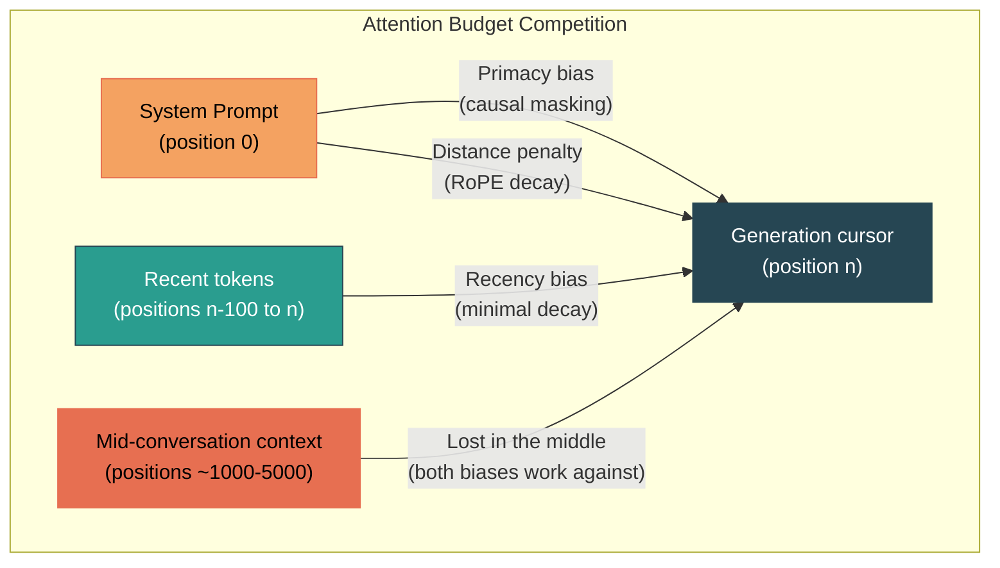
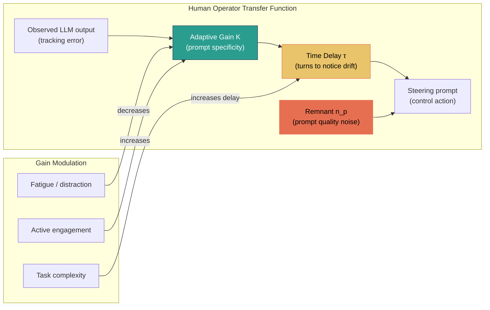
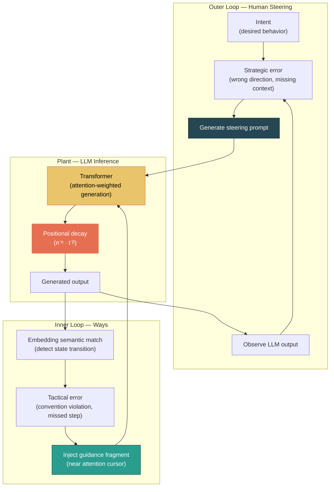
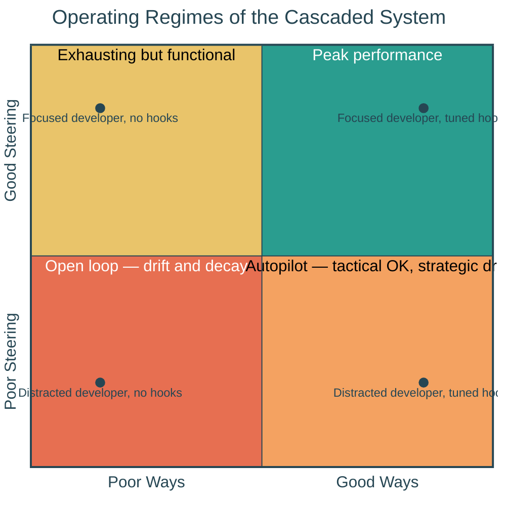

# Formal Foundations of the Context Decay Model

**A companion to [The Context Decay Model: Why Timed Injection Beats Front-Loading](context-decay.md)**

**See also:** [ADR-123: Firing dynamics — progression-axis unification](../architecture/system/ADR-123-firing-dynamics-progression-axis-unification.md) — the architecture that operationalizes this model for ways and attend, including why token position (not turn count, not wall clock) is the correct progression axis for transformer-hosted ways.

> **Read section 1.1a before citing this document.** The RoPE decay derivation below is the *baseline positional prior*, not a complete model of trained-attention retrieval behavior. Modern LLMs override the baseline for salient content via head specialization, and empirical retention is substantially better than the baseline curve predicts. The decay model is used here as an approximation of *aggregate presentation economics*, which is the right quantity for firing decisions — but it is not a direct model of attention internals.

## In Plain Terms

AI assistants like Claude forget their instructions as conversations get longer. Not because they're broken — it's how the underlying attention mechanism works. The further away an instruction is from what the model is currently generating, the less influence it has — the forgetting curve, with token distance playing the role time plays in human memory. Research confirms this: information in the middle of a long conversation can lose over 30% of its effectiveness.

The ways system is a control loop that injects small, structured guidance signals at the moments they're relevant — close to where the model is actively paying attention. Rather than one large upfront payload that fades over distance, frequent small corrections keep the signal fresh — spaced repetition applied to injected guidance. The effect is that the human operator doesn't have to constantly re-explain conventions, catch format drift, or repeat themselves. The cognitive load drops.

The human still drives. Ways don't make decisions — they maintain consistency so the operator can focus on direction, judgment, and the parts of the work that actually require a person. This two-layer structure — automated correction for routine adherence, human authority for strategic choices — is a well-known pattern in control engineering called cascade control. The rest of this document shows how each piece maps to established theory.

---

This document maps the context decay model to established research in transformer attention mechanics, human operator control theory, and cascaded feedback systems. Where the primary document describes the *what*, this document provides the *why* — grounding each claim in published theory, empirical findings, and formal mathematical models.

---

## 1. Positional Attention Decay: Baseline Prior and Its Limits

The context decay model posits that system prompt adherence follows a damped sawtooth:

$$A(t) \approx A_0 \cdot n^{-\alpha} \cdot t_\mathrm{local}^{\ -\beta}$$

This is a presentation-economics approximation of a more complex underlying mechanism. It captures the **baseline positional prior** that transformer architectures impose on attention — a prior that is real, measurable, and architecturally grounded. What it does *not* capture is the ability of trained attention heads to override that prior for specific content they have learned to retrieve. Both halves of this picture matter, and the sections below lay out both.

### 1.1 The Baseline Mechanism: Positional Encoding Decay

Modern LLMs use Rotary Position Embeddings (RoPE), which encode relative position by rotating query and key vectors. The attention score between tokens at positions $i$ and $j$ is modulated by a function of their distance $|i - j|$.

For sinusoidal positional encodings (the original Transformer), the inner product between two position vectors decays asymptotically as:

$$\langle PE(m), PE(n) \rangle \sim O\left(\frac{1}{|m-n|}\right)$$

This creates what the positional encoding literature calls a **natural attention bias toward local context** — tokens attend more strongly to nearby tokens, with influence falling off inversely with distance (Vaswani et al., 2017).

For RoPE, the decay is sharper. The rotation angles are parameterized by frequency bands:

$$\theta_k = b^{-2k/d}$$

where $b$ is the base (typically 10000) and $d$ is the model dimension. Each frequency band contributes a cosine-modulated decay to the attention score:

$$a_{ij} \propto \sum_k \cos\left((i - j)\,\theta_k\right)$$

Low-frequency components (small $\theta_k$) decay slowly and distinguish distant positions. High-frequency components decay rapidly and encode fine-grained local structure. The aggregate structural effect is that **the baseline attention prior diminishes with distance**, reaching the point where the encoding alone cannot distinguish useful positional patterns beyond roughly 20 tokens (Attention Needs to Focus, 2026). This is the structural *prior*, not the final attention weight.

### 1.1a Why the Baseline Is Not the Whole Story

If the baseline prior were the whole story, long-context models would be useless and needle-in-a-haystack retrieval would be impossible. Neither is true. Trained attention heads — especially in instruction-tuned models like Claude — *learn to override the RoPE-imposed baseline* for specific token patterns the training objective rewards retrieving from distance. A head that has learned "retrieve rule tokens when generating commit messages" applies near-full attention to rule tokens 100k+ positions back, effectively ignoring the structural decay.

This is empirically confirmed. Anthropic's Claude 4.6 model card ([model-context-decay/README.md](../reference/model-context-decay/README.md)) reports that Opus 4.6 retains **78.3% retrieval accuracy at 1M tokens** on MRCR v2 (8-needle). A clean exponential or inverse-power decay along token distance would predict accuracy in the single digits at that range. The gap between "what RoPE's structural prior predicts" and "what trained models actually achieve" is the entire story of attention head specialization for retrieval.

**What this means for the decay model:** the $A(t) \approx A_0 \cdot n^{-\alpha} \cdot t_\mathrm{local}^{\ -\beta}$ formula is most usefully read as an approximation of **aggregate effective adherence across a mixture of attention heads** — some of which honor the baseline decay, some of which override it. For decisions about *when to re-inject a way* (presentation economics), this aggregate is the right thing to track: we don't care whether some specific head could still retrieve the guidance, we care whether the overall generation behavior is still being steered by it. For decisions about *whether a model can retrieve a specific fact from distance* (the needle-in-haystack question), the formula significantly underestimates actual performance.

Firing dynamics operate on the aggregate, not the specific retrieval curve. This is why the model below remains useful despite the gap between it and what attention actually does.

This is the $t_\mathrm{local}^{\ -\beta}$ term — with the caveat that "$\beta$ under trained retrieval" is not the same as "$\beta$ under the pure RoPE baseline." The formula compresses both into one exponent; reality separates them.

### 1.2 Multi-Layer Amplification: Why Decay Compounds

A single attention layer's decay is moderate. But transformers stack dozens of layers, and the interaction between layers amplifies positional bias.

A graph-theoretic analysis of multi-layer attention (On the Emergence of Position Bias in Transformers, 2025) proved two key results:

**Result 1 — Causal masking biases toward early positions.** In a decoder-only transformer, tokens at later positions attend to *contextualized representations* of earlier tokens — representations that have already been shaped by attention to even earlier tokens. Across $L$ layers, this creates a compounding bias where early-position tokens accumulate disproportionate influence through what the authors model as path weights in a directed graph:

$$W_\mathrm{effective}(i \to j) = \sum_{\text{paths}\ p\ :\ i \to j} \prod_{e \in p} w_e$$

The number of directed paths from early positions to late positions grows combinatorially with depth, giving early tokens — including system prompt tokens — a structural advantage in shallow-to-moderate depths.

**Result 2 — Positional encodings introduce competing decay.** RoPE and similar relative encodings impose distance-based decay *within* each layer's attention map. While causal masking favors early tokens, RoPE penalizes distant tokens. These two forces create a **trade-off**:

- At moderate context lengths, the causal masking advantage for early tokens (like the system prompt) partially compensates for positional decay.
- At long context lengths, positional decay dominates, and early tokens lose influence despite their structural advantage.

This trade-off is the mechanism behind the $n^{-\alpha}$ envelope. It is not simply that the system prompt is "far away" — it is that the compounding decay across layers eventually overwhelms the causal masking advantage that initially preserves it.

### 1.3 The "Lost in the Middle" Empirical Confirmation

The landmark empirical study by Liu et al. (2023), "Lost in the Middle: How Language Models Use Long Contexts" (Stanford/UW, TACL 2024), validated this decay experimentally.

Key findings:

- **U-shaped performance curve.** LLM accuracy on multi-document QA is highest when relevant information is at the beginning or end of the context, and degrades by over 30% when it appears in the middle.
- **Architecture-independent.** The effect appears across decoder-only and encoder-decoder models, and persists in models explicitly designed for long context.
- **Scale-independent.** Increasing context window size does not fix the problem — it merely widens the "valley" in the middle where information is lost.

The U-shape corresponds to two competing biases: RoPE's recency bias (favoring tokens near the generation cursor) and causal masking's primacy bias (favoring early tokens). The system prompt, being at position zero, benefits from primacy but is vulnerable to distance decay as the context grows.

In the context decay model's terms: the system prompt starts with high effective adherence ($A_0$) due to primacy, but the $n^{-\alpha}$ envelope eventually pushes it below the noise floor where neither primacy nor recency can rescue it.

**Caveat from section 1.1a:** Liu et al. were studying models from 2023; attention retrieval behavior has improved substantially since. Later benchmarks ([model-context-decay/README.md](../reference/model-context-decay/README.md)) show Opus 4.6 at 78% retrieval at 1M tokens — well above the "lost in the middle" curve's predictions. The U-shape still exists but is much shallower in well-trained modern models. This does not invalidate the decay model for presentation economics (which tracks the aggregate, not the specific retrieval curve), but it does mean any quantitative claim derived from Lost in the Middle should be read as a 2023-era baseline, not current performance.

### 1.4 Remediation at the Architecture Level

The research community's proposed fixes validate the injection approach from the opposite direction. Multi-scale Positional Encoding (Ms-PoE) by Chi et al. (2024) rescales position indices to counteract RoPE's long-term decay. Different attention heads receive different scaling ratios, creating a **multi-scale context fusion** that preserves both local and global dependencies.

Ms-PoE achieves a 20–40% improvement in mid-position accuracy — without fine-tuning or additional parameters. It works by making distant positions *appear closer* in the attention computation.

The ways system achieves the same effect through a different mechanism: instead of modifying the encoding to reduce apparent distance, it **re-positions the information to actually be close**. Both approaches solve the same equation; ways operate at the application layer rather than the model layer.

---

## 2. The Human Operator as Variable-Gain Controller

The outer loop of the context decay architecture — human steering — maps to one of the most thoroughly characterized systems in engineering: the human operator in a compensatory tracking task.

### 2.1 McRuer's Crossover Law

In the 1960s, Robert McRuer established the foundational law of human-machine interaction through systematic experiments with pilots tracking random forcing functions (McRuer & Krendel, 1974, AGARD Report 188).

The **crossover model** states that the human operator adapts their transfer function $Y_p(s)$ to compensate for the plant dynamics $Y_c(s)$, such that the open-loop transfer function maintains a specific form near the crossover frequency:

$$Y_p(j\omega) \cdot Y_c(j\omega) \approx \frac{\omega_c \, e^{-j\omega\tau}}{j\omega}$$

where $\omega_c$ is the crossover frequency and $\tau$ is the operator's effective time delay.

The key insight: **the human adjusts their gain to maintain a -20 dB/dec slope at the crossover frequency**, regardless of the plant dynamics. This process is called *equalization*. The human generates lead or lag as needed to shape the open-loop response.

But equalization has a cost. McRuer's three fundamental principles (from the AGARD report):

1. The pilot establishes control loops that the unaugmented plant cannot achieve alone.
2. The pilot acts as an **adaptive controller** that adjusts gains to the plant dynamics.
3. **The cost of adaptation is workload-induced stress and reduced capacity to handle unexpected events.**

Principle 3 is the critical one for the context decay model. Every unit of gain the human operator generates to compensate for LLM drift is a unit of cognitive capacity unavailable for higher-level decisions. The more the human must compensate, the less they can strategize.

### 2.2 The Quasi-Linear Model and the Remnant

McRuer's crossover model is quasi-linear: it consists of a linear component (the transfer function) and a nonlinear component called the **remnant**.

$$y_p(t) = \mathcal{L}^{-1}\lbrace Y_p(s)\rbrace * e(t) + n_p(t)$$

where $e(t)$ is the tracking error and $n_p(t)$ is the remnant — a noise-like signal uncorrelated with the input. The remnant represents:

- Motor noise (imprecision in physical control actions)
- Cognitive noise (attention fluctuations, decision variability)
- Intermittent scanning behavior (the operator doesn't attend continuously)

In the context of LLM steering, the remnant maps to **prompt quality variance**. Even with the same intent, the human operator's prompt formulation varies with attention, fatigue, and engagement. A high-engagement prompt ("refactor this function to use dependency injection, preserve the existing test interface, and add error handling for the database connection timeout case") and a low-engagement prompt ("clean this up") both aim at code improvement but carry vastly different information content. The difference is the remnant.

### 2.3 Gain and Delay as Measurable Quantities

The crossover model parameters — gain $K$ and delay $\tau$ — are not abstract. They have been measured continuously in real flight data.

Landry (2014) developed a parameter tracking system that extracts pilot gain and delay from continuous aircraft state data, fitting them to the McRuer model in real time. Key findings:

- **Operator delay is inversely correlated with workload.** Under high workload, delay decreases (faster but less considered responses). Under low workload, delay increases (slower, potentially complacent responses).
- **Error duration and extent track workload levels.** Longer errors at higher workload indicate saturated correction capacity.
- **Gain values are indicative of inattention, complacency, low situational awareness, and high workload** when tracked over time.

The direct translation to LLM interaction:

| McRuer Parameter | Pilot Context | LLM Steering Context |
|---|---|---|
| Gain $K$ | Rate of correction to deviations | Specificity and assertiveness of prompts |
| Delay $\tau$ | Time from error inception to correction start | Number of turns before noticing and correcting drift |
| Remnant $n_p$ | Motor and cognitive noise | Prompt quality variance |
| Crossover frequency $\omega_c$ | Bandwidth of effective control | Range of error types the human catches |

### 2.4 The Workload–Gain Tradeoff

The relationship between workload and operator performance follows an inverted-U (the Yerkes-Dodson law, adapted to tracking tasks):

$$\text{Performance} \propto K(\text{workload}) \cdot \left(1 - \tau(\text{workload}) \cdot s\right)$$

At low workload: gain is moderate, delay is long, the operator is under-engaged. This is the "poor steering" regime — the human is coasting, accepting outputs without scrutiny.

At optimal workload: gain is high, delay is short, corrections are precise. This is "good steering."

At high workload: gain is nominally high but the remnant dominates, delay becomes erratic, and the operator begins shedding subtasks. In the LLM context, this manifests as the user stopping to review code carefully, accepting completions without testing, or issuing vague follow-up prompts.

The figure above shows the core benefit in the time domain: without the inner loop, the operator's error signal contains both high-frequency tactical spikes (convention violations, format errors, missed steps) and low-frequency strategic drift. With the inner loop, the tactical content is absorbed — the operator sees only the smooth, low-amplitude strategic component. The required corrective gain $K$ drops proportionally, and the difficulty floor — the minimum operator engagement needed for acceptable output — drops with it.

---

## 3. The Cascaded Control Architecture

The combination of automated ways (inner loop) and human steering (outer loop) constitutes a **cascaded control system** — one of the most robust architectures in control engineering.

### 3.1 Classical Cascade Control

In process control, cascade control uses two (or more) nested feedback loops:

- The **inner loop** has a fast response time, operates on a measurable intermediate variable, and rejects local disturbances before they propagate.
- The **outer loop** has a slower response time, operates on the primary controlled variable, and handles setpoint changes and disturbances that the inner loop cannot see.

The transfer function of the cascaded system:

$$G_\mathrm{cascade}(s) = \frac{C_\mathrm{outer}(s) \cdot C_\mathrm{inner}(s) \cdot P(s)}{1 + C_\mathrm{inner}(s) \cdot P_\mathrm{inner}(s) + C_\mathrm{outer}(s) \cdot C_\mathrm{inner}(s) \cdot P(s)}$$

The key property: **the inner loop reduces the effective plant dynamics seen by the outer loop**, making the outer controller's job easier. Disturbances rejected by the inner loop never reach the outer loop at all.

### 3.2 Mapping to the Ways Architecture

| Cascade Element | Classical Process Control | Ways Architecture |
|---|---|---|
| Inner controller | PID on intermediate variable | Way injection on tool-use state |
| Inner measurement | Fast sensor (pressure, flow) | Embedding semantic match score |
| Inner disturbance | Local perturbation (valve noise) | Positional attention decay |
| Outer controller | PID on primary variable | Human steering prompt |
| Outer measurement | Slow sensor (temperature, level) | Observed LLM output quality |
| Outer disturbance | Setpoint change, unmodeled dynamics | New requirements, strategic shifts |

### 3.3 Why the Inner Loop Must Be Fast and Narrow

In cascade control, the inner loop must be **significantly faster** than the outer loop — typically 3–10× faster in terms of response time. This ensures the inner loop reaches steady state before the outer loop takes its next corrective action.

In the ways architecture:

- The inner loop (ways) operates at the **tool-call timescale** — every `PreToolUse` or `PostToolUse` event. Response time: one tool invocation.
- The outer loop (human) operates at the **turn timescale** — every time the human reads output and formulates a response. Response time: one conversational turn (seconds to minutes, depending on engagement).

The bandwidth separation is naturally large, satisfying the cascade design requirement. The inner loop can make multiple corrections within a single outer-loop cycle.

The frequency-domain view makes the bandwidth separation explicit: the inner loop attenuates disturbances above the crossover frequency (tactical errors at the per-tool-call timescale), while disturbances below it (strategic drift at the per-turn timescale) pass through to the human. This is classical cascade disturbance rejection — the same principle used in industrial process control to isolate fast actuator noise from slow setpoint tracking.

The inner loop must also be **narrow in scope** — it should reject specific, well-characterized disturbances without attempting to control the primary variable. This is why ways are designed as small (20–60 line), targeted injections rather than comprehensive instructions. A way that tries to control everything becomes a second system prompt and inherits the same decay problem.

### 3.4 Graceful Degradation: The Four Quadrants

The cascaded architecture produces four operating regimes, each with a well-characterized performance envelope:

The critical design insight: **the inner loop exists to make Quadrant 4 (distracted + good ways) acceptable rather than catastrophic.** In a single-loop system, distracted steering maps directly to open-loop operation (Quadrant 3). The inner loop decouples tactical adherence from strategic attention, providing a floor below which performance cannot easily fall.

This is analogous to stability augmentation systems (SAS) in fly-by-wire aircraft. The SAS does not fly the aircraft — the pilot provides strategic control. But the SAS rejects high-frequency disturbances (gusts, turbulence) and maintains basic stability, so that a momentary lapse in pilot attention does not result in a departure from controlled flight.

---

## 4. The Saturation Constraint as Attention Budget Allocation

The context decay model identifies a saturation effect:

$$A_\mathrm{eff} \approx \frac{A_\mathrm{inject}}{1 + k \cdot N_\mathrm{concurrent}}$$

This has a precise interpretation in terms of softmax attention mechanics.

### 4.1 Softmax and the Zero-Sum Attention Budget

The attention mechanism computes weights via softmax:

$$\alpha_{ij} = \frac{\exp(q_i^\top k_j / \sqrt{d})}{\sum_{m} \exp(q_i^\top k_m / \sqrt{d})}$$

This is a **zero-sum allocation**: increasing attention to one token necessarily decreases attention to all others. The denominator enforces normalization. When multiple way injections are active simultaneously, they all compete for the same denominator.

If a single injection contributes a logit boost of $\Delta$ to the attention score, the resulting attention weight is approximately:

$$\alpha_\mathrm{inject} \approx \frac{e^\Delta}{Z + e^\Delta}$$

where $Z$ is the normalizing constant from all other tokens. With $N$ concurrent injections of similar strength:

$$\alpha_\mathrm{per\ inject} \approx \frac{e^\Delta}{Z + N \cdot e^\Delta}$$

For $N \cdot e^\Delta \gg Z$, this simplifies to:

$$\alpha_\mathrm{per\ inject} \approx \frac{1}{N}$$

Each injection receives approximately $1/N$ of the attention budget allocated to injections as a group. This is the mechanism behind the $1/(1 + k \cdot N)$ saturation curve.

### 4.2 Analogy to Persistent Excitation in Adaptive Control

In adaptive control theory, the **persistent excitation condition** requires that input signals contain sufficient spectral richness for parameter estimation to converge. Formally, a signal $u(t)$ is persistently exciting of order $n$ if:

$$\int_t^{t+T} \Phi(\tau)\,\Phi^\top(\tau)\,d\tau \geq \gamma I \quad \forall\, t$$

where $\Phi$ is the regressor matrix and $\gamma > 0$.

The key constraint: the excitation signals must be **sufficiently orthogonal**. If two excitation signals are collinear, they provide redundant information and the estimation problem becomes ill-conditioned.

The same principle applies to way injections. Two ways that deliver overlapping guidance (e.g., both addressing commit conventions) provide less total information than two ways addressing orthogonal concerns (e.g., commit conventions and security scanning). The saturation curve is steeper when injections are redundant (high $k$) and shallower when they are orthogonal (low $k$).

This provides a design heuristic beyond "keep injections small": **keep injections orthogonal**. Each way should address a distinct dimension of the desired behavior space.

---

## 5. Steady-State Adherence as a Control Objective

The combined system — decaying system prompt, timed injections, variable human steering — can be analyzed for its steady-state properties.

### 5.1 The Composite Adherence Function

$$A(t) = \underbrace{A_0 \cdot n^{-\alpha} \cdot t_\mathrm{local}^{\ -\beta}}_{\text{system prompt}} + \underbrace{\sum_{i} \frac{A_{\mathrm{inject},i}}{1 + k \cdot N_i} \cdot t_{\mathrm{since},i}^{\ -\beta}}_{\text{ways (inner loop)}} + \underbrace{G_\mathrm{human}(t) \cdot e_\mathrm{observed}(t)}_{\text{steering (outer loop)}}$$

where:

- $n$ is the conversation turn count
- $t_\mathrm{local}$ is token count since the last user message
- $A_{\mathrm{inject},i}$ is the salience of injection $i$
- $N_i$ is the number of concurrent injections at injection time $i$
- $t_{\mathrm{since},i}$ is token count since injection $i$
- $G_\mathrm{human}(t)$ is the human operator's time-varying gain
- $e_\mathrm{observed}(t)$ is the observed error (deviation from desired behavior)

The stacked decomposition shows how each term dominates at different phases: the system prompt carries most of the adherence early in the conversation, ways sustain it through the middle as the system prompt decays, and human steering provides periodic corrections for strategic drift. The total remains above threshold throughout.

### 5.2 Conditions for Steady State

The system reaches steady state when the injection term compensates for the system prompt decay at a rate faster than the decay itself. Formally, if injections fire at intervals $T_\mathrm{inject}$, steady state requires:

$$\mathbb{E}\left[\sum_{i} \frac{A_{\mathrm{inject},i}}{1 + k \cdot N_i}\right] \geq A_\mathrm{threshold}$$

where $A_\mathrm{threshold}$ is the minimum adherence level needed for correct behavior, and the expectation is over the stochastic injection schedule (determined by which tools are invoked and which ways match).

The system prompt term $A_0 \cdot n^{-\alpha}$ is guaranteed to fall below threshold for sufficiently large $n$. The injection term is **bounded below** by the worst-case single injection, as long as at least one relevant way fires per turn:

$$A_\mathrm{inject,min} = \frac{A_\mathrm{inject,weakest}}{1 + k \cdot N_\mathrm{max}}$$

This provides the **steady-state floor** — the minimum adherence level the system can maintain regardless of conversation length, as long as relevant ways exist and fire.

### 5.3 The Human Operator as Integral Controller

The human steering term $G_\mathrm{human}(t) \cdot e(t)$ acts as an **integral controller** in the slow loop. When the human observes accumulated error (code quality degrading, conventions being ignored), they issue a corrective prompt. This has the effect of:

1. Resetting $t_\mathrm{local}$ (the new user message is at the attention cursor)
2. Providing high-salience guidance with zero positional decay at the moment of injection
3. Potentially triggering additional way injections via the tool calls that follow

The integral character arises because the human responds to *accumulated* error rather than instantaneous error. A single missed convention might not trigger correction, but a pattern of degradation will. This is exactly the behavior of an integral controller: zero output for zero steady-state error, increasing output for persistent error.

The danger of integral control is **windup** — if the error persists for too long (because the human is disengaged), the accumulated correction can overshoot when finally applied. In LLM terms, this manifests as the frustrated user who issues an aggressive correction prompt ("You keep forgetting to run the tests! ALWAYS run tests after ANY code change!") that overcorrects and causes the model to run tests unnecessarily.

The once-per-session gating of ways serves as **anti-windup**: it prevents the injection system from accumulating redundant corrections that would compound with an eventual human correction.

---

## 6. Connections to Adjacent Theory

### 6.1 Active Inference and the Free Energy Principle

The context decay model has parallels to the **free energy principle** from cognitive science (Friston, 2010). Under active inference, an agent maintains a generative model of its environment and acts to minimize prediction error (free energy).

The system prompt represents the LLM's prior — its initial generative model of how to behave. As conversation progresses, the prior is progressively overwhelmed by the likelihood (recent context), causing the posterior (generated behavior) to drift from the intended distribution. Ways act as **empirical priors** injected at the point of action, re-anchoring the posterior toward the intended behavior.

For the cognitive science perspective on active inference, predictive processing, and situated cognition as they relate to the ways architecture, see [rationale.md](rationale.md).

### 6.2 Dither and Describing Function Analysis

Classical dither injection uses a known signal to linearize a nonlinear system. In describing function analysis, the effective gain of a nonlinear element (like a relay or saturating amplifier) can be modified by injecting a dither signal of known amplitude and frequency.

The LLM's response to prompts is highly nonlinear — small changes in prompt content can cause large changes in output (the "prompt sensitivity" problem). Ways act as structured dither: they inject known, controlled content that keeps the model's effective behavior in a more predictable region of its response surface. Without dither, the system can settle into unintended limit cycles (repetitive behavior patterns) or saturate (ignoring instructions entirely).

### 6.3 Progressive Disclosure and Information Theory

From an information-theoretic perspective, front-loading a 500-line system prompt wastes channel capacity. If the channel is the attention mechanism, and its capacity is bounded by the softmax normalization, then transmitting information that is not relevant to the current generation is noise that reduces the signal-to-noise ratio for the information that *is* relevant.

The optimal coding strategy is to transmit information at the rate it can be consumed — matching the transmission schedule to the consumption schedule. This is exactly what progressive disclosure achieves: each way is transmitted (injected) at the moment the model needs it, maximizing the mutual information between the injection and the model's next action.

---

## References

**Attention Mechanics and Positional Encoding:**

- Vaswani, A. et al. (2017). "Attention Is All You Need." *NeurIPS*.
- Su, J. et al. (2024). "RoFormer: Enhanced Transformer with Rotary Position Embedding." *Neurocomputing*.
- Liu, N. F. et al. (2023). "Lost in the Middle: How Language Models Use Long Contexts." *TACL*, Vol. 12, 2024.
- Chi, T.-C. et al. (2024). "Found in the Middle: How Language Models Use Long Contexts Better via Plug-and-Play Positional Encoding." *NeurIPS Workshop*.
- Barbero et al. (2024). On decoupling positional and symbolic attention behavior in transformers. *arXiv:2511.11579*.
- "On the Emergence of Position Bias in Transformers." (2025). *OpenReview/arXiv:2502.01951*.
- "Attention Needs to Focus: A Unified Perspective on Attention Allocation." (2026). *arXiv:2601.00919*.

**Human Operator Modeling:**

- McRuer, D. T. & Krendel, E. (1974). "Mathematical Models of Human Pilot Behavior." *AGARD Report 188*.
- McRuer, D. & Graham, D. (1965). "Human Pilot Dynamics in Compensatory Systems." *AFFDL-TR-65-15*.
- Landry, S. J. (2014). "Modeling McRuer Delay and Gain Parameters within Recorded Aircraft State Data." *Proceedings of the Human Factors and Ergonomics Society Annual Meeting*.
- Yerkes, R. M. & Dodson, J. D. (1908). "The Relation of Strength of Stimulus to Rapidity of Habit-Formation." *Journal of Comparative Neurology and Psychology*, 18, 459–482.

**Supervisory and Cascade Control:**

- Sheridan, T. B. (2002). *Humans and Automation: System Design and Research Issues.* Wiley.
- Åström, K. J. & Murray, R. M. (2021). *Feedback Systems: An Introduction for Scientists and Engineers.* Princeton University Press.
- Tognetti, A. et al. (2025). "Human Control of AI Systems: From Supervision to Teaming." *PMC/Frontiers*.
- Hollnagel, E. (1993). *Models of Cognition: Procedural Prototypes and Contextual Control.*

**Adaptive Control and Persistent Excitation:**

- Åström, K. J. & Wittenmark, B. (2013). *Adaptive Control.* Dover Publications.
- Ariyur, K. B. & Krstić, M. (2003). *Real-Time Optimization by Extremum-Seeking Control.* Wiley.

**Cognitive Science:**

- Friston, K. (2010). "The Free-Energy Principle: A Unified Brain Theory?" *Nature Reviews Neuroscience*, 11, 127–138.
