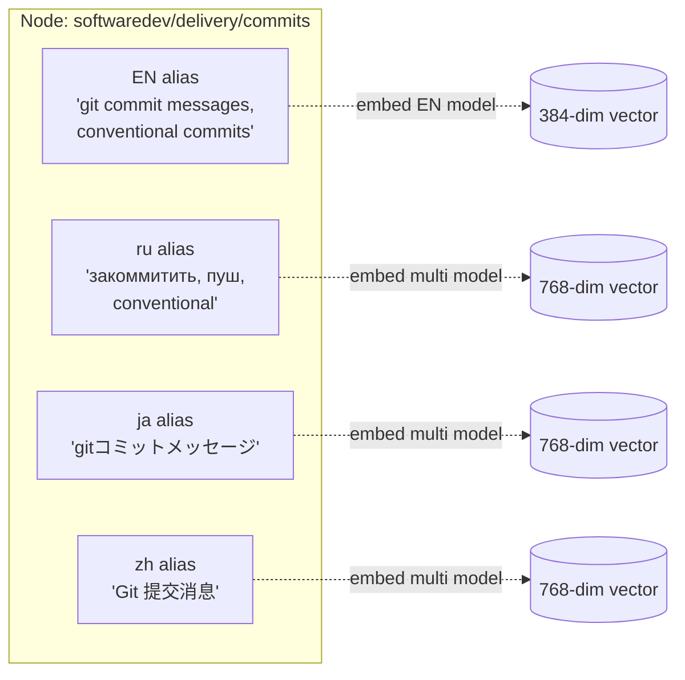
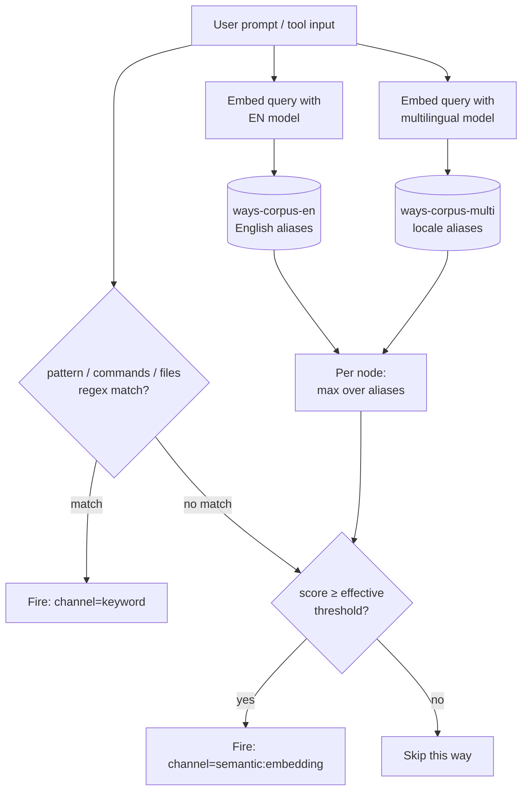

# Matching and Routing

How ways decide when to fire, and how progressive disclosure is structured.

## The Way Graph

Ways are not a flat list — they form an **authored disclosure graph** (ADR-125). Each way is a node; the graph has three kinds of edges.

```mermaid
graph TD
    SD[softwaredev]
    Code[softwaredev/code]
    Quality[softwaredev/code/quality]
    Testing[softwaredev/code/testing]
    Delivery[softwaredev/delivery]
    Commits[softwaredev/delivery/commits]
    Branching[softwaredev/delivery/branching]

    SD --> Code
    SD --> Delivery
    Code --> Quality
    Code --> Testing
    Delivery --> Commits
    Delivery --> Branching

    Commits -. See Also .-> Branching
    Quality -. sibling 0.62 .-> Testing

    classDef node fill:#f9f,stroke:#333,stroke-width:1px
    classDef sibling stroke-dasharray: 5 5
```

- **Parent/child edges** — from the directory tree (`softwaredev/delivery/commits` is a child of `softwaredev/delivery`)
- **See Also edges** — declared explicitly in a way's body prose
- **Sibling edges** — computed by `ways siblings`, weighted by cosine similarity between canonical embeddings

Every node carries one or more **coordinate aliases** — embeddings that route queries to it. The canonical alias comes from the English frontmatter (description + vocabulary); each active language has a locale alias in `.locales.jsonl`. All aliases on a node route to the same node's body content.



Each alias is embedded once (at `ways corpus` time) into the appropriate model's vector space and stored. At match time, the query is embedded and compared against every alias of every node; the node's score is the max across its aliases.

## How a Prompt Routes to a Way

Three channels decide whether a way fires. They run additively — any one firing activates the way.



**Channel 1 — explicit triggers.** `pattern:` (prompt text), `commands:` (bash commands), `files:` (file paths). Regex, case-insensitive, case-sensitive to match boundary anchors the author writes. These always fire if they match; they are the author's "I know exactly when this should fire" surface.

**Channel 2 — embedding.** Sole semantic retrieval tier (ADR-125). The query is embedded by both models against their respective corpora; per-node score is the max across the node's aliases. Multilingual and English queries both land on the same nodes via whichever alias is closer. The embedding model is a hard dependency — if missing, no semantic matching happens.

**Channel 3 — state triggers.** Not content-based. `trigger: context-threshold` fires when transcript size exceeds the configured percentage; `file-exists` fires when a glob matches; `session-start` fires once per session. See the [State Triggers](#state-triggers) section.

## Progressive Disclosure (Session Subgraph)

"Progressive disclosure" in this system is not a top-down cascade. It is the gradual accumulation of fired nodes in the session — the **session subgraph** — and a per-way threshold boost that applies once a parent has fired.

```mermaid
sequenceDiagram
    participant U as User
    participant S as Session
    participant M as Matcher
    participant Ways

    Note over S: Empty frontier<br/>no ways shown yet

    U->>M: "let's refactor this module"
    M->>Ways: score all nodes at base thresholds
    Ways-->>M: softwaredev/code/quality hits 0.72
    M->>S: mark code/quality shown
    Note over S: Frontier: {code, code/quality}<br/>(parent auto-pulled)

    U->>M: "rename extract_method"
    M->>Ways: score all; code/quality is ancestor of<br/>code/quality/refactoring — apply 0.8 boost
    Ways-->>M: code/quality/refactoring hits 0.31<br/>effective threshold 0.35 × 0.8 = 0.28 ✓
    M->>S: mark refactoring shown
    Note over S: Frontier grows:<br/>{code, code/quality, refactoring}
```

**Two mechanics make this work together:**

1. **Marker accumulation.** Each time a way fires, a per-session marker records it. The set of fired markers is the session subgraph — the portion of the way DAG that has been "disclosed" in this conversation.

2. **Parent-boost.** Before comparing a candidate way's score to its threshold, the matcher checks the way's ancestor chain for any fired marker. If found, the effective threshold is `base_threshold * parent_threshold_multiplier` (default 0.8). Children within an active parent domain fire on weaker signal; children in cold domains need to clear the full bar.

Configure via `~/.config/ways/config.yaml`:
```yaml
parent_threshold_multiplier: 0.8   # 1.0 disables the boost
default_embed_threshold: 0.35      # base for nodes without explicit override
```

A way's **effective threshold** therefore depends on session state, not just frontmatter. This is what makes disclosure feel progressive: the same query "rename this variable" may not fire the refactoring way in a fresh session but will fire it once the code/quality parent has been active.

The matcher itself is stateless per call — it reads session markers every turn and recomputes effective thresholds. There is no "revealed ways list" to maintain.

## Regex Matching

The default and most common mode. Three fields can be tested independently:

- `pattern:` - tested against the user's prompt text
- `commands:` - tested against bash commands (PreToolUse:Bash)
- `files:` - tested against file paths (PreToolUse:Edit|Write)

A way can declare any combination. Each field is a standard regex evaluated case-insensitively against its input.

### Why regex is the default

Most ways have clear trigger words. "commit", "refactor", "ssh" - these don't need fuzzy matching. Regex is fast, predictable, and easy to debug. When a way misfires, you can read the pattern and understand why.

### Pattern design considerations

Patterns need to balance sensitivity and specificity:
- Too broad: `error` fires on "no errors found"
- Too narrow: `error_handling` misses "exception handling"
- Right: `error.?handl|exception|try.?catch` catches the concept without false positives

Word boundaries (`\b`) help with short words that appear inside other words. The `commits` way uses `\bcommit\b` to avoid matching "committee" or "commitment".

## Semantic Matching

For concepts that users express in varied language. "Make this faster", "optimize the query", "it's too slow" all mean the same thing but share few words.

### How it works

A way with `description:` and `vocabulary:` frontmatter fields is automatically eligible for semantic matching. The `description` plus `vocabulary` is the way's **canonical alias**. Locale stubs in `.locales.jsonl` add language-specific aliases to the same node. See [The Way Graph](#the-way-graph) above for how aliases relate to nodes.

```yaml
description: debugging code issues, troubleshooting errors, investigating broken behavior
vocabulary: debug breakpoint stacktrace investigate troubleshoot regression bisect crash error
embed_threshold: 0.35   # optional per-way override of default_embed_threshold
```

At match time, the query is embedded once per model and scored against every alias in the corpus. The node's score is the max across its aliases; the way fires if that score clears the effective threshold (see [How a Prompt Routes](#how-a-prompt-routes-to-a-way) for the full flow and [Progressive Disclosure](#progressive-disclosure-session-subgraph) for how the effective threshold is computed).

### Engine and setup

The embedding engine is a hard dependency (ADR-125). `make setup` fetches the `way-embed` binary and the GGUF models (English + multilingual). If either is missing, ways with only semantic triggers will not fire — only `pattern:`, `commands:`, `files:` ways will. The `ways status` command reports whether the engine is installed.

### Vocabulary design

Good vocabulary terms are domain-specific words that **users would say** when asking about the topic:

- **Include**: Terms users type in prompts — `bcrypt`, `xss`, `breakpoint`, `monolith`
- **Skip**: Generic terms that don't discriminate — `code`, `use`, `make`, `change`
- **Keep unused terms**: Vocabulary terms that don't appear in the way body are often intentional — they catch user prompts, not body text

Use `/ways-tests suggest <way>` to find gaps and `/ways-tests score-all "prompt"` to check for cross-way false positives.

### Sparsity over coverage

The goal of vocabulary design isn't to maximize each way's match rate — it's to maximize the semantic distance *between* ways. Each way should occupy a distinct region of the scoring space with minimal overlap. When a prompt fires exactly one way with a clear margin above others, the system is working well. When multiple ways fire on the same prompt, their vocabularies overlap and need sharpening.

This means expanding vocabulary can be counterproductive. Adding generic terms like `error` to the debugging way might catch more debugging prompts, but it also creates overlap with the errors way. Narrow, specific vocabulary creates sparsity — clean separation between ways — which is more valuable than broad recall on any single way.

### Which ways use semantic matching

Ways covering broad concepts where regex would be too narrow or too noisy use semantic matching — most ways in `softwaredev/code/*`, `softwaredev/architecture/*`, `softwaredev/delivery/*`, and domains like `ea`, `itops`, `writing`, `research`. The test harness maintains 0 false positives as a hard constraint; see [scoring-and-testing.md](scoring-and-testing.md) for the vocabulary-tuning workflow.

## What This Actually Is

The vocabulary tuning workflow — choosing terms, measuring precision, eliminating false positives, running test fixtures — has a name. Several names, in fact, depending on which decade of research you're reading.

### The lineage

The matching system is a **text retrieval** system. The user's prompt is the query; the ways are the document collection; the embedding scorer ranks documents by relevance. This is the core problem of information retrieval, studied continuously since the 1950s.

| What we do | Established term | Field |
|------------|-----------------|-------|
| Choosing which terms to include/exclude per way | Feature selection / controlled vocabulary design | ML / library science |
| Tuning vocabularies so ways occupy distinct scoring regions | Discriminative feature engineering | ML |
| Removing terms like "risk" or "standard" after false positive detection | Precision optimization with hard constraint | IR evaluation |
| The 0 FP constraint with tolerable FN | High-precision classifier tuning | Classification theory |
| TP/FP/TN/FN tracking per scorer | Confusion matrix evaluation | Statistics (1940s+) |
| Co-activation fixtures with array expected values | Multi-label classification evaluation | ML |
| The test fixtures file with known-good judgments | Test collection / qrels | IR (Cranfield, 1960s) |

The test harness is essentially the **Cranfield evaluation paradigm**: a fixed test collection (`test-fixtures.jsonl`) + relevance judgments (expected values) + evaluation metrics (TP/FP/TN/FN). Cyril Cleverdon developed this at Cranfield University in the early 1960s. TREC (Text REtrieval Conference) has been running standardized evaluations on the same model since 1992. Our harness is a miniature TREC track.

The system uses sentence-embedding cosine similarity as the sole retrieval tier (ADR-108 and ADR-125). The IR lineage below still frames the tuning workflow — document representations, test collections, precision-first evaluation — but the numerator is learned embedding similarity rather than hand-tuned term overlap.

### Why this matters

The broader Claude Code ecosystem has developed its own vocabulary for agent steering: [Ralph Wiggum loops](https://github.com/ghuntley/how-to-ralph-wiggum), CLAUDE.md "constitutions," PROMPT.md steering files, AGENTS.md orchestration, "vibe coding." These are practical techniques — legitimate and useful — but the informal naming can obscure what's actually happening underneath.

What's happening underneath is information retrieval. The vocabulary tuning loop is **relevance engineering**: the iterative process of adjusting document representations to improve retrieval quality against a test collection with known-good judgments. The matching system is a **ranked retrieval** system with a precision-first objective. The sparsity principle is a restatement of **discriminative power** — descriptions that occupy distinct regions of embedding space produce clean matches, and descriptions that drift into neighbors produce confusion.

This isn't to diminish the newer work. Ralph Wiggum loops are a genuine contribution to autonomous agent workflows. CLAUDE.md files are effective cognitive scaffolds (see [rationale.md](rationale.md) for the situated cognition framing). But the matching and evaluation layer of this system draws from a 60-year research tradition, and knowing that tradition helps when you're stuck:

- If ways are cross-firing, you have a **discrimination** problem — read about IDF weighting and feature selection
- If a way isn't catching enough prompts, you have a **recall** problem — but expanding vocabulary trades recall for precision, so measure both
- If you're unsure whether your test fixtures are good enough, look at TREC's methodology for building test collections
- If the manual tuning feels unsustainable, the next step is **Learning to Rank** (LambdaMART et al.) — but at 20 ways and 70 test cases, hand-tuning is arguably more appropriate than ML

### Scale-appropriate methods

At our scale — ~20 ways, ~70 test fixtures — the manual approach isn't a compromise. It's the right tool. Learning to Rank, dense retrieval, and neural re-ranking shine at thousands of queries against millions of documents. We'd overfit immediately. What we built is closer to a hand-crafted decision tree, which is exactly what works when the domain is small, well-understood, and the humans have strong intuition about the categories.

The field term for where we sit: **manual relevance engineering** with **Cranfield-style evaluation**. If it was good enough for the researchers who built the foundations of web search, it's good enough for 20 ways.

### References

- Cleverdon, C. W. (1967). The Cranfield tests on index language devices. *Aslib Proceedings*, 19(6), 173-194.
- Voorhees, E. M. (2002). The philosophy of information retrieval evaluation. *CLEF 2001*, LNCS 2406, 355-370.
- Reimers, N., & Gurevych, I. (2019). Sentence-BERT: Sentence Embeddings using Siamese BERT-Networks. *EMNLP 2019*.

## State Triggers

Unlike the other modes, state triggers don't match against content. They evaluate session conditions.

### context-threshold

Monitors transcript size as a proxy for context window usage. The calculation:
- Claude's context window: ~155K tokens
- Estimated density: ~4 characters per token
- Total capacity: ~620K characters
- Threshold at 75%: fires when transcript exceeds ~465K characters

The transcript size is measured since the last compaction (identified by `"type":"summary"` markers in the transcript JSONL). A cache avoids rescanning the full transcript on every prompt.

Unlike other ways, context-threshold triggers **repeat on every prompt** until the condition is resolved (task list created). This is deliberate: it's an enforcement mechanism, not educational guidance.

### file-exists

Checks for a glob pattern relative to the project directory. Fires once (standard marker) if any matching file exists. Useful for detecting project state - e.g., whether tracking files exist.

### session-start

Always evaluates true. Uses the standard marker, so it fires exactly once on the first UserPromptSubmit after session start. Useful for one-time session initialization that doesn't belong in SessionStart hooks.
